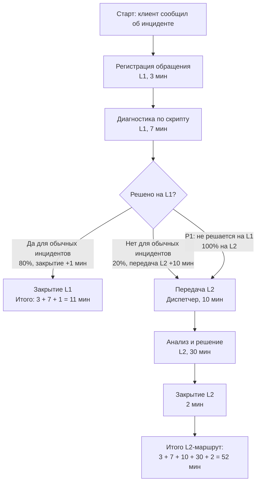
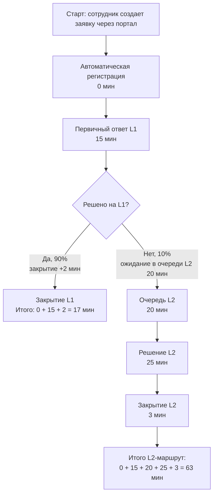
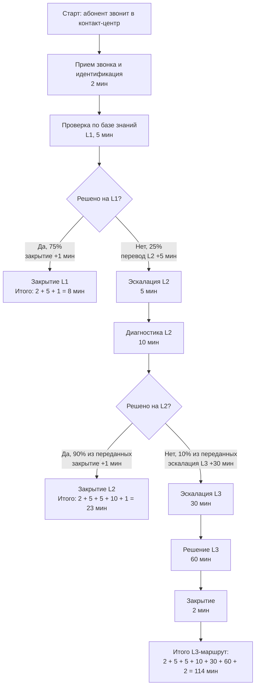

# Обработка инцидента до устранения: ITIL/ITSM-анализ трех кейсов

## 0. Кейс и выбранная рамка

Работа рассматривает три типовых процесса обработки инцидентов до устранения:

| Кейс | Организация | Фокус анализа |
|---|---|---|
| 1 | Магазин онлайн-одежды | Инциденты интернет-магазина с разделением L1/L2 и отдельным правилом для P1 по оплате |
| 2 | Офисная IT-поддержка | Заявки сотрудников через портал, время реакции L1 и очередь L2 |
| 3 | Мобильный оператор | Контакт-центр с эскалацией L1 -> L2 -> L3 и разными SLA по приоритетам |

Рамка расчета:

| Правило | Как применяется |
|---|---|
| Время считается от регистрации/приема обращения до закрытия инцидента | Если этап закрытия указан отдельно, он входит в полное время решения |
| MTTR считается как среднее время решения по заданным вероятностям маршрутов | Для P1 в первом кейсе используется отдельное правило: все P1 идут на L2 |
| SLA проверяется по полному времени решения | Для L2/L3 учитывается не только работа специалиста, но и ожидание/передача |
| Блок-схемы показаны текстовой Mermaid-нотацией | В каждой схеме указаны проценты ветвления и время этапов |

Ключевые обозначения:

| Обозначение | Значение |
|---|---|
| L1 | Первая линия поддержки / Service Desk |
| L2 | Вторая линия поддержки / профильный специалист |
| L3 | Третья линия / глубокая техническая экспертиза |
| MTTR | Mean Time To Resolve, среднее время решения инцидента |
| SLA | Service Level Agreement, целевой уровень сервиса |
| OLA | Operational Level Agreement, внутреннее соглашение между линиями поддержки |

## Задание 1. Магазин онлайн-одежды

### 1.1 Блок-схема процесса

### 1.2 Расчет времени и MTTR

Базовые маршруты:

| Маршрут | Формула | Время |
|---|---:|---:|
| Решение на L1 | 3 + 7 + 1 | 11 мин |
| Эскалация и решение на L2 | 3 + 7 + 10 + 30 + 2 | 52 мин |

Расчет по приоритетам:

| Приоритет | Условие маршрута | Формула MTTR | MTTR |
|---|---|---:|---:|
| P1: не работает оплата | Все P1 идут на L2, потому что L1 не имеет доступа к платежной системе | 52 | 52 мин |
| P2: медленно грузится каталог | 80% решаются на L1, 20% идут на L2 | 0.8 * 11 + 0.2 * 52 = 8.8 + 10.4 | 19.2 мин |
| P3: не отображается фото | 80% решаются на L1, 20% идут на L2 | 0.8 * 11 + 0.2 * 52 = 8.8 + 10.4 | 19.2 мин |

Портфельное среднее за месяц с учетом долей P1/P2/P3:

| Доля инцидентов | Формула | Результат |
|---|---:|---:|
| P1 10%, P2 40%, P3 50% | 0.1 * 52 + 0.4 * 19.2 + 0.5 * 19.2 | 22.48 мин |

### 1.3 Проверка SLA

| Приоритет | SLA | Расчетное время | Запас / нарушение | Итог |
|---|---:|---:|---:|---|
| P1 | <= 60 мин | 52 мин | запас 8 мин | SLA соблюдается, но запас очень мал |
| P2 | <= 240 мин | 19.2 мин MTTR; даже L2-маршрут 52 мин | запас 220.8 мин по MTTR | SLA соблюдается |
| P3 | <= 1440 мин | 19.2 мин MTTR; даже L2-маршрут 52 мин | запас 1420.8 мин по MTTR | SLA соблюдается |

Критичный вывод по SLA: P1 формально укладывается в 1 час, но процесс почти не имеет операционного буфера. Любая очередь у L2, повторная диагностика, ожидание платежного провайдера или ручное согласование легко приведут к нарушению.

### 1.4 Риски

| Риск | Почему это опасно | Последствие |
|---|---|---|
| P1 теряет 7 минут на L1-диагностику и 10 минут на передачу, хотя заранее известно, что L1 не может устранить платежный сбой | Время тратится на этапы без права решения, а запас до SLA остается всего 8 минут | Любая очередь L2, ожидание платежного провайдера или повторная проверка легко превращает P1 в breach |
| Передача L2 не выделена в отдельную приоритетную очередь с внутренним OLA | P1 конкурирует с обычными L2-задачами и не имеет гарантированного времени принятия | Платежные инциденты задерживают восстановление оплаты и могут приводить к потере выручки |

### 1.5 ITIL-улучшения и вывод

| Улучшение | ITIL-практика | Как меняет процесс |
|---|---|---|
| Ввести отдельную модель P1 Payment Incident | Incident Management | После регистрации и минимальной классификации P1 сразу уходит в платежный L2/дежурную группу, без полного L1-скрипта |
| Закрепить OLA и SLA-таймеры для L2 по P1 | Service Level Management + Incident Management | Например: передача P1 <= 2 мин, первичное принятие L2 <= 5 мин, автоматическая эскалация при риске нарушения SLA |
| Создать runbook и Known Error Database по типовым платежным сбоям | Knowledge Management + Problem Management | L1 быстро распознает известные симптомы, L2 не начинает диагностику с нуля, повторяющиеся причины попадают в problem record |

Вывод: текущий процесс хорошо работает для P2/P3, но для P1 он слишком близок к границе SLA. Главная ITIL-задача - сделать P1 отдельной моделью инцидента с прямой маршрутизацией, внутренними OLA и контролем времени на каждом шаге.

## Задание 2. Офисная IT-поддержка

### 2.1 Блок-схема процесса

Дополнительная рабочая рамка для расчета портфеля:

| Процент | Что означает | Где используется |
|---:|---|---|
| 90% / 10% | Фактическое ветвление процесса после первичного ответа L1 | Для блок-схемы и контроля качества маршрутизации |
| 70% / 30% | Распределение типов обращений: типовые L1-запросы и сеть/сервер, требующие L2 | Для расчета среднего портфельного времени решения |

### 2.2 Расчет времени

| Показатель | Формула | Результат |
|---|---:|---:|
| Ожидание именно в очереди L2 | 20 | 20 мин |
| Время от регистрации до начала работы L2 | 0 + 15 + 20 | 35 мин |
| Полное время решения L1-инцидента | 0 + 15 + 2 | 17 мин |
| Полное время решения L2-инцидента | 0 + 15 + 20 + 25 + 3 | 63 мин |
| Среднее время решения по распределению 70% L1 / 30% L2 | 0.7 * 17 + 0.3 * 63 = 11.9 + 18.9 | 30.8 мин |

Ответ на вопрос о начале обработки L2-инцидента: если считать только ожидание в очереди L2, оно равно 20 минут. Если считать с момента создания заявки до момента, когда L2 реально начинает работу, получается 35 минут: 15 минут до первичного ответа L1 плюс 20 минут ожидания в L2.

### 2.3 Проверка SLA

| SLA | Требование | Расчет | Итог |
|---|---:|---:|---|
| Время реакции L1 | <= 30 мин | 15 мин | SLA соблюдается, запас 15 мин |
| Время решения L1-инцидента | <= 240 мин | 17 мин | SLA соблюдается, запас 223 мин |
| Время решения L2-инцидента | <= 240 мин | 63 мин | SLA соблюдается, запас 177 мин |
| Среднее портфельное время решения | <= 240 мин | 30.8 мин | SLA соблюдается |

Да, SLA по времени решения соблюдается: полный L2-маршрут занимает 63 минуты, что существенно меньше лимита 4 часа.

### 2.4 Риски

| Риск | Почему это опасно | Последствие |
|---|---|---|
| L2-инцидент начинает профильную обработку только через 35 минут после регистрации | Для сетевых и серверных проблем это может быть слишком поздно, особенно если затронут отдел или весь офис | Формально SLA соблюдается, но фактический бизнес-простой растет |
| В исходных данных одновременно есть 90%/10% по gateway и 70%/30% по типам обращений | Если не разделить процессную статистику и структуру спроса, capacity planning будет противоречивым | L2 может быть недоукомплектован по фактической нагрузке, даже если процессная статистика выглядит стабильной |

### 2.5 ITIL-улучшения и вывод

| Улучшение | ITIL-практика | Как уменьшает ожидание без найма |
|---|---|---|
| Автоклассификация заявок и маршрутизация сети/серверов в L2 сразу после регистрации | Incident Management + Service Request Management | L1 сохраняет первичный контакт, но L2 получает задачу параллельно, а не после полного ожидания |
| Shift-left для типовых запросов: self-service password reset, каталог ПО, шаблоны диагностики | Knowledge Management + Service Request Management | L1 освобождается от повторяющихся задач, а L2 получает меньше ошибочных эскалаций |
| Приоритетная L2-очередь с WIP-лимитами и таймером ожидания | Incident Management + Service Level Management | Заявки по сети/серверу поднимаются выше обычных обращений, если ожидание приближается к порогу |

Вывод: расчетный SLA выполняется с большим запасом, но метрика "время решения" скрывает важный операционный риск - L2 начинает работу через 35 минут после создания заявки. Лучшее улучшение без найма - не увеличивать штат, а убрать лишнее ожидание через автоклассификацию, параллельную маршрутизацию и self-service для типовых L1-запросов.

## Задание 3. Мобильный оператор: отдел техподдержки

### 3.1 Блок-схема процесса

### 3.2 Расчет времени

| Маршрут | Вероятность в общем потоке | Формула | Полное время |
|---|---:|---:|---:|
| Инцидент решен на L1 | 75% | 2 + 5 + 1 | 8 мин |
| Инцидент решен на L2 | 25% * 90% = 22.5% | 2 + 5 + 5 + 10 + 1 | 23 мин |
| Инцидент решен на L3 | 25% * 10% = 2.5% | 2 + 5 + 5 + 10 + 30 + 60 + 2 | 114 мин |

Ожидаемый MTTR процесса с учетом вероятностей:

| Формула | Результат |
|---:|---:|
| 0.75 * 8 + 0.225 * 23 + 0.025 * 114 = 6 + 5.175 + 2.85 | 14.025 мин, округленно 14.0 мин |

### 3.3 Проверка SLA

Проверка по маршрутам:

| Приоритет | SLA | L1-маршрут 8 мин | L2-маршрут 23 мин | L3-маршрут 114 мин | Итог |
|---|---:|---:|---:|---:|---|
| P1: прерывание связи | <= 30 мин | соблюдается | соблюдается, запас 7 мин | нарушается на 84 мин | При эскалации на L3 SLA гарантированно нарушается |
| P2: нет доступа в интернет | <= 120 мин | соблюдается | соблюдается | соблюдается, запас 6 мин | SLA формально соблюдается, но запас мал |
| P3: вопрос по тарифу | <= 1440 мин | соблюдается | соблюдается | соблюдается | SLA соблюдается |

Ответ: при эскалации на L3 гарантированно нарушит SLA только P1. Причина простая: полный L3-маршрут занимает 114 минут, а лимит P1 составляет 30 минут. Уже одна эскалация L3 в 30 минут равна всему SLA P1, еще до 60 минут работы L3 и закрытия.

### 3.4 Риски

| Риск | Почему это опасно | Последствие |
|---|---|---|
| P1 может попасть в обычную цепочку L1 -> L2 -> L3 | Стандартный L3-маршрут 114 минут несовместим с SLA 30 минут | Гарантированное нарушение клиентского SLA при сложном P1 |
| P2 на L3 имеет запас только 6 минут | В расчете нет ожидания в очереди, повторного звонка, проверки внешней сети или согласования с инженером | Любая небольшая задержка превращает P2 в breach |

### 3.5 ITIL-улучшения и вывод

| Улучшение | ITIL-практика | Как меняет процесс |
|---|---|---|
| Ввести fast-track для P1: после идентификации сразу подключать L2/L3 и major incident coordinator | Incident Management + Major Incident Management | P1 не идет по обычной последовательной очереди, а получает параллельное восстановление сервиса |
| Разделить SLA и OLA по уровням поддержки | Service Level Management | Например: P1 triage <= 3 мин, L2/L3 acceptance <= 5 мин, workaround <= 20 мин |
| Обновлять Known Error Database, скрипты L1 и привязку массовых сбоев к incident record | Knowledge Management + Problem Management + Monitoring and Event Management | Больше инцидентов решается на L1/L2, а при массовой деградации обращения сразу связываются с известным инцидентом |

Вывод: средний MTTR процесса выглядит хорошим - около 14 минут, но среднее значение маскирует критический хвост L3. Для мобильного оператора P1 нельзя обрабатывать обычной последовательной цепочкой; нужен отдельный major incident / fast-track процесс с параллельной диагностикой и жесткими внутренними OLA.

## Итоговая сводка

| Кейс | Основной расчет | SLA-итог | Главный ITIL-вывод |
|---|---:|---|---|
| Магазин онлайн-одежды | P1 MTTR 52 мин; P2/P3 MTTR 19.2 мин; портфельный MTTR 22.48 мин | Все SLA соблюдаются, но P1 имеет запас только 8 мин | P1 Payment Incident нужно выделить в отдельную модель с прямой L2-эскалацией |
| Офисная IT-поддержка | L2-инцидент 63 мин; ожидание L2 20 мин; до начала L2 35 мин; среднее 30.8 мин | Реакция L1 и решение L2 соблюдают SLA | Нужно сокращать L2-ожидание через автоклассификацию, self-service и приоритетную очередь |
| Мобильный оператор | L1 8 мин; L2 23 мин; L3 114 мин; ожидаемый MTTR 14.0 мин | P1 нарушает SLA при L3, P2/P3 укладываются | Для P1 нужен fast-track / major incident process, иначе L3-маршрут несовместим с SLA |

Финальный вывод: во всех трех кейсах средние значения выглядят приемлемо, но ITIL-анализ показывает, что главные риски находятся не в среднем MTTR, а в маршрутах высокой критичности и очередях эскалации. Для устойчивого процесса нужны отдельные модели инцидентов по приоритетам, OLA между линиями поддержки, база знаний, автоматическая маршрутизация и контроль SLA-таймеров на каждом этапе.
