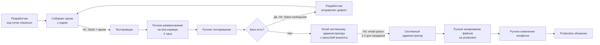
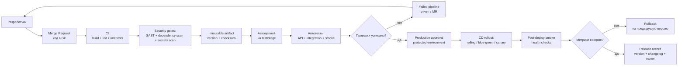

# FinTech Solutions: перевод релизного процесса мобильного банка в управляемый поток

## 0. Кейс и выбранная рамка

Компания: **FinTech Solutions**, команда мобильного банка. Рассматривается путь серверного изменения от момента, когда разработчик считает код готовым к проверке, до фактического выхода изменения на production. В AS-IS этот путь проходит через архив в Slack, ручное развертывание тестировщиком, ручную проверку, email системному администратору и ручное копирование файлов на боевой сервер.

Целевая работа: заменить цепочку неформальных передач ответственности на управляемый CI/CD-поток, в котором код хранится в Git, проверки выполняются автоматически, тестовое и production-окружения разворачиваются воспроизводимо, а ручное участие остается как осознанный approval для production-релиза.

Ограничительная рамка:

| В scope | Out of scope |
|---|---|
| Путь фичи от готового кода до production | Разработка самой бизнес-функциональности мобильного банка |
| Backend/API, конфигурации и серверный релиз | Публикация мобильного приложения в App Store / Google Play |
| Анализ handover-ов, потерь, WIP и очередей | Полный аудит оргструктуры и всех команд банка |
| TO-BE CI/CD pipeline, IaC и release governance | Закупочная спецификация и бюджетирование лицензий |
| Сравнение Lead Time на уровне процесса | Точный SLA на основании исторических логов, которых в кейсе нет |

Расчетная рамка для Lead Time: время разработки до передачи в релиз не включается. Точные длительности в кейсе даны только для ручного тестового развертывания и ожидания администратора, поэтому для сравнения используются осторожные операционные допущения: ручное функциональное тестирование небольшой фичи - 4 часа, ручной production deploy с копированием файлов и правкой конфигов - 1 час.

## 1. AS-IS: визуализация текущего процесса и handover-ы

AS-IS процесс не имеет единого источника правды о версии, статусе проверки, release candidate и владельце следующего шага. Ответственность передается через Slack и email, поэтому работа движется не как поток, а как набор локальных ручных операций с очередями между ролями.

### 1.1 Этапы AS-IS процесса

| Этап | Исполнитель | Канал / артефакт | Активная работа | Handover |
|---|---|---|---:|---|
| 1. Код готов локально | Разработчик | Локальная рабочая копия | Вне рамки расчета | Нет |
| 2. Архив с кодом отправлен на проверку | Разработчик -> тестировщик | Slack + файл-архив | 5-15 минут | H1 |
| 3. Развертывание на тестовом сервере | Тестировщик | SSH, ручная установка, ручные настройки | 2 часа | Нет |
| 4. Ручное тестирование | Тестировщик | Ручные проверки | 4 часа, расчетное допущение | Нет |
| 5. Возврат дефекта | Тестировщик -> разработчик | Сообщение в Slack | Переменно | H2 |
| 6. Запрос на production-релиз | Тестировщик -> системный администратор | Email | 5 минут отправки, 1-2 дня ожидания | H3 |
| 7. Production deploy | Системный администратор | SSH, файловая система, ручные конфиги | 1 час, расчетное допущение | Нет |
| 8. Production обновлен | Команда / бизнес | Не формализован | Не фиксируется | Нет |

### 1.2 AS-IS схема

### 1.3 Реестр handover-ов

| Handover | Передача | Почему это проблема | Операционный риск |
|---|---|---|---|
| H1 | Разработчик передает тестировщику архив в Slack | Архив не является управляемым release artifact; нет обязательной связи с commit, задачей и версией | Можно протестировать не тот код, который затем попадет в production |
| H2 | Тестировщик возвращает баг разработчику сообщением | Дефект не привязан к автоматическому отчету, окружению, логам и воспроизводимому pipeline run | Длинный feedback loop и повторные ручные проверки |
| H3 | Тестировщик пишет администратору email на production deploy | Заявка попадает в личный inbox без видимого SLA, очереди, приоритета и статуса | Главная задержка Lead Time и зависимость от одного ручного исполнителя |

## 2. Три операционные потери AS-IS

В процессе видны три ключевые Lean-потери: ожидание, лишняя транспортировка / ручная обработка и дефекты с переделкой. Они важны не только как задержки, но и как источник риска: команда не может уверенно доказать, какая версия проверялась, кто владеет следующим шагом и почему релиз стоит.

| Потеря | Где проявляется | Аргументация | Эффект для бизнеса |
|---|---|---|---|
| Ожидание | Production-релиз ожидает, пока администратор увидит email; баги ожидают реакции между тестировщиком и разработчиком | В кейсе ожидание администратора занимает 1-2 дня, тогда как сама ручная операция deploy оценивается примерно в 1 час; качество продукта в это время не растет | Фича поздно попадает к клиентам, бизнес позже получает обратную связь и эффект от изменения |
| Лишняя транспортировка и ручная обработка | Код пересылается архивом, тестовое окружение поднимается вручную, production-файлы копируются вручную | Один и тот же результат перемещается как файл и набор действий человека, а не как версионированный artifact и воспроизводимый pipeline | Увеличиваются трудозатраты, повышается зависимость от отдельных исполнителей, сложно повторить релиз |
| Дефекты и переделка | Баги возвращаются через Slack, окружения и конфиги настраиваются вручную | Причина сбоя может быть в коде, архиве, тестовом deploy, отличиях окружений или production-конфигах; без автоматических отчетов источник дефекта локализуется медленно | Растет число повторных циклов проверки, а риск production-инцидента остается высоким |

## 3. WIP и очереди

Самый большой WIP скапливается перед системным администратором, потому что готовые к релизу изменения лежат в email-очереди без общего release board, SLA и автоматической проверки готовности. Это bottleneck не из-за длительности копирования файлов, а из-за невидимой очереди перед единственным ручным каналом production-деплоя.

### 3.1 Карта WIP

| Точка процесса | Что находится в WIP | Почему накапливается | Риск |
|---|---|---|---|
| Перед тестировщиком | Архивы, отправленные в Slack | Нет общей очереди release candidate-ов и автоматического test deploy | Средний |
| На тестовом развертывании | Фичи, ожидающие ручной установки | Каждая установка занимает 2 часа и выполняется тестировщиком вместо pipeline | Высокий |
| В bug loop | Фичи, возвращенные разработчику | Нет быстрых unit, integration и smoke checks до ручной проверки | Средний |
| Перед администратором | Фичи, готовые к production | Email обрабатывается через 1-2 дня; нет self-service deploy с approval | Критичный |
| На production-деплое | Файлы и конфиги для ручного копирования | Нет автоматизированного rollout, rollback и config management | Высокий |

### 3.2 Оценка влияния очереди

AS-IS happy path без учета разработки и исправления багов:

| Компонент времени | Нижняя оценка | Верхняя оценка | Основание |
|---|---:|---:|---|
| Ручное развертывание на test | 2 часа | 2 часа | Дано в кейсе |
| Ручное тестирование | 4 часа | 4 часа | Расчетное допущение для небольшой фичи |
| Ожидание администратора | 24 часа | 48 часов | Дано в кейсе как 1-2 дня |
| Ручной production deploy | 1 час | 1 час | Расчетное допущение для копирования файлов и конфигов |
| Итого AS-IS Lead Time | 31 час | 55 часов | Без bug loop |

Доля очереди администратора в Lead Time составляет примерно `24 / 31 = 77%` в нижней оценке и `48 / 55 = 87%` в верхней оценке. Поэтому главный рычаг улучшения - не ускорить чтение email, а убрать email как транспорт релиза и заменить его управляемой release queue в CD-системе.

## 4. TO-BE: целевой pipeline поставки

TO-BE процесс строится вокруг Git-based delivery. Разработчик больше не пересылает архив: он открывает merge request, CI автоматически собирает код, запускает проверки, публикует неизменяемый artifact и разворачивает его на test/stage. Production deploy выполняется тем же artifact через защищенный CD job, approval, health checks и rollback-механизм.

### 4.1 TO-BE схема

### 4.2 Что автоматизируется

| Этап TO-BE | Автоматизация | Ручная роль остается для |
|---|---|---|
| Source control | Git commit, MR/PR, связь с задачей, audit trail | Code review и принятие изменения |
| Build | Сборка из Git в одном pipeline | Разбор failed build |
| Quality gates | Lint, unit, API, integration, smoke tests | Risk-based exploratory QA |
| Security gates | SAST, dependency scan, secret scan | Анализ критичных security findings |
| Artifact publishing | Публикация immutable artifact с версией и checksum | Выбор release candidate при нестандартном релизе |
| Test/stage deploy | Развертывание тестового окружения из pipeline | Проверка редких сценариев, которые не покрыты автотестами |
| Production deploy | Rolling, blue-green или canary rollout | Approval и решение по high-risk change |
| Rollback | Возврат на предыдущую версию по job или runbook | Решение об откате при сложном бизнес-инциденте |
| Observability | Release markers, метрики, логи, алерты | Incident response и анализ трендов |

### 4.3 Как меняются передачи ответственности

| AS-IS handover | TO-BE замена | Что улучшается |
|---|---|---|
| Slack-архив от разработчика тестировщику | Merge Request + CI artifact | Версия, автор, diff, проверки и статус видны в одной системе |
| Slack-сообщение о баге | Failed pipeline + test report + linked issue | Дефект связан с commit, окружением и логами |
| Email администратору | Production approval + CD job | Очередь становится видимой, управляемой и измеримой |
| Ручное копирование на сервер | IaC/CD rollout с rollback | Деплой повторяем, audit trail сохраняется, rollback заранее определен |

## 5. Инструменты и обоснование выбора

Стек выбран от проблем кейса, а не от моды на инструменты: нужно убрать Slack-архивы, ручной test deploy, ручную правку конфигов, invisible queue перед администратором и отсутствие наблюдаемого статуса релиза.

| Область | Инструмент / класс | Рекомендованный выбор | Почему подходит |
|---|---|---|---|
| Source control и review | Git platform | GitLab или GitHub Enterprise | Заменяет архивы на commit/MR/PR, хранит историю изменений и reviewer-ов |
| CI | GitLab CI, GitHub Actions или Jenkins | GitLab CI как базовая единая точка build-test-release | Pipeline хранится рядом с кодом, статус проверки виден до передачи QA |
| Artifact repository | Container Registry, Nexus, Artifactory | GitLab Container Registry или Nexus | Production получает тот же immutable artifact, который прошел проверки |
| Упаковка | Docker / OCI image | Docker image для backend/API | Снижает расхождение test и production окружений |
| IaC | Terraform | Terraform для инфраструктуры и базовых окружений | Серверы, сети и managed-сервисы становятся версионированными и воспроизводимыми |
| Config management | Helm, Ansible, Kubernetes manifests | Helm при Kubernetes-платформе, Ansible для VM-based старта | Конфиги применяются из репозитория, а не правятся вручную на сервере |
| CD и rollout | GitLab Environments, Argo CD, Spinnaker | GitLab Environments на первом этапе, Argo CD при переходе к GitOps | Убирает email админу и дает protected production deployment |
| Автотесты | Unit/API/integration/smoke frameworks | JUnit/pytest, Postman/Newman, contract tests, smoke suite | Находит дефекты до ручной QA и сокращает bug loop |
| Security gates | SAST, dependency scan, secret scanning | Встроенные GitLab scans + SonarQube при необходимости | Для мобильного банка security checks должны быть стандартной частью релиза |
| Observability | Prometheus, Grafana, Loki/ELK, OpenTelemetry | Метрики, логи и release markers | Команда видит влияние релиза на error rate, latency и доступность |
| Approval / change record | Protected environments, ITSM integration | Protected production environment с обязательным approval | Ручное согласование сохраняется, но выходит из email и получает audit trail |

Минимальный порядок внедрения:

| Волна | Изменение | Какую боль закрывает |
|---|---|---|
| 1 | Git MR/PR вместо Slack-архива | Версионирование, traceability, единый release candidate |
| 2 | CI build, lint, unit tests и artifact publishing | Быстрый feedback и неизменяемый artifact |
| 3 | Автоматический deploy на test/stage | Убирает 2 часа ручной работы тестировщика |
| 4 | API, integration и smoke tests | Сокращает bug loop и объем ручной проверки |
| 5 | Terraform + config management | Убирает ручные изменения серверов и конфигов |
| 6 | Production CD с approval, health checks и rollback | Убирает email-очередь администратора и снижает риск deploy |

## 6. Сокращение Lead Time

В AS-IS стандартный happy path занимает примерно 31-55 часов без учета возврата багов, причем 77-87% этого времени дает ожидание администратора в email-очереди. В TO-BE ручное тестовое развертывание заменяется CD job на 5-10 минут, значимая часть ручной проверки переносится в автоматические тесты, а production deploy запускается из защищенного pipeline после approval. Оценочный happy path для типового изменения сокращается до 40-145 минут: разброс сохраняется из-за approval SLA и возможной risk-based QA, но исчезает многодневное ожидание ручного исполнителя. Главный эффект достигается не отдельным ускорением копирования файлов, а превращением релиза в измеримый поток с одним artifact, видимым статусом, автоматическими quality gates и заранее подготовленным rollback.
