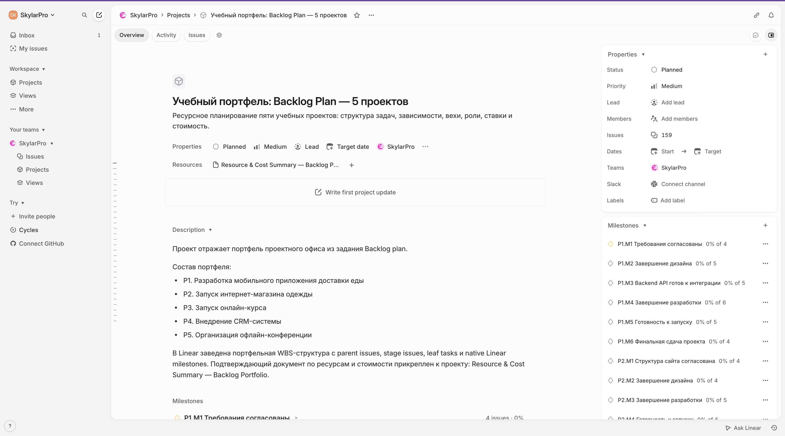
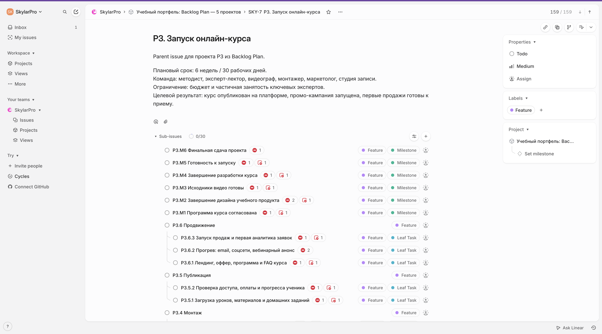
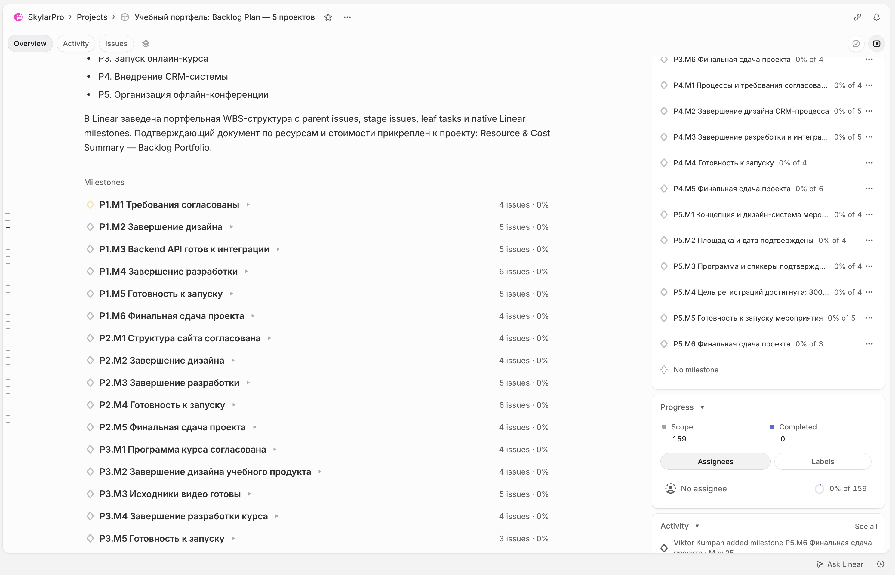
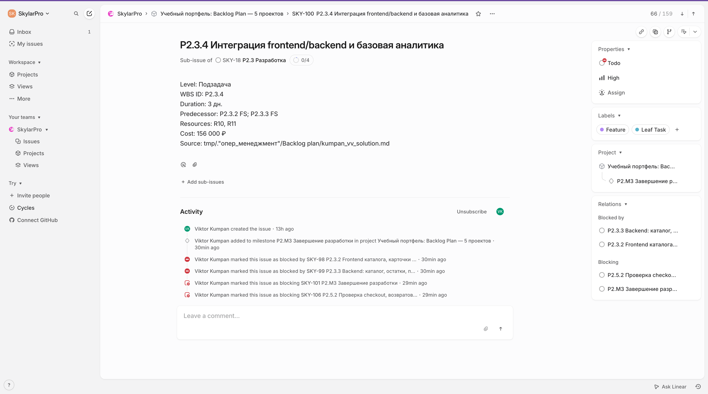

# Портфель Backlog Plan: ресурсное планирование пяти проектов в Linear

## 0. Кейс и выбранная рамка

Кейс: проектный офис ведет пять клиентских инициатив разного типа и должен подготовить полноценный backlog-план для заведения в Linear: мобильное приложение доставки еды, интернет-магазин одежды, онлайн-курс, внедрение CRM и офлайн-конференция на 300 человек.

Цель работы: не просто перечислить задачи, а разложить каждый проект в структуру "родительская задача -> этапы -> подзадачи", назначить ресурсы со ставками, показать зависимости, вехи, длительности, стоимость и критический путь.

Ограничительная рамка:

| В scope | Out of scope |
|---|---|
| Планирование всех 5 проектов как портфеля проектного офиса и заведенная Linear-структура parent/stage/leaf issues, native Linear milestones и native `blockedBy`-зависимости | Публичная интернет-публикация Linear без доступа к workspace |
| Структура задач, этапов, подзадач и вех | Детальная закупочная документация подрядчиков |
| Ресурсный пул, ставки, назначение и ориентировочная стоимость | Бухгалтерская смета с НДС, договорами и актами |
| Зависимости FS, SS и лаги между задачами | Автоматическая синхронизация с календарями сотрудников |
| Критический путь и выводы по управлению сроками | Реальная загрузка конкретных людей из HR-системы |

Единица планирования: **дни**. Рабочая неделя: понедельник-пятница. Базовый рабочий день: **8 часов**. Вехи имеют длительность **0 дней** и стоимость **0 ₽**. Только leaf/second-level work tasks несут расчетный Cost; в Linear он зафиксирован в описании leaf-задач и в подтверждающем документе. Стоимость leaf-задач рассчитана как `часы участия * ставка ресурса`; суммы округлены до тысяч рублей, чтобы их было удобно сверять с Linear.

Проверочная ссылка на заведенную портфельную структуру в Linear: [Учебный портфель: Backlog Plan — 5 проектов](https://linear.app/skylarpro/project/uchebnyj-portfel-backlog-plan-5-proektov-3fedaa01ff3d). Подтверждающий документ по ресурсам и стоимости: [Resource & Cost Summary — Backlog Portfolio](https://linear.app/skylarpro/document/resource-and-cost-summary-backlog-portfolio-4746eaa67336).

Проверочные изображения Linear:

## 1. Общая модель планирования

### 1.1 Формат задач для переноса в Linear

В Linear для каждого проекта создается одна родительская задача уровня Epic/Project. Внутри нее создаются этапы как подзадачи первого уровня, а конкретные работы как подзадачи второго уровня.

Формат записи:

| Поле | Правило заполнения |
|---|---|
| ID | Код вида `P1.2.3`, где `P1` — проект, `2` — этап, `3` — подзадача |
| Название | Короткое действие, понятное исполнителю |
| Уровень | Parent, этап, подзадача или веха |
| Длительность | В днях, часах или неделях |
| Предшественники | `FS` = окончание-начало, `SS` = начало-начало, `+Nd` = лаг в рабочих днях |
| Ресурсы | Роли или виртуальные исполнители из ресурсного пула |
| Стоимость | Оценка трудозатрат по ставкам |

Строки уровня "этап" являются rollup-контейнерами: Cost на них не вводится вручную; итог этапа равен сумме Cost подзадач второго уровня.

### 1.2 Календарь ресурсов

| Календарь | Режим | Где используется |
|---|---|---|
| Full-time delivery | 5/2, 8 ч/день | Проект 1, ключевая разработка проекта 2 и CRM-интеграции |
| Part-time 50% | 5/2, 4 ч/день | Контент, маркетинг, методист, эксперт, часть e-commerce команды |
| Part-time 25% | 5/2, 2 ч/день | Сотрудники заказчика в CRM-проекте |
| Studio days | Только забронированные съемочные дни, 8 ч/день | Проект 3 |
| Event week extended | 6/1 в последнюю неделю, 8 ч/день | Проект 5 перед конференцией |

Нерабочие дни: суббота и воскресенье для всех проектов, кроме финальной event-недели проекта 5. Для конференции допускается работа в субботу только в день проведения мероприятия и только для event-команды.

### 1.3 Правила расчета стоимости и загрузки

Чтобы отчет можно было без двусмысленности перенести в Linear, используются единые правила:

| Правило | Применение |
|---|---|
| Parent task | Верхняя задача проекта нужна для группировки; стоимость на нее не вводится вручную |
| Этап | Этап является rollup-строкой; Cost рассчитывается только как сумма leaf-задач второго уровня |
| Подзадача второго уровня | Единственный уровень, где задается плановая стоимость работы |
| Веха | Длительность 0 дней, стоимость 0 ₽, используется только как контрольная точка |
| Стоимость | `ставка ресурса * плановые часы участия`, округление до ближайшей 1 000 ₽ |
| Part-time ресурсы | Длительность показывает календарное окно задачи; загрузка фиксируется в описании Linear issue и подтверждающем документе, а Cost сверяется по leaf-строке |
| Материальные и внешние ресурсы | Включаются в Cost только там, где они являются назначенным ресурсом leaf-задачи; отдельные счета площадки, рекламы или закупок остаются внешними бюджетными строками |

Итоговая стоимость проекта в этом отчете всегда считается только как сумма leaf-task Cost. Parent/stage rows остаются группирующими строками; при подключении кастомных полей Cost в Linear они могут использоваться только как rollup, а не как отдельная ручная строка бюджета.

## 2. Ресурсный пул и ставки

| Код | Ресурс | Тип занятости | Ставка, ₽/ч | Использование |
|---|---|---:|---:|---|
| R01 | Продакт-менеджер mobile | Full-time | 3 000 | P1 |
| R02 | UI/UX дизайнер mobile | Full-time | 2 500 | P1 |
| R03 | iOS-разработчик | Full-time | 3 600 | P1 |
| R04 | Android-разработчик | Full-time | 3 600 | P1 |
| R05 | Backend-разработчик mobile | Full-time | 3 400 | P1 |
| R06 | QA-инженер mobile | Full-time | 2 200 | P1 |
| R07 | Release/DevOps подрядчик | По задачам | 2 800 | P1, дополнительный ресурс |
| R08 | Project manager e-commerce | 50-75% | 2 800 | P2 |
| R09 | Web-дизайнер | 75% | 2 400 | P2 |
| R10 | Frontend-разработчик | Full-time | 3 200 | P2 |
| R11 | Backend-разработчик e-commerce | 75% | 3 300 | P2 |
| R12 | Контент-менеджер | 50% | 1 600 | P2 |
| R13 | Маркетолог e-commerce | 50% | 2 200 | P2 |
| R14 | CMS-интегратор подрядчик | По задачам | 2 600 | P2, дополнительный ресурс |
| R15 | Методист | 50% | 2 400 | P3 |
| R16 | Эксперт-лектор | 40% | 3 500 | P3 |
| R17 | Видеограф | По съемочным дням | 2 500 | P3 |
| R18 | Монтажер | 50% | 2 200 | P3 |
| R19 | Маркетолог курса | 50% | 2 200 | P3 |
| R20 | Студия записи | По броням | 1 800 | P3, материальный ресурс |
| R21 | Бизнес-аналитик CRM | Full-time | 3 000 | P4 |
| R22 | CRM-специалист | Full-time | 3 200 | P4 |
| R23 | Интеграционный разработчик | Full-time | 3 400 | P4 |
| R24 | Тренер | По задачам | 2 300 | P4 |
| R25 | Руководитель CRM-проекта | 50-75% | 2 800 | P4 |
| R26 | SME отдела продаж заказчика | 25% | 1 800 | P4 |
| R27 | Event-менеджер | Full-time | 2 600 | P5 |
| R28 | Event-маркетолог | 50% | 2 200 | P5 |
| R29 | Event-дизайнер | 50% | 2 200 | P5 |
| R30 | Координатор мероприятия | Full-time на финальной фазе | 1 800 | P5 |
| R31 | Технический специалист площадки | По задачам | 2 500 | P5 |
| R32 | Подрядчик площадки и логистики | По задачам | 3 000 | P5, дополнительный ресурс |

## 3. Проект 1. Разработка мобильного приложения доставки еды

### 3.1 Родительская задача

| Поле | Значение |
|---|---|
| Parent task | P1. Разработка мобильного приложения доставки еды |
| Плановый срок | 8 недель / 40 рабочих дней |
| Команда | Продакт-менеджер, UI/UX дизайнер, iOS-разработчик, Android-разработчик, Backend-разработчик, QA-инженер, Release/DevOps подрядчик |
| Основное ограничение | Срок 2 месяца и ограниченный бюджет |
| Целевой результат | iOS и Android приложение опубликовано в сторах, backend готов к MVP-нагрузке |

### 3.2 Структура, назначения и зависимости

| ID | Уровень | Задача | Длительность | Предшественники | Назначено | Стоимость |
|---|---|---|---:|---|---|---:|
| P1.1 | Этап | Аналитика требований | 4 дн. | Start | R01, R02, R05 | Rollup: сумма подзадач; не вводить вручную |
| P1.1.1 | Подзадача | Kick-off, цели MVP, ограничения бюджета | 8 ч | Start | R01, R05 | 51 000 ₽ |
| P1.1.2 | Подзадача | Customer journey и основные сценарии заказа | 1,5 дн. | P1.1.1 FS | R01, R02 | 66 000 ₽ |
| P1.1.3 | Подзадача | Backlog MVP и критерии приемки | 1,5 дн. | P1.1.2 FS | R01, R05, R06 | 103 000 ₽ |
| P1.M1 | Веха | Требования согласованы | 0 дн. | P1.1.3 FS | R01 | 0 ₽ |
| P1.2 | Этап | Дизайн интерфейсов | 7 дн. | P1.1.2 FS | R02, R01 | Rollup: сумма подзадач; не вводить вручную |
| P1.2.1 | Подзадача | Информационная архитектура приложения | 1 дн. | P1.1.2 FS | R02, R01 | 44 000 ₽ |
| P1.2.2 | Подзадача | Wireframes: ресторан, корзина, checkout, статус | 3 дн. | P1.2.1 FS | R02 | 60 000 ₽ |
| P1.2.3 | Подзадача | UI kit и дизайн основных экранов | 2 дн. | P1.2.2 FS | R02 | 40 000 ₽ |
| P1.2.4 | Подзадача | Clickable prototype и handoff разработке | 1 дн. | P1.2.3 FS; P1.1.3 FS | R02, R01, R03, R04 | 102 000 ₽ |
| P1.M2 | Веха | Завершение дизайна | 0 дн. | P1.2.4 FS | R01 | 0 ₽ |
| P1.3 | Этап | Разработка backend | 13 дн. | P1.M1 FS; P1.2.1 SS +1d | R05 | Rollup: сумма подзадач; не вводить вручную |
| P1.3.1 | Подзадача | API contract: рестораны, меню, корзина, checkout | 2 дн. | P1.M1 FS | R05, R01 | 102 000 ₽ |
| P1.3.2 | Подзадача | Backend MVP: каталог, заказ, пользовательский статус | 5 дн. | P1.3.1 FS | R05 | 136 000 ₽ |
| P1.3.3 | Подзадача | Интеграция оплаты и статусов доставки | 4 дн. | P1.3.2 FS | R05 | 109 000 ₽ |
| P1.3.4 | Подзадача | Логи, базовый мониторинг и feature flags | 2 дн. | P1.3.3 FS | R05, R07 | 99 000 ₽ |
| P1.M3 | Веха | Backend API готов к интеграции | 0 дн. | P1.3.4 FS | R05 | 0 ₽ |
| P1.4 | Этап | Разработка мобильного приложения | 15 дн. | P1.2.3 SS +1d; P1.3.1 FS | R03, R04 | Rollup: сумма подзадач; не вводить вручную |
| P1.4.1 | Подзадача | App skeleton, авторизация, навигация | 2 дн. | P1.2.3 SS +1d; P1.3.1 FS | R03, R04 | 115 000 ₽ |
| P1.4.2 | Подзадача | Каталог ресторанов, меню, корзина | 4 дн. | P1.4.1 FS; P1.2.4 FS; P1.3.2 SS +2d | R03, R04 | 230 000 ₽ |
| P1.4.3 | Подзадача | Checkout, оплата, статус заказа | 4 дн. | P1.4.2 FS; P1.3.3 FS | R03, R04 | 230 000 ₽ |
| P1.4.4 | Подзадача | Push-уведомления, профиль, история заказов | 2 дн. | P1.4.2 FS | R03, R04 | 115 000 ₽ |
| P1.4.5 | Подзадача | Полировка, accessibility, crash-free baseline | 3 дн. | P1.4.3 FS; P1.4.4 FS | R03, R04, R06 | 208 000 ₽ |
| P1.M4 | Веха | Завершение разработки | 0 дн. | P1.4.5 FS; P1.M3 FS | R01 | 0 ₽ |
| P1.5 | Этап | Тестирование | финальное окно 6 дн.; prep раньше | P1.3.1 FS; P1.4.3 FS | R06, R03, R04, R05 | Rollup: сумма подзадач; не вводить вручную |
| P1.5.1 | Подзадача | Тест-план, тестовые устройства, smoke checklist | 2 дн. | P1.3.1 FS; P1.2.4 FS | R06 | 35 000 ₽ |
| P1.5.2 | Подзадача | Функциональное тестирование iOS/Android | 3 дн. | P1.4.3 FS; P1.5.1 FS | R06, R03, R04 | 139 000 ₽ |
| P1.5.3 | Подзадача | Регрессия backend/mobile и исправление дефектов | 2 дн. | P1.4.5 FS; P1.M3 FS; P1.5.2 FS | R06, R05, R03, R04 | 134 000 ₽ |
| P1.5.4 | Подзадача | Release candidate и приемка MVP | 1 дн. | P1.5.3 FS | R01, R06 | 42 000 ₽ |
| P1.M5 | Веха | Готовность к запуску | 0 дн. | P1.5.4 FS | R01 | 0 ₽ |
| P1.6 | Этап | Публикация в сторах | 4 дн. + store-prep параллельно | P1.M2 FS; P1.M5 FS | R01, R07, R03, R04 | Rollup: сумма подзадач; не вводить вручную |
| P1.6.1 | Подзадача | Store assets, privacy forms, release notes | 2 дн. | P1.M2 FS | R01, R07 | 93 000 ₽ |
| P1.6.2 | Подзадача | Отправка сборок в App Store и Google Play | 16 ч | P1.M5 FS; P1.6.1 FS | R07, R03, R04 | 160 000 ₽ |
| P1.6.3 | Подзадача | Launch monitoring и hotfix-window | 1 дн. | P1.6.2 FS | R01, R05, R06 | 69 000 ₽ |
| P1.M6 | Веха | Финальная сдача проекта | 0 дн. | P1.6.3 FS | R01 | 0 ₽ |

### 3.3 Критический путь и выводы по проекту 1

Критический путь укладывается в ограничение 2 месяца: расчетная gating-цепочка занимает **28 рабочих дней** внутри лимита **40 рабочих дней**.

Основная backend-gated цепочка: `P1.1.1 -> P1.1.2 -> P1.1.3 -> P1.M1 -> P1.3.1 -> P1.3.2 -> P1.3.3 -> P1.4.3 -> P1.4.5 -> P1.5.3 -> P1.5.4 -> P1.M5 -> P1.6.2 -> P1.6.3 -> P1.M6`.

Конвергентные гейты, которые должны быть завершены к соответствующим точкам цепочки: дизайн/mobile branch `P1.2.1 -> P1.2.2 -> P1.2.3 --SS+1d--> P1.4.1 -> P1.4.2` остается near-critical и гейтит каталог перед `P1.4.3`; `P1.M3` нужен до регрессии `P1.5.3`; store-prep `P1.6.1` выполняется после `P1.M2` и не ждет финального тестирования, но должен быть готов до отправки сборок `P1.6.2`.

Проверка длительности: requirements/design handoff занимает около 9,5 рабочих дней, mobile/backend convergence до `P1.M4` — еще около 12,5 рабочих дней, финальная регрессия и RC — 3 рабочих дня, store submission и monitoring — 3 рабочих дня. Итого **28 рабочих дней**, остается **12 рабочих дней буфера** на review стора, дефекты и календарные сдвиги без нарушения 8-недельного ограничения.

Ориентировочный бюджет проекта 1 по leaf-задачам: **2,482 млн ₽**.

## 4. Проект 2. Запуск интернет-магазина одежды

### 4.1 Родительская задача

| Поле | Значение |
|---|---|
| Parent task | P2. Запуск интернет-магазина одежды |
| Плановый срок | 6 недель / 30 рабочих дней |
| Команда | Project manager, web-дизайнер, frontend-разработчик, backend-разработчик, контент-менеджер, маркетолог, CMS-интегратор |
| Основное ограничение | Часть команды part-time, запуск с нуля на CMS |
| Целевой результат | Каталог, карточки товаров, корзина, оплата и базовый маркетинг готовы к запуску |

### 4.2 Структура, назначения и зависимости

| ID | Уровень | Задача | Длительность | Предшественники | Назначено | Стоимость |
|---|---|---|---:|---|---|---:|
| P2.1 | Этап | Подготовка структуры сайта | 1 неделя | Start | R08, R12, R13 | Rollup: сумма подзадач; не вводить вручную |
| P2.1.1 | Подзадача | Kick-off, цели запуска, ассортимент MVP | 1 дн. | Start | R08, R13 | 40 000 ₽ |
| P2.1.2 | Подзадача | Структура каталога, фильтры, категории | 2 дн. | P2.1.1 FS | R08, R12 | 70 000 ₽ |
| P2.1.3 | Подзадача | CMS-модель данных: товары, размеры, цены, фото | 2 дн. | P2.1.2 FS | R14, R11, R12 | 126 000 ₽ |
| P2.M1 | Веха | Структура сайта согласована | 0 дн. | P2.1.3 FS | R08 | 0 ₽ |
| P2.2 | Этап | Дизайн | 1,5 недели | P2.M1 FS | R09, R08 | Rollup: сумма подзадач; не вводить вручную |
| P2.2.1 | Подзадача | UX checkout, каталог, карточка товара | 3 дн. | P2.M1 FS | R09, R08 | 126 000 ₽ |
| P2.2.2 | Подзадача | Визуальный дизайн ключевых страниц | 3 дн. | P2.2.1 FS | R09 | 86 000 ₽ |
| P2.2.3 | Подзадача | Handoff и дизайн состояния ошибок оплаты | 1 дн. | P2.2.2 FS | R09, R10, R11 | 71 000 ₽ |
| P2.M2 | Веха | Завершение дизайна | 0 дн. | P2.2.3 FS | R08 | 0 ₽ |
| P2.3 | Этап | Разработка | 2,5 недели | P2.M2 FS; P2.1.3 FS | R10, R11, R14 | Rollup: сумма подзадач; не вводить вручную |
| P2.3.1 | Подзадача | Настройка CMS, шаблоны и окружения | 3 дн. | P2.1.3 FS | R14, R11 | 142 000 ₽ |
| P2.3.2 | Подзадача | Frontend каталога, карточки товара, корзины | 5 дн. | P2.M2 FS | R10 | 128 000 ₽ |
| P2.3.3 | Подзадача | Backend: каталог, остатки, промокоды MVP | 5 дн. | P2.3.1 FS | R11 | 132 000 ₽ |
| P2.3.4 | Подзадача | Интеграция frontend/backend и базовая аналитика | 3 дн. | P2.3.2 FS; P2.3.3 FS | R10, R11 | 156 000 ₽ |
| P2.M3 | Веха | Завершение разработки | 0 дн. | P2.3.4 FS | R08 | 0 ₽ |
| P2.4 | Этап | Наполнение контентом | 2 недели | P2.1.2 SS +3d | R12, R09 | Rollup: сумма подзадач; не вводить вручную |
| P2.4.1 | Подзадача | Подготовка карточек товаров и размерных сеток | 5 дн. | P2.1.2 SS +3d | R12 | 64 000 ₽ |
| P2.4.2 | Подзадача | Обработка изображений и баннеров | 3 дн. | P2.2.2 SS | R12, R09 | 86 000 ₽ |
| P2.4.3 | Подзадача | Загрузка контента в CMS и проверка витрины | 2 дн. | P2.4.1 FS; P2.3.1 FS | R12, R14 | 67 000 ₽ |
| P2.5 | Этап | Настройка платежей | 4 дн. | P2.3.3 FS | R11, R14, R08 | Rollup: сумма подзадач; не вводить вручную |
| P2.5.1 | Подзадача | Подключение платежного провайдера и тестовых карт | 2 дн. | P2.3.3 FS | R11, R14 | 94 000 ₽ |
| P2.5.2 | Подзадача | Проверка checkout, возвратов и ошибок оплаты | 2 дн. | P2.5.1 FS; P2.3.4 SS | R11, R10, R08 | 150 000 ₽ |
| P2.M4 | Веха | Готовность к запуску | 0 дн. | P2.M3 FS; P2.4.3 FS; P2.5.2 FS | R08 | 0 ₽ |
| P2.6 | Этап | Запуск | 3 дн. | P2.M4 FS | R08, R10, R11, R12, R13 | Rollup: сумма подзадач; не вводить вручную |
| P2.6.1 | Подзадача | UAT, smoke test и проверка заказов | 1 дн. | P2.M4 FS | R08, R10, R11, R12 | 87 000 ₽ |
| P2.6.2 | Подзадача | Маркетинговый запуск и email/social анонсы | 1 дн. | P2.6.1 FS | R13, R12, R08 | 53 000 ₽ |
| P2.6.3 | Подзадача | Production launch и первый день мониторинга | 1 дн. | P2.6.2 FS | R08, R10, R11, R13 | 90 000 ₽ |
| P2.M5 | Веха | Финальная сдача проекта | 0 дн. | P2.6.3 FS | R08 | 0 ₽ |

### 4.3 Критический путь и выводы по проекту 2

Критический путь: `P2.1.1 -> P2.1.2 -> P2.1.3 -> P2.M1 -> P2.2.1 -> P2.2.2 -> P2.2.3 -> P2.M2 -> P2.3.2/P2.3.3 -> P2.3.4 -> P2.M3 -> P2.5.2 -> P2.M4 -> P2.6.1 -> P2.6.2 -> P2.6.3 -> P2.M5`.

Контент запускается параллельно разработке и не должен ждать полного завершения CMS. Критичный риск — платежная интеграция: если `P2.5.1` задерживается, запуск нельзя считать готовым даже при заполненном каталоге. Управленческое решение: платежный провайдер и тестовые сценарии заводятся сразу после готовности backend-основы.

Ориентировочный бюджет проекта 2 по leaf-задачам: **1,768 млн ₽**.

## 5. Проект 3. Онлайн-курс

### 5.1 Родительская задача

| Поле | Значение |
|---|---|
| Parent task | P3. Запуск онлайн-курса |
| Плановый срок | 6 недель / 30 рабочих дней |
| Команда | Методист, эксперт-лектор, видеограф, монтажер, маркетолог, студия записи |
| Основное ограничение | Бюджет и частичная занятость ключевых экспертов |
| Целевой результат | Курс опубликован на платформе, промо-кампания запущена, первые продажи готовы к приему |

### 5.2 Структура, назначения и зависимости

| ID | Уровень | Задача | Длительность | Предшественники | Назначено | Стоимость |
|---|---|---|---:|---|---|---:|
| P3.1 | Этап | Разработка программы курса | 1 неделя | Start | R15, R16 | Rollup: сумма подзадач; не вводить вручную |
| P3.1.1 | Подзадача | Цели курса, портрет студента, результаты обучения | 2 дн. | Start | R15, R16 | 94 000 ₽ |
| P3.1.2 | Подзадача | Модули, уроки, контрольные задания | 2 дн. | P3.1.1 FS | R15, R16 | 94 000 ₽ |
| P3.1.3 | Подзадача | Приемка программы и календаря съемки | 1 дн. | P3.1.2 FS | R15, R16, R17 | 79 000 ₽ |
| P3.M1 | Веха | Программа курса согласована | 0 дн. | P3.1.3 FS | R15 | 0 ₽ |
| P3.2 | Этап | Подготовка материалов | 1,5 недели | P3.M1 FS | R15, R16 | Rollup: сумма подзадач; не вводить вручную |
| P3.2.1 | Подзадача | Сценарии уроков и тезисы лектора | 4 дн. | P3.M1 FS | R15, R16 | 189 000 ₽ |
| P3.2.2 | Подзадача | Презентации, чек-листы, домашние задания | 3 дн. | P3.2.1 SS +1d | R15 | 58 000 ₽ |
| P3.2.3 | Подзадача | Подготовка съемочного плана | 8 ч | P3.2.1 FS | R15, R17 | 39 000 ₽ |
| P3.M2 | Веха | Завершение дизайна учебного продукта | 0 дн. | P3.2.2 FS; P3.2.3 FS | R15 | 0 ₽ |
| P3.3 | Этап | Съемка видео | 1 неделя | P3.M2 FS | R16, R17, R20 | Rollup: сумма подзадач; не вводить вручную |
| P3.3.1 | Подзадача | Бронь студии, свет, звук, техническая проверка | 8 ч | P3.M2 FS | R17, R20 | 34 000 ₽ |
| P3.3.2 | Подзадача | Съемка модулей 1-2 | 2 дн. | P3.3.1 FS | R16, R17, R20 | 125 000 ₽ |
| P3.3.3 | Подзадача | Съемка модулей 3-4 и intro/outro | 2 дн. | P3.3.2 FS | R16, R17, R20 | 125 000 ₽ |
| P3.3.4 | Подзадача | Резервный съемочный слот и пересъемки | 1 дн. | P3.3.3 FS | R16, R17, R20 | 62 000 ₽ |
| P3.M3 | Веха | Исходники видео готовы | 0 дн. | P3.3.4 FS | R17 | 0 ₽ |
| P3.4 | Этап | Монтаж | 2 недели | P3.M3 FS | R18, R15, R16 | Rollup: сумма подзадач; не вводить вручную |
| P3.4.1 | Подзадача | Черновой монтаж уроков | 5 дн. | P3.M3 FS | R18 | 88 000 ₽ |
| P3.4.2 | Подзадача | Проверка методистом и экспертом | 2 дн. | P3.4.1 SS +3d | R15, R16 | 94 000 ₽ |
| P3.4.3 | Подзадача | Финальный монтаж, звук, титры, экспорт | 4 дн. | P3.4.2 FS | R18 | 70 000 ₽ |
| P3.M4 | Веха | Завершение разработки курса | 0 дн. | P3.4.3 FS | R15 | 0 ₽ |
| P3.5 | Этап | Публикация | 3 дн. | P3.M4 FS | R15, R18 | Rollup: сумма подзадач; не вводить вручную |
| P3.5.1 | Подзадача | Загрузка уроков, материалов и домашних заданий | 2 дн. | P3.M4 FS | R15, R18 | 74 000 ₽ |
| P3.5.2 | Подзадача | Проверка доступа, оплаты и прогресса ученика | 1 дн. | P3.5.1 FS | R15, R19 | 37 000 ₽ |
| P3.M5 | Веха | Готовность к запуску | 0 дн. | P3.5.2 FS | R15 | 0 ₽ |
| P3.6 | Этап | Продвижение | 2 недели | P3.4.1 SS +2d | R19, R16 | Rollup: сумма подзадач; не вводить вручную |
| P3.6.1 | Подзадача | Лендинг, оффер, программа и FAQ курса | 3 дн. | P3.2.2 FS | R19, R15 | 110 000 ₽ |
| P3.6.2 | Подзадача | Прогрев: email, соцсети, вебинарный анонс | 5 дн. | P3.6.1 FS; P3.4.1 SS +2d | R19, R16 | 158 000 ₽ |
| P3.6.3 | Подзадача | Запуск продаж и первая аналитика заявок | 2 дн. | P3.M5 FS | R19 | 35 000 ₽ |
| P3.M6 | Веха | Финальная сдача проекта | 0 дн. | P3.6.3 FS | R15, R19 | 0 ₽ |

### 5.3 Критический путь и выводы по проекту 3

Критический путь: `P3.1.1 -> P3.1.2 -> P3.1.3 -> P3.M1 -> P3.2.1 -> P3.2.2/P3.2.3 -> P3.M2 -> P3.3.1 -> P3.3.2 -> P3.3.3 -> P3.3.4 -> P3.M3 -> P3.4.1 -> P3.4.2 -> P3.4.3 -> P3.M4 -> P3.5.1 -> P3.5.2 -> P3.M5 -> P3.6.3 -> P3.M6`.

Продвижение может начаться до финальной публикации, но продажи нельзя открывать до проверки доступа и оплаты. Главный риск — доступность эксперта и студии: перенос съемочного дня автоматически сдвигает монтаж и публикацию. Управленческое решение: резервный съемочный слот заложен как отдельная задача, а маркетинг готовит лендинг на основе утвержденной программы до завершения видео.

Ориентировочный бюджет проекта 3 по leaf-задачам: **1,565 млн ₽**.

## 6. Проект 4. Внедрение CRM-системы

### 6.1 Родительская задача

| Поле | Значение |
|---|---|
| Parent task | P4. Внедрение CRM-системы для отдела продаж |
| Плановый срок | 7 недель / 35 рабочих дней |
| Команда | Бизнес-аналитик, CRM-специалист, разработчик, тренер, руководитель проекта, SME отдела продаж |
| Основное ограничение | Ограниченное время сотрудников заказчика и интеграция с существующими системами |
| Целевой результат | CRM настроена, интеграции работают, сотрудники обучены, продажи переведены в новую систему |

### 6.2 Структура, назначения и зависимости

| ID | Уровень | Задача | Длительность | Предшественники | Назначено | Стоимость |
|---|---|---|---:|---|---|---:|
| P4.1 | Этап | Анализ процессов | 1,5 недели | Start | R21, R25, R26 | Rollup: сумма подзадач; не вводить вручную |
| P4.1.1 | Подзадача | Kick-off, цели внедрения, список интеграций | 1 дн. | Start | R21, R25, R26 | 61 000 ₽ |
| P4.1.2 | Подзадача | Интервью с продажами и карта AS-IS | 3 дн. | P4.1.1 FS | R21, R26 | 101 000 ₽ |
| P4.1.3 | Подзадача | TO-BE pipeline, роли, права, поля карточек | 3 дн. | P4.1.2 FS | R21, R22, R26 | 178 000 ₽ |
| P4.M1 | Веха | Процессы и требования согласованы | 0 дн. | P4.1.3 FS | R25 | 0 ₽ |
| P4.2 | Этап | Настройка CRM | 2 недели | P4.M1 FS | R22, R21, R25 | Rollup: сумма подзадач; не вводить вручную |
| P4.2.1 | Подзадача | Настройка pipeline, стадий, карточек и справочников | 4 дн. | P4.M1 FS | R22, R21 | 198 000 ₽ |
| P4.2.2 | Подзадача | Роли, права, команды, SLA обработки лидов | 2 дн. | P4.2.1 FS | R22, R25 | 96 000 ₽ |
| P4.2.3 | Подзадача | Автоматизации: уведомления, задачи, scoring MVP | 3 дн. | P4.2.2 FS | R22 | 77 000 ₽ |
| P4.2.4 | Подзадача | Дизайн отчетов и dashboard продаж | 1 дн. | P4.2.3 FS | R21, R22, R25 | 72 000 ₽ |
| P4.M2 | Веха | Завершение дизайна CRM-процесса | 0 дн. | P4.2.4 FS | R25 | 0 ₽ |
| P4.3 | Этап | Интеграции | 2 недели | P4.2.1 SS +2d | R23, R22, R21 | Rollup: сумма подзадач; не вводить вручную |
| P4.3.1 | Подзадача | Интеграция с сайтом и формами лидов | 3 дн. | P4.2.1 SS +2d | R23, R22 | 158 000 ₽ |
| P4.3.2 | Подзадача | Интеграция с email/телефонией | 3 дн. | P4.3.1 FS | R23 | 82 000 ₽ |
| P4.3.3 | Подзадача | Импорт исторических клиентов и дедупликация | 3 дн. | P4.1.3 FS | R23, R21 | 154 000 ₽ |
| P4.3.4 | Подзадача | Интеграционные тесты и журнал ошибок | 1 дн. | P4.3.2 FS; P4.3.3 FS; P4.M2 FS | R23, R22, R21 | 77 000 ₽ |
| P4.M3 | Веха | Завершение разработки и интеграций | 0 дн. | P4.3.4 FS | R25 | 0 ₽ |
| P4.4 | Этап | Тестирование | 1 неделя | P4.M3 FS | R21, R22, R23, R26 | Rollup: сумма подзадач; не вводить вручную |
| P4.4.1 | Подзадача | UAT-сценарии: лид, сделка, коммуникация, отчет | 2 дн. | P4.M3 FS | R21, R26 | 67 000 ₽ |
| P4.4.2 | Подзадача | Исправление дефектов настройки и интеграций | 2 дн. | P4.4.1 FS | R22, R23 | 106 000 ₽ |
| P4.4.3 | Подзадача | Go-live checklist и rollback-план | 1 дн. | P4.4.2 FS | R25, R21, R23 | 74 000 ₽ |
| P4.M4 | Веха | Готовность к запуску | 0 дн. | P4.4.3 FS | R25 | 0 ₽ |
| P4.5 | Этап | Обучение сотрудников | 4 дн. | P4.M4 FS | R24, R21, R26 | Rollup: сумма подзадач; не вводить вручную |
| P4.5.1 | Подзадача | Подготовка инструкций и коротких сценариев | 1 дн. | P4.M4 FS | R24, R21 | 42 000 ₽ |
| P4.5.2 | Подзадача | Обучение менеджеров продаж | 2 дн. | P4.5.1 FS | R24, R26 | 66 000 ₽ |
| P4.5.3 | Подзадача | Office hours и ответы на вопросы | 1 дн. | P4.5.2 FS | R24, R21 | 42 000 ₽ |
| P4.6 | Этап | Запуск | 3 дн. | P4.5.3 FS | R25, R22, R23, R21 | Rollup: сумма подзадач; не вводить вручную |
| P4.6.1 | Подзадача | Миграция финальных данных и включение CRM | 1 дн. | P4.5.3 FS | R22, R23, R25 | 75 000 ₽ |
| P4.6.2 | Подзадача | Hypercare первых рабочих дней | 2 дн. | P4.6.1 FS | R25, R21, R22, R23 | 167 000 ₽ |
| P4.M5 | Веха | Финальная сдача проекта | 0 дн. | P4.6.2 FS | R25 | 0 ₽ |

### 6.3 Критический путь и выводы по проекту 4

Критический путь соответствует зависимостям из таблицы: `P4.1.1 -> P4.1.2 -> P4.1.3 -> P4.M1 -> P4.2.1 -> P4.2.2 -> P4.2.3 -> P4.2.4 -> P4.M2 -> P4.3.4 -> P4.M3 -> P4.4.1 -> P4.4.2 -> P4.4.3 -> P4.M4 -> P4.5.1 -> P4.5.2 -> P4.5.3 -> P4.6.1 -> P4.6.2 -> P4.M5`.

Параллельные ветки интеграций не теряются из логики: `P4.3.1` стартует от `P4.2.1 SS +2d`, `P4.3.2` идет после `P4.3.1`, а импорт `P4.3.3` идет после `P4.1.3 FS`. Все три гейта сходятся в `P4.3.4`, потому что интеграционные тесты ждут `P4.3.2 FS`, `P4.3.3 FS` и `P4.M2 FS`.

Время SME заказчика ограничено 2 часами в день, поэтому интервью, UAT и обучение нельзя сжимать за счет увеличения исполнителей. Главный риск — интеграция с существующими системами: задержка email/телефонии или импорта данных переносит UAT и обучение. Управленческое решение: технические интеграции стартуют через `SS +2d` после начала настройки CRM, а исторические данные проверяются отдельно от формы лидов.

Ориентировочный бюджет проекта 4 по leaf-задачам: **1,893 млн ₽**.

## 7. Проект 5. Организация конференции на 300 человек

### 7.1 Родительская задача

| Поле | Значение |
|---|---|
| Parent task | P5. Организация офлайн-конференции на 300 человек |
| Плановый срок | 8 недель до фиксированной даты события |
| Команда | Event-менеджер, маркетолог, дизайнер, координатор, технический специалист, подрядчик площадки и логистики |
| Основное ограничение | Ограниченный бюджет и жесткая дата мероприятия |
| Целевой результат | Конференция проведена, гости зарегистрированы, программа и площадка готовы, пост-отчет сдан |

### 7.2 Структура, назначения и зависимости

| ID | Уровень | Задача | Длительность | Предшественники | Назначено | Стоимость |
|---|---|---|---:|---|---|---:|
| P5.1 | Этап | Подготовка концепции | 3 дн. | Start | R27, R28, R29 | Rollup: сумма подзадач; не вводить вручную |
| P5.1.1 | Подзадача | Цель конференции, аудитория, формат, KPI | 1 дн. | Start | R27, R28 | 38 000 ₽ |
| P5.1.2 | Подзадача | Концепция программы и треков | 1 дн. | P5.1.1 FS | R27, R28 | 38 000 ₽ |
| P5.1.3 | Подзадача | Визуальная рамка и event identity | 1 дн. | P5.1.2 FS | R29, R27 | 38 000 ₽ |
| P5.M1 | Веха | Концепция и дизайн-система мероприятия согласованы | 0 дн. | P5.1.3 FS | R27 | 0 ₽ |
| P5.2 | Этап | Поиск площадки | 1,5 недели | P5.M1 FS | R27, R30, R32 | Rollup: сумма подзадач; не вводить вручную |
| P5.2.1 | Подзадача | Shortlist площадок на 300 человек | 2 дн. | P5.M1 FS | R27, R30 | 70 000 ₽ |
| P5.2.2 | Подзадача | Осмотр площадок, сметы, технические ограничения | 3 дн. | P5.2.1 FS | R27, R30, R31 | 166 000 ₽ |
| P5.2.3 | Подзадача | Договор, бронь даты, аванс | 2 дн. | P5.2.2 FS | R27, R32 | 90 000 ₽ |
| P5.M2 | Веха | Площадка и дата подтверждены | 0 дн. | P5.2.3 FS | R27 | 0 ₽ |
| P5.3 | Этап | Договоры со спикерами | 2 недели | P5.1.2 FS | R27, R30 | Rollup: сумма подзадач; не вводить вручную |
| P5.3.1 | Подзадача | Longlist и приоритизация спикеров | 2 дн. | P5.1.2 FS | R27 | 42 000 ₽ |
| P5.3.2 | Подзадача | Переговоры, темы выступлений, условия | 5 дн. | P5.3.1 FS | R27, R30 | 176 000 ₽ |
| P5.3.3 | Подзадача | Сбор материалов спикеров и тайминг программы | 3 дн. | P5.3.2 FS | R27, R30, R29 | 134 000 ₽ |
| P5.M3 | Веха | Программа и спикеры подтверждены | 0 дн. | P5.3.3 FS | R27 | 0 ₽ |
| P5.4 | Этап | Продвижение | 5 недель | P5.M2 FS; P5.M1 FS | R28, R29, R27 | Rollup: сумма подзадач; не вводить вручную |
| P5.4.1 | Подзадача | Лендинг, регистрационная форма, билетные квоты | 4 дн. | P5.M2 FS | R28, R29, R27 | 178 000 ₽ |
| P5.4.2 | Подзадача | Контент-план, email, соцсети, партнерские анонсы | 2 недели | P5.4.1 FS | R28, R29 | 176 000 ₽ |
| P5.4.3 | Подзадача | Paid/social продвижение и контроль регистраций | 2 недели | P5.4.2 SS +2d | R28 | 176 000 ₽ |
| P5.M4 | Веха | Цель регистраций достигнута: 300 участников | 0 дн. | P5.4.3 FS | R28, R27 | 0 ₽ |
| P5.5 | Этап | Организация логистики | 3 недели | P5.M2 FS; P5.M3 SS +2d | R27, R30, R31, R32 | Rollup: сумма подзадач; не вводить вручную |
| P5.5.1 | Подзадача | План зала, регистрация, навигация, бейджи | 5 дн. | P5.M2 FS | R30, R27, R29 | 264 000 ₽ |
| P5.5.2 | Подзадача | Техника: звук, экран, трансляция, Wi-Fi | 4 дн. | P5.5.1 SS +2d | R31, R32, R27 | 310 000 ₽ |
| P5.5.3 | Подзадача | Кейтеринг, подрядчики, тайминг монтажа | 4 дн. | P5.5.1 FS | R30, R32 | 154 000 ₽ |
| P5.5.4 | Подзадача | Run of show, risk checklist, briefing команды | 2 дн. | P5.5.2 FS; P5.5.3 FS; P5.M3 FS | R27, R30, R31 | 110 000 ₽ |
| P5.M5 | Веха | Готовность к запуску мероприятия | 0 дн. | P5.5.4 FS; P5.M4 FS | R27 | 0 ₽ |
| P5.6 | Этап | Проведение мероприятия | 1 дн. + 8 ч пост-отчета | P5.M5 FS | R27, R30, R31, R28, R29 | Rollup: сумма подзадач; не вводить вручную |
| P5.6.1 | Подзадача | Монтаж, регистрация, сопровождение конференции | 1 дн. | P5.M5 FS | R27, R30, R31, R32 | 174 000 ₽ |
| P5.6.2 | Подзадача | Демонтаж, сбор обратной связи, пост-отчет | 8 ч | P5.6.1 FS | R27, R28, R30 | 53 000 ₽ |
| P5.M6 | Веха | Финальная сдача проекта | 0 дн. | P5.6.2 FS | R27 | 0 ₽ |

### 7.3 Критический путь и выводы по проекту 5

Критический путь к финальной сдаче проходит через readiness gate `P5.M5`, который зависит от двух веток: логистика должна завершить `P5.5.4`, а продвижение должно закрыть регистрацию `P5.M4`.

Основная gating-цепочка с учетом регистрации: `P5.1.1 -> P5.1.2 -> P5.1.3 -> P5.M1 -> P5.2.1 -> P5.2.2 -> P5.2.3 -> P5.M2 -> P5.4.1 -> P5.4.2 --SS+2d--> P5.4.3 -> P5.M4 -> P5.M5 -> P5.6.1 -> P5.6.2 -> P5.M6`.

Логистическая ветка `P5.M2 -> P5.5.1 -> P5.5.2/P5.5.3 -> P5.5.4 -> P5.M5` остается near-critical: если она отстает от регистрации, именно она становится критической. В текущем плане promotion/registration длиннее после подтверждения площадки, поэтому `P5.4.1 -> P5.4.2 -> P5.4.3 -> P5.M4` включена в критический путь и явно гейтит readiness.

Если площадка не подтверждена, нельзя корректно открыть регистрацию, заказать навигацию, финализировать технику и кейтеринг. Если регистрационная цель не достигнута, `P5.M5` также не закрывается, даже если логистика готова. Управленческое решение: бронь площадки идет раньше полного закрытия программы, продвижение стартует от подтверждения площадки и остается контрольной веткой до достижения 300 регистраций.

Ориентировочный бюджет проекта 5 по leaf-задачам: **2,387 млн ₽** без учета фиксированных внешних счетов площадки, кейтеринга и рекламы; эти счета должны быть заведены отдельными cost-line items во внешнем бюджете.

## 8. Межпроектные зависимости и загрузка

### 8.1 Сводный ресурсно-стоимостной план

| Проект | Leaf-task cost | Extra / external resource | Cost basis |
|---|---:|---|---|
| P1 Mobile delivery app | 2,482 млн ₽ | R07 Release/DevOps подрядчик | сумма Cost подзадач P1.*.* |
| P2 E-commerce | 1,768 млн ₽ | R14 CMS-интегратор подрядчик | сумма Cost подзадач P2.*.* |
| P3 Онлайн-курс | 1,565 млн ₽ | R20 Студия записи | сумма Cost подзадач P3.*.* |
| P4 CRM | 1,893 млн ₽ | R26 SME заказчика | сумма Cost подзадач P4.*.* |
| P5 Конференция | 2,387 млн ₽ | R32 Подрядчик площадки и логистики | сумма Cost подзадач P5.*.* |
| Итого портфель | 10,095 млн ₽ | R07, R14, R20, R32 и другие внешние/дополнительные роли | сумма всех leaf-task Cost P1-P5 |

### 8.1.1 Аудируемая база стоимости leaf-задач

Формат расчета: `ресурс часы * ставка = сумма до округления -> Cost в таблице задач`. Этапы и parent tasks здесь не перечислены, потому что они остаются rollup-строками.

| ID | Нагрузка / расчет стоимости | Cost |
|---|---|---:|
| P1.1.1 | R01 8ч * 3 000 + R05 8ч * 3 400 = 51 200 -> 51 000 | 51 000 ₽ |
| P1.1.2 | R01 12ч * 3 000 + R02 12ч * 2 500 = 66 000 -> 66 000 | 66 000 ₽ |
| P1.1.3 | R01 12ч * 3 000 + R05 12ч * 3 400 + R06 12ч * 2 200 = 103 200 -> 103 000 | 103 000 ₽ |
| P1.2.1 | R02 8ч * 2 500 + R01 8ч * 3 000 = 44 000 -> 44 000 | 44 000 ₽ |
| P1.2.2 | R02 24ч * 2 500 = 60 000 -> 60 000 | 60 000 ₽ |
| P1.2.3 | R02 16ч * 2 500 = 40 000 -> 40 000 | 40 000 ₽ |
| P1.2.4 | R02 8ч * 2 500 + R01 8ч * 3 000 + R03 8ч * 3 600 + R04 8ч * 3 600 = 101 600 -> 102 000 | 102 000 ₽ |
| P1.3.1 | R05 16ч * 3 400 + R01 16ч * 3 000 = 102 400 -> 102 000 | 102 000 ₽ |
| P1.3.2 | R05 40ч * 3 400 = 136 000 -> 136 000 | 136 000 ₽ |
| P1.3.3 | R05 32ч * 3 400 = 108 800 -> 109 000 | 109 000 ₽ |
| P1.3.4 | R05 16ч * 3 400 + R07 16ч * 2 800 = 99 200 -> 99 000 | 99 000 ₽ |
| P1.4.1 | R03 16ч * 3 600 + R04 16ч * 3 600 = 115 200 -> 115 000 | 115 000 ₽ |
| P1.4.2 | R03 32ч * 3 600 + R04 32ч * 3 600 = 230 400 -> 230 000 | 230 000 ₽ |
| P1.4.3 | R03 32ч * 3 600 + R04 32ч * 3 600 = 230 400 -> 230 000 | 230 000 ₽ |
| P1.4.4 | R03 16ч * 3 600 + R04 16ч * 3 600 = 115 200 -> 115 000 | 115 000 ₽ |
| P1.4.5 | R03 24ч * 3 600 + R04 24ч * 3 600 + R06 16ч * 2 200 = 208 000 -> 208 000 | 208 000 ₽ |
| P1.5.1 | R06 16ч * 2 200 = 35 200 -> 35 000 | 35 000 ₽ |
| P1.5.2 | R06 24ч * 2 200 + R03 12ч * 3 600 + R04 12ч * 3 600 = 139 200 -> 139 000 | 139 000 ₽ |
| P1.5.3 | R06 16ч * 2 200 + R05 12ч * 3 400 + R03 8ч * 3 600 + R04 8ч * 3 600 = 133 600 -> 134 000 | 134 000 ₽ |
| P1.5.4 | R01 8ч * 3 000 + R06 8ч * 2 200 = 41 600 -> 42 000 | 42 000 ₽ |
| P1.6.1 | R01 16ч * 3 000 + R07 16ч * 2 800 = 92 800 -> 93 000 | 93 000 ₽ |
| P1.6.2 | R07 16ч * 2 800 + R03 16ч * 3 600 + R04 16ч * 3 600 = 160 000 -> 160 000 | 160 000 ₽ |
| P1.6.3 | R01 8ч * 3 000 + R05 8ч * 3 400 + R06 8ч * 2 200 = 68 800 -> 69 000 | 69 000 ₽ |
| P2.1.1 | R08 8ч * 2 800 + R13 8ч * 2 200 = 40 000 -> 40 000 | 40 000 ₽ |
| P2.1.2 | R08 16ч * 2 800 + R12 16ч * 1 600 = 70 400 -> 70 000 | 70 000 ₽ |
| P2.1.3 | R14 16ч * 2 600 + R11 16ч * 3 300 + R12 20ч * 1 600 = 126 400 -> 126 000 | 126 000 ₽ |
| P2.2.1 | R09 36ч * 2 400 + R08 14ч * 2 800 = 125 600 -> 126 000 | 126 000 ₽ |
| P2.2.2 | R09 36ч * 2 400 = 86 400 -> 86 000 | 86 000 ₽ |
| P2.2.3 | R09 8ч * 2 400 + R10 8ч * 3 200 + R11 8ч * 3 300 = 71 200 -> 71 000 | 71 000 ₽ |
| P2.3.1 | R14 24ч * 2 600 + R11 24ч * 3 300 = 141 600 -> 142 000 | 142 000 ₽ |
| P2.3.2 | R10 40ч * 3 200 = 128 000 -> 128 000 | 128 000 ₽ |
| P2.3.3 | R11 40ч * 3 300 = 132 000 -> 132 000 | 132 000 ₽ |
| P2.3.4 | R10 24ч * 3 200 + R11 24ч * 3 300 = 156 000 -> 156 000 | 156 000 ₽ |
| P2.4.1 | R12 40ч * 1 600 = 64 000 -> 64 000 | 64 000 ₽ |
| P2.4.2 | R12 24ч * 1 600 + R09 20ч * 2 400 = 86 400 -> 86 000 | 86 000 ₽ |
| P2.4.3 | R12 16ч * 1 600 + R14 16ч * 2 600 = 67 200 -> 67 000 | 67 000 ₽ |
| P2.5.1 | R11 16ч * 3 300 + R14 16ч * 2 600 = 94 400 -> 94 000 | 94 000 ₽ |
| P2.5.2 | R11 16ч * 3 300 + R10 16ч * 3 200 + R08 16,5ч * 2 800 = 150 200 -> 150 000 | 150 000 ₽ |
| P2.6.1 | R08 8ч * 2 800 + R10 8ч * 3 200 + R11 8ч * 3 300 + R12 8ч * 1 600 = 87 200 -> 87 000 | 87 000 ₽ |
| P2.6.2 | R13 8ч * 2 200 + R12 8ч * 1 600 + R08 8ч * 2 800 = 52 800 -> 53 000 | 53 000 ₽ |
| P2.6.3 | R08 8ч * 2 800 + R10 8ч * 3 200 + R11 8ч * 3 300 + R13 7ч * 2 200 = 89 800 -> 90 000 | 90 000 ₽ |
| P3.1.1 | R15 16ч * 2 400 + R16 16ч * 3 500 = 94 400 -> 94 000 | 94 000 ₽ |
| P3.1.2 | R15 16ч * 2 400 + R16 16ч * 3 500 = 94 400 -> 94 000 | 94 000 ₽ |
| P3.1.3 | R15 8ч * 2 400 + R16 8ч * 3 500 + R17 12,6ч * 2 500 = 78 700 -> 79 000 | 79 000 ₽ |
| P3.2.1 | R15 32ч * 2 400 + R16 32ч * 3 500 = 188 800 -> 189 000 | 189 000 ₽ |
| P3.2.2 | R15 24ч * 2 400 = 57 600 -> 58 000 | 58 000 ₽ |
| P3.2.3 | R15 8ч * 2 400 + R17 8ч * 2 500 = 39 200 -> 39 000 | 39 000 ₽ |
| P3.3.1 | R17 8ч * 2 500 + R20 8ч * 1 800 = 34 400 -> 34 000 | 34 000 ₽ |
| P3.3.2 | R16 16ч * 3 500 + R17 16ч * 2 500 + R20 16ч * 1 800 = 124 800 -> 125 000 | 125 000 ₽ |
| P3.3.3 | R16 16ч * 3 500 + R17 16ч * 2 500 + R20 16ч * 1 800 = 124 800 -> 125 000 | 125 000 ₽ |
| P3.3.4 | R16 8ч * 3 500 + R17 8ч * 2 500 + R20 8ч * 1 800 = 62 400 -> 62 000 | 62 000 ₽ |
| P3.4.1 | R18 40ч * 2 200 = 88 000 -> 88 000 | 88 000 ₽ |
| P3.4.2 | R15 16ч * 2 400 + R16 16ч * 3 500 = 94 400 -> 94 000 | 94 000 ₽ |
| P3.4.3 | R18 32ч * 2 200 = 70 400 -> 70 000 | 70 000 ₽ |
| P3.5.1 | R15 16ч * 2 400 + R18 16ч * 2 200 = 73 600 -> 74 000 | 74 000 ₽ |
| P3.5.2 | R15 8ч * 2 400 + R19 8ч * 2 200 = 36 800 -> 37 000 | 37 000 ₽ |
| P3.6.1 | R19 24ч * 2 200 + R15 24ч * 2 400 = 110 400 -> 110 000 | 110 000 ₽ |
| P3.6.2 | R19 40ч * 2 200 + R16 20ч * 3 500 = 158 000 -> 158 000 | 158 000 ₽ |
| P3.6.3 | R19 16ч * 2 200 = 35 200 -> 35 000 | 35 000 ₽ |
| P4.1.1 | R21 8ч * 3 000 + R25 8ч * 2 800 + R26 8ч * 1 800 = 60 800 -> 61 000 | 61 000 ₽ |
| P4.1.2 | R21 24ч * 3 000 + R26 16ч * 1 800 = 100 800 -> 101 000 | 101 000 ₽ |
| P4.1.3 | R21 24ч * 3 000 + R22 24ч * 3 200 + R26 16ч * 1 800 = 177 600 -> 178 000 | 178 000 ₽ |
| P4.2.1 | R22 32ч * 3 200 + R21 32ч * 3 000 = 198 400 -> 198 000 | 198 000 ₽ |
| P4.2.2 | R22 16ч * 3 200 + R25 16ч * 2 800 = 96 000 -> 96 000 | 96 000 ₽ |
| P4.2.3 | R22 24ч * 3 200 = 76 800 -> 77 000 | 77 000 ₽ |
| P4.2.4 | R21 8ч * 3 000 + R22 8ч * 3 200 + R25 8ч * 2 800 = 72 000 -> 72 000 | 72 000 ₽ |
| P4.3.1 | R23 24ч * 3 400 + R22 24ч * 3 200 = 158 400 -> 158 000 | 158 000 ₽ |
| P4.3.2 | R23 24ч * 3 400 = 81 600 -> 82 000 | 82 000 ₽ |
| P4.3.3 | R23 24ч * 3 400 + R21 24ч * 3 000 = 153 600 -> 154 000 | 154 000 ₽ |
| P4.3.4 | R23 8ч * 3 400 + R22 8ч * 3 200 + R21 8ч * 3 000 = 76 800 -> 77 000 | 77 000 ₽ |
| P4.4.1 | R21 16ч * 3 000 + R26 10,5ч * 1 800 = 66 900 -> 67 000 | 67 000 ₽ |
| P4.4.2 | R22 16ч * 3 200 + R23 16ч * 3 400 = 105 600 -> 106 000 | 106 000 ₽ |
| P4.4.3 | R25 8ч * 2 800 + R21 8ч * 3 000 + R23 8ч * 3 400 = 73 600 -> 74 000 | 74 000 ₽ |
| P4.5.1 | R24 8ч * 2 300 + R21 8ч * 3 000 = 42 400 -> 42 000 | 42 000 ₽ |
| P4.5.2 | R24 16ч * 2 300 + R26 16ч * 1 800 = 65 600 -> 66 000 | 66 000 ₽ |
| P4.5.3 | R24 8ч * 2 300 + R21 8ч * 3 000 = 42 400 -> 42 000 | 42 000 ₽ |
| P4.6.1 | R22 8ч * 3 200 + R23 8ч * 3 400 + R25 8ч * 2 800 = 75 200 -> 75 000 | 75 000 ₽ |
| P4.6.2 | R25 16ч * 2 800 + R21 16ч * 3 000 + R22 16ч * 3 200 + R23 6,8ч * 3 400 = 167 120 -> 167 000 | 167 000 ₽ |
| P5.1.1 | R27 8ч * 2 600 + R28 8ч * 2 200 = 38 400 -> 38 000 | 38 000 ₽ |
| P5.1.2 | R27 8ч * 2 600 + R28 8ч * 2 200 = 38 400 -> 38 000 | 38 000 ₽ |
| P5.1.3 | R29 8ч * 2 200 + R27 8ч * 2 600 = 38 400 -> 38 000 | 38 000 ₽ |
| P5.2.1 | R27 16ч * 2 600 + R30 16ч * 1 800 = 70 400 -> 70 000 | 70 000 ₽ |
| P5.2.2 | R27 24ч * 2 600 + R30 24ч * 1 800 + R31 24ч * 2 500 = 165 600 -> 166 000 | 166 000 ₽ |
| P5.2.3 | R27 12ч * 2 600 + R32 19,6ч * 3 000 = 90 000 -> 90 000 | 90 000 ₽ |
| P5.3.1 | R27 16ч * 2 600 = 41 600 -> 42 000 | 42 000 ₽ |
| P5.3.2 | R27 40ч * 2 600 + R30 40ч * 1 800 = 176 000 -> 176 000 | 176 000 ₽ |
| P5.3.3 | R27 24ч * 2 600 + R30 24ч * 1 800 + R29 12,8ч * 2 200 = 133 760 -> 134 000 | 134 000 ₽ |
| P5.4.1 | R28 32ч * 2 200 + R29 32ч * 2 200 + R27 14,4ч * 2 600 = 178 240 -> 178 000 | 178 000 ₽ |
| P5.4.2 | R28 40ч * 2 200 + R29 40ч * 2 200 = 176 000 -> 176 000 | 176 000 ₽ |
| P5.4.3 | R28 80ч * 2 200 = 176 000 -> 176 000 | 176 000 ₽ |
| P5.5.1 | R30 40ч * 1 800 + R27 40ч * 2 600 + R29 40ч * 2 200 = 264 000 -> 264 000 | 264 000 ₽ |
| P5.5.2 | R31 32ч * 2 500 + R32 42ч * 3 000 + R27 40ч * 2 600 = 310 000 -> 310 000 | 310 000 ₽ |
| P5.5.3 | R30 32ч * 1 800 + R32 32ч * 3 000 = 153 600 -> 154 000 | 154 000 ₽ |
| P5.5.4 | R27 16ч * 2 600 + R30 16ч * 1 800 + R31 16ч * 2 500 = 110 400 -> 110 000 | 110 000 ₽ |
| P5.6.1 | R27 8ч * 2 600 + R30 8ч * 1 800 + R31 8ч * 2 500 + R32 39,6ч * 3 000 = 174 000 -> 174 000 | 174 000 ₽ |
| P5.6.2 | R27 8ч * 2 600 + R28 8ч * 2 200 + R30 8ч * 1 800 = 52 800 -> 53 000 | 53 000 ₽ |

### 8.2 Сводная таблица проектов

| Проект | Плановый срок | Основной критический ресурс | Ключевой риск | Контрольная веха |
|---|---:|---|---|---|
| P1 Mobile delivery app | 8 недель | iOS/Android разработчики и QA | store review и интеграция backend/mobile | P1.M5 Готовность к запуску |
| P2 E-commerce | 6 недель | Frontend/backend и CMS-интегратор | платежи и контент не успеют к UAT | P2.M4 Готовность к запуску |
| P3 Онлайн-курс | 6 недель | Эксперт, студия, монтажер | перенос съемки сдвигает весь курс | P3.M5 Готовность к запуску |
| P4 CRM | 7 недель | SME заказчика и интеграционный разработчик | ограниченная доступность заказчика | P4.M4 Готовность к запуску |
| P5 Конференция | 8 недель | площадка, event-менеджер, техник | фиксированная дата события | P5.M5 Готовность к мероприятию |

### 8.3 Управление перегрузкой

Базовый план использует виртуальные ресурсы по ролям, поэтому каждый проект можно завести в Linear без искусственной конкуренции за одного человека. Если организация решит использовать одного общего маркетолога для P2, P3 и P5, возникнет перегрузка в середине портфеля:

| Недели | Потенциальный конфликт | Решение |
|---|---|---|
| 2-4 | P2 контент/запуск + P3 лендинг курса | Разделить R13 и R19 или перенести P3.6 на 3 рабочих дня |
| 3-6 | P5 продвижение требует постоянного контроля регистраций | Закрепить отдельного R28, иначе P5.M4 становится рискованной |
| 4-6 | P1 QA и P2 UAT требуют внимания backend/frontend | Не смешивать R05/R11 и R06 с e-commerce тестированием |

### 8.4 Портфельные вехи

| Портфельная веха | Условие готовности |
|---|---|
| Portfolio.M1 Структуры проектов заведены | В Linear созданы 5 parent tasks и подзадачи по WBS |
| Portfolio.M2 Ресурсы заведены | Все роли R01-R32 и ставки зафиксированы в отчете, issue descriptions и подтверждающем документе |
| Portfolio.M3 Зависимости заведены | Native `blockedBy` проставлены между predecessor issues; FS/SS и лаги сохранены в описаниях задач |
| Portfolio.M4 Cost view проверен | Duration, Resources и Cost сверены по issue descriptions и подтверждающему документу |
| Portfolio.M5 Linear-структура доступна для проверки | В отчете указаны ссылки на созданный Linear-проект и подтверждающий документ по ресурсам и стоимости |

Подтверждение native Linear milestones:

## 9. Контрольная карта для заведения в Linear

### 9.1 Последовательность ручного заведения

| Шаг | Действие | Результат |
|---|---|---|
| 1 | Создать новый Linear-проект или портфель с единицей планирования "дни" | Создан Linear-проект: [Учебный портфель: Backlog Plan — 5 проектов](https://linear.app/skylarpro/project/uchebnyj-portfel-backlog-plan-5-proektov-3fedaa01ff3d) |
| 2 | Зафиксировать Duration, Resources и Cost в описаниях leaf issues и подтверждающем документе | Таблица и Linear issue descriptions показывают длительность, исполнителя и стоимость |
| 3 | Создать ресурсный справочник R01-R32 и указать ставки в отчете | Стоимость задач сверяется по единому справочнику ресурсов |
| 4 | Создать parent tasks P1-P5 | Каждый проект имеет верхний уровень |
| 5 | Создать этапы и подзадачи по таблицам 3.2, 4.2, 5.2, 6.2, 7.2 | Есть полная WBS-структура |
| 6 | Заполнить ресурсы, длительности и Cost на уровне leaf issues | Ресурсная загрузка и стоимость читаются из issue descriptions и подтверждающего документа |
| 7 | Проставить native `blockedBy` между predecessor issues; тип FS/SS и лаги сохранить в описании задачи | В Linear видны критические связи, а точная календарная семантика остается в WBS-строке |
| 8 | Создать вехи M1-M6 внутри каждого проекта как native Linear milestones, привязать к ним WBS-issues и сохранить WBS-вехи в строках плана | Есть контрольные точки сдачи в разделе Milestones проекта и в WBS-структуре |
| 9 | Проверить critical path view или вручную сверить цепочки | Видны задачи, влияющие на срок |
| 10 | Прикрепить ссылки на Linear-проект и подтверждающий документ | Проверяющий может открыть созданную структуру и сверить ресурсно-стоимостную модель |

Пример row-level Linear issue с milestone, predecessor, resources и cost:

### 9.2 Проверка критериев

| Критерий | Как закрыт в плане |
|---|---|
| Архитектурное решение | Каждый проект имеет иерархию parent -> этапы -> подзадачи -> вехи, связи и критический путь |
| Обоснование выбора | Зависимости и лаги выбраны по логике выполнения: сначала требования, затем дизайн/настройка/разработка, затем тестирование и запуск |
| Связь с бизнесом | Для каждого проекта явно указан целевой результат и главный сроковой/ресурсный риск |
| Качество представления | Полная WBS-структура перенесена в Linear: 5 parent issues, 30 stage issues, 96 leaf tasks, 28 native Linear milestones и native `blockedBy`-связи между predecessor issues; ссылки на проект и подтверждающий документ указаны в отчете |

### 9.3 Матрица полноты по пяти проектам

| Требование проверки | P1 Mobile app | P2 E-commerce | P3 Онлайн-курс | P4 CRM | P5 Конференция |
|---|---|---|---|---|---|
| Parent task | 3.1 | 4.1 | 5.1 | 6.1 | 7.1 |
| Этапы первого уровня | 3.2 | 4.2 | 5.2 | 6.2 | 7.2 |
| Подзадачи второго уровня | P1.*.* | P2.*.* | P3.*.* | P4.*.* | P5.*.* |
| FS/SS зависимости и лаги | P1.3, P1.4, P1.6 | P2.3, P2.4, P2.5 | P3.2, P3.4, P3.6 | P4.3 | P5.4, P5.5 |
| Вехи дизайна, разработки, запуска и сдачи | P1.M2, P1.M4, P1.M5, P1.M6 | P2.M2, P2.M3, P2.M4, P2.M5 | P3.M2, P3.M4, P3.M5, P3.M6 | P4.M2, P4.M3, P4.M4, P4.M5 | P5.M1, P5.M3, P5.M5, P5.M6 |
| Длительности | 8 недель / 40 рабочих дней | 6 недель / 30 рабочих дней | 6 недель / 30 рабочих дней | 7 недель / 35 рабочих дней | 8 недель до события |
| Ресурсы со ставками | R01-R07 | R08-R14 | R15-R20 | R21-R26 | R27-R32 |
| Назначения на задачи | 3.2, колонка "Назначено" | 4.2, колонка "Назначено" | 5.2, колонка "Назначено" | 6.2, колонка "Назначено" | 7.2, колонка "Назначено" |
| Cost basis | 8.1.1, строки P1.*.* | 8.1.1, строки P2.*.* | 8.1.1, строки P3.*.* | 8.1.1, строки P4.*.* | 8.1.1, строки P5.*.* |
| Дополнительный/внешний ресурс | R07 | R14 | R20 | R26 | R32 |
| Критический путь и выводы | 3.3 | 4.3 | 5.3 | 6.3 | 7.3 |

## 10. Итоговые выводы

1. Все пять проектов можно завести в Linear как отдельные parent tasks внутри одного портфеля. Такой формат позволяет сохранить общую ресурсную картину и не смешивать разные типы работ.
2. Самые жесткие критические пути: P4 из-за ограниченного времени сотрудников заказчика и P5 из-за фиксированной даты события и регистрационного гейта. P1 после перепланирования укладывается в 28 рабочих дней критической цепочки при лимите 40 рабочих дней.
3. Для P2 и P3 часть работ специально распараллелена: контент и продвижение не ждут полного завершения разработки или монтажа, но финальные запусковые вехи остаются зависимыми от технической готовности.
4. Ресурсный план содержит все роли из пяти проектов и дополнительные ресурсы: Release/DevOps подрядчик, CMS-интегратор, студия записи, подрядчик площадки и логистики.
5. Linear-проект, подтверждающий документ и полная WBS-структура заведены: 5 parent issues, 30 stage issues, 96 leaf tasks, 28 native Linear milestones и native `blockedBy`-связи между predecessor issues. Ссылки на проект и документ указаны в отчете.
