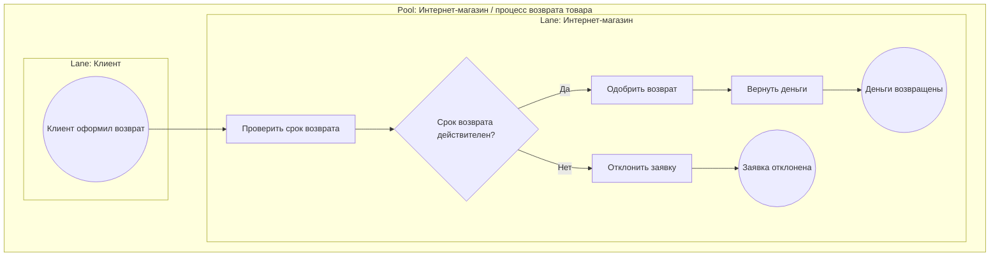

# Возврат товара в интернет-магазин: BPMN-модель процесса

## 0. Кейс и выбранная рамка

Выбранный кейс: **Кейс 3. Возврат товара в интернет-магазин**.

Процесс описывает базовый возврат товара в интернет-магазине: клиент оформляет заявку на возврат, магазин проверяет срок возврата, после чего либо одобряет возврат и возвращает деньги, либо отклоняет заявку. Модель специально оставлена компактной, потому что задача практики направлена на корректное применение базовых элементов BPMN 2.0: start event, task, exclusive gateway, sequence flow и end event.

Цель BPMN-модели: показать понятный сквозной процесс с разделением ответственности между клиентом и интернет-магазином, явным решением по сроку возврата и завершением каждой ветки без висящих потоков.

Остальные кейсы из практики не моделируются. В документе выбран ровно один кейс, чтобы диаграмма оставалась однозначной и не смешивала разные процессы.

Ограничительная рамка:

| В scope | Out of scope |
|---|---|
| Клиент оформляет заявку на возврат | Детальная логистика обратной доставки |
| Интернет-магазин проверяет срок возврата | Проверка качества товара, брака и комплектации |
| XOR Gateway принимает решение по сроку возврата | Частичные возвраты, обмен товара и гарантийный ремонт |
| При действительном сроке магазин одобряет возврат | Сложные платежные исключения и банковские споры |
| После одобрения магазин возвращает деньги | Автоматизация склада, CRM и accounting-проводки |
| При истекшем сроке магазин отклоняет заявку | Многоуровневое согласование с менеджером |

Ключевой принцип модели: решение о возврате строится вокруг одного условия — **срок возврата действителен?**. Если ответ "Да", процесс идет к возврату денег. Если ответ "Нет", процесс завершается отказом.

## 1. Участники, Pool и Lanes

### 1.1 Pool

В модели используется один Pool: **"Интернет-магазин / процесс возврата товара"**.

Такой Pool показывает, что диаграмма описывает один end-to-end процесс возврата в рамках взаимодействия клиента и магазина. Внутри Pool процесс разделен на дорожки по ролям.

### 1.2 Lanes

| Lane | Роль в процессе | Ответственность |
|---|---|---|
| Клиент | Инициатор процесса | Оформляет заявку на возврат товара |
| Интернет-магазин | Исполнитель и владелец решения | Проверяет срок, одобряет или отклоняет возврат, возвращает деньги |

В этой версии модели платежный провайдер не выделяется в отдельную Lane. Операция "Вернуть деньги" остается задачей интернет-магазина, потому что учебный кейс требует простую BPMN-диаграмму с двумя дорожками: клиент и интернет-магазин.

## 2. Элементы BPMN

### 2.1 Реестр элементов

| ID | BPMN-элемент | Название на диаграмме | Lane | Назначение |
|---|---|---|---|---|
| S1 | Start Event | Клиент оформил возврат | Клиент | Запускает процесс после подачи заявки |
| T1 | Task | Проверить срок возврата | Интернет-магазин | Проверяет, не истек ли период возврата |
| G1 | Exclusive Gateway (XOR) | Срок возврата действителен? | Интернет-магазин | Разделяет процесс на ветку одобрения и ветку отказа |
| T2 | Task | Одобрить возврат | Интернет-магазин | Фиксирует положительное решение по заявке |
| T3 | Task | Вернуть деньги | Интернет-магазин | Выполняет возврат денежных средств клиенту |
| E1 | End Event | Деньги возвращены | Интернет-магазин | Завершает успешную ветку процесса |
| T4 | Task | Отклонить заявку | Интернет-магазин | Фиксирует отказ, если срок возврата истек |
| E2 | End Event | Заявка отклонена | Интернет-магазин | Завершает ветку отказа |

### 2.2 Sequence Flow

| Поток | Откуда | Куда | Подпись |
|---|---|---|---|
| F1 | S1 | T1 | Заявка передана в обработку |
| F2 | T1 | G1 | Срок проверен |
| F3 | G1 | T2 | Да |
| F4 | T2 | T3 | Возврат одобрен |
| F5 | T3 | E1 | Деньги возвращены |
| F6 | G1 | T4 | Нет |
| F7 | T4 | E2 | Заявка отклонена |

После XOR Gateway исходящие потоки подписаны "Да" и "Нет". Это делает условие однозначным и соответствует базовой практике BPMN: у развилки должен быть понятный вопрос, а у веток — понятные подписи.

### 2.3 Почему выбран XOR Gateway

Для этого процесса подходит **Exclusive Gateway (XOR)**, потому что после проверки срока возврата возможна только одна ветка:

| Условие | Ветка |
|---|---|
| Срок возврата действителен | Одобрить возврат -> вернуть деньги -> завершить процесс |
| Срок возврата истек | Отклонить заявку -> завершить процесс |

Параллельный Gateway здесь не нужен: магазин не должен одновременно одобрять и отклонять одну и ту же заявку. Закрывающий Gateway также не нужен, потому что ветки не объединяются обратно в общий поток; каждая ветка завершается собственным End Event.

## 3. Поток процесса

### 3.1 Основной сценарий: возврат одобрен

1. Клиент оформляет возврат товара.
2. Интернет-магазин получает заявку и проверяет срок возврата.
3. XOR Gateway задает вопрос: "Срок возврата действителен?"
4. Если ответ "Да", интернет-магазин одобряет возврат.
5. Интернет-магазин возвращает деньги клиенту.
6. Процесс завершается событием "Деньги возвращены".

### 3.2 Альтернативный сценарий: заявка отклонена

1. Клиент оформляет возврат товара.
2. Интернет-магазин получает заявку и проверяет срок возврата.
3. XOR Gateway задает вопрос: "Срок возврата действителен?"
4. Если ответ "Нет", интернет-магазин отклоняет заявку.
5. Процесс завершается событием "Заявка отклонена".

### 3.3 Табличное представление процесса

| Шаг | Lane | Тип элемента | Действие / событие | Следующий шаг |
|---|---|---|---|---|
| 1 | Клиент | Start Event | Клиент оформил возврат | Проверить срок возврата |
| 2 | Интернет-магазин | Task | Проверить срок возврата | XOR Gateway |
| 3 | Интернет-магазин | Exclusive Gateway | Срок возврата действителен? | Да -> одобрение; Нет -> отказ |
| 4A | Интернет-магазин | Task | Одобрить возврат | Вернуть деньги |
| 5A | Интернет-магазин | Task | Вернуть деньги | Деньги возвращены |
| 6A | Интернет-магазин | End Event | Деньги возвращены | Процесс завершен |
| 4B | Интернет-магазин | Task | Отклонить заявку | Заявка отклонена |
| 5B | Интернет-магазин | End Event | Заявка отклонена | Процесс завершен |

## 4. BPMN-диаграмма в Markdown/Mermaid representation

Ниже приведена текстовая визуализация BPMN-модели в Mermaid flowchart. Это **не** файл `.bpmn`, `.drawio` и не экспорт из draw.io/bpmn.io. Mermaid используется только как markdown-представление для сдачи: оно сохраняет смысловую структуру процесса — Pool, Lanes, start event, tasks, XOR gateway, подписанные ветки "Да"/"Нет" и end events.

В формальном BPMN-редакторе Pool и Lanes нужно отрисовать настоящими swimlanes. В Mermaid они показаны через вложенные `subgraph`, поэтому это компактная текстовая проекция, а не машинно-валидируемый BPMN 2.0 XML.

### 4.1 Как вручную перенести схему в draw.io или bpmn.io

При ручной отрисовке в BPMN-редакторе нужно использовать следующие формы:

| BPMN-форма | Элемент из модели | Как подписать |
|---|---|---|
| Pool | Интернет-магазин / процесс возврата товара | Название Pool слева или сверху |
| Lane | Клиент | Верхняя дорожка |
| Lane | Интернет-магазин | Нижняя дорожка |
| Thin circle | Start Event | Клиент оформил возврат |
| Rounded rectangle | Task | Проверить срок возврата |
| Diamond | XOR Gateway | Срок возврата действителен? |
| Rounded rectangle | Task | Одобрить возврат |
| Rounded rectangle | Task | Вернуть деньги |
| Thick circle | End Event | Деньги возвращены |
| Rounded rectangle | Task | Отклонить заявку |
| Thick circle | End Event | Заявка отклонена |

Рекомендуемое расположение: слева направо. Стартовое событие размещается в Lane "Клиент", остальные действия и решение — в Lane "Интернет-магазин". Ветка "Да" идет по верхней или центральной линии к одобрению и возврату денег. Ветка "Нет" уходит вниз или ниже основного потока к отклонению заявки и отдельному завершению.

## 5. Логическая проверка модели

### 5.1 Проверка выбранного кейса и формата модели

| Проверка | Результат |
|---|---|
| Выбран ровно один кейс | Да, только Кейс 3 "Возврат товара в интернет-магазин" |
| В документе нет смешения с другими кейсами | Да, элементы процесса относятся только к возврату товара |
| Документ не заявляет наличие отдельного draw.io/bpmn.io файла | Да, указано, что создано Markdown/Mermaid-представление процесса |
| Markdown representation не заменяет BPMN XML | Да, Mermaid явно описан как текстовая визуализация |
| Pool и Lanes присутствуют в модели | Да, Pool "Интернет-магазин / процесс возврата товара", Lanes "Клиент" и "Интернет-магазин" |

### 5.2 Проверка happy path

| Проверка | Результат |
|---|---|
| Есть одно стартовое событие | Да, S1 |
| После старта есть задача обработки | Да, T1 "Проверить срок возврата" |
| Условие вынесено в Gateway | Да, G1 |
| Положительная ветка подписана | Да, "Да" |
| При действительном сроке возврат одобряется | Да, T2 |
| После одобрения показан возврат денег | Да, T3 |
| Успешная ветка завершается End Event | Да, E1 |

### 5.3 Проверка reject path

| Проверка | Результат |
|---|---|
| Отрицательная ветка подписана | Да, "Нет" |
| При недействительном сроке заявка отклоняется | Да, T4 |
| После отказа процесс завершается | Да, E2 |
| Отказ не переходит к возврату денег | Да, ветка T4 ведет только к E2 |
| Нет висящих потоков | Да, каждая ветка имеет End Event |

### 5.4 Проверка на избыточность

| Возможное усложнение | Решение в этой модели | Почему |
|---|---|---|
| Отдельный платежный провайдер | Не выделяется | Учебный кейс требует простую модель с Lane "Клиент" и "Интернет-магазин" |
| Проверка состояния товара | Не добавляется | В заданном кейсе ключевое условие только срок возврата |
| Проверка доставки возврата | Не добавляется | Это отдельный подпроцесс логистики |
| Уведомление клиента | Не добавляется как отдельная Task | Базовый набор задач уже покрывает обязательную BPMN-логику кейса |
| Закрывающий Gateway | Не добавляется | Ветки не объединяются, каждая завершается собственным End Event |

## 6. Best Practices check

| Best practice | Выполнение | Комментарий |
|---|---|---|
| Использовать Pool и Lanes | PASS | Есть один Pool и две дорожки: "Клиент" и "Интернет-магазин" |
| Разделять зоны ответственности | PASS | Клиент только инициирует возврат; магазин принимает решение и выполняет возврат денег |
| Начинать процесс с одного Start Event | PASS | В модели один старт: "Клиент оформил возврат" |
| Завершать процесс End Event | PASS | У успешной и отказной ветки есть отдельные End Event |
| Все действия отображать через Task | PASS | Проверка, одобрение, возврат денег и отклонение заявки оформлены как Task |
| Использовать Gateway для условия | PASS | Проверка результата оформлена через XOR Gateway |
| Подписывать Gateway вопросом | PASS | Gateway подписан: "Срок возврата действителен?" |
| Подписывать исходящие потоки Gateway | PASS | Ветки подписаны "Да" и "Нет" |
| Использовать названия "глагол + существительное" | PASS | "Проверить срок возврата", "Одобрить возврат", "Вернуть деньги", "Отклонить заявку" |
| Вести поток слева направо | PASS | Mermaid-схема построена в направлении LR; при переносе в BPMN-редактор сохраняется компактный порядок S1 -> T1 -> G1 |
| Избегать пересечений линий | PASS | Ветки короткие и не требуют пересечения |
| Не перегружать диаграмму | PASS | Модель содержит только элементы, нужные для учебного кейса |

## 7. Итоговая спецификация для сдачи

Итоговая BPMN-модель инкапсулирует процесс возврата товара в интернет-магазине на уровне учебной практики:

| Параметр | Значение |
|---|---|
| Выбранный кейс | Кейс 3. Возврат товара в интернет-магазин |
| Pool | Интернет-магазин / процесс возврата товара |
| Lanes | Клиент; Интернет-магазин |
| Start Event | Клиент оформил возврат |
| Основная проверка | Срок возврата действителен? |
| Gateway | Exclusive Gateway (XOR) |
| Ветка "Да" | Одобрить возврат -> вернуть деньги -> деньги возвращены |
| Ветка "Нет" | Отклонить заявку -> заявка отклонена |
| End Events | Деньги возвращены; заявка отклонена |
| Реальный `.bpmn` / `.drawio` файл | Не создавался; документ содержит Markdown/Mermaid-представление процесса |
| Замечания по полноте модели | Отсутствуют |

Диаграмма соответствует обязательным элементам кейса: старту, проверке срока возврата, XOR-развилке с подписями "Да"/"Нет", задачам одобрения, отклонения и возврата денег, а также корректному завершению процесса после каждой ветки.
