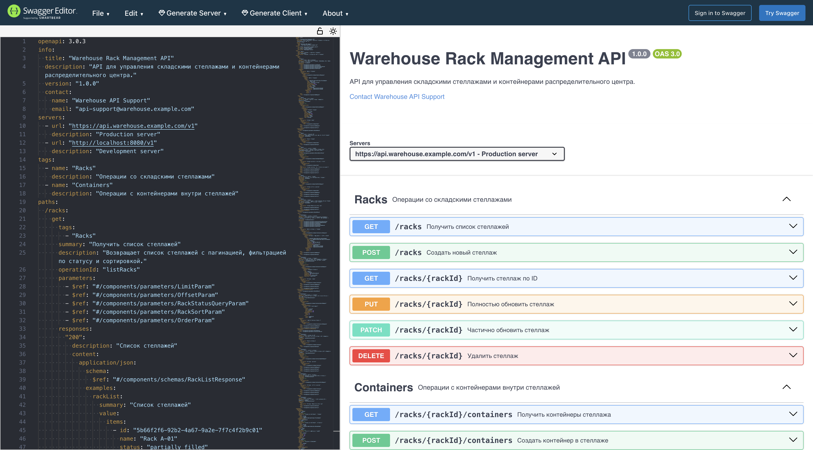

# Warehouse API: управление складскими стеллажами и контейнерами

## Задание 1. Выбор предметной области и рамка API

Кейс: **складская логистика** для распределительного центра, где WMS должна управлять стеллажами, их загрузкой и размещенными контейнерами.

Основной объект: **стеллаж** (`Rack`). Стеллаж описывает физическое место хранения в складской зоне: максимальную нагрузку, материал, номер пролета, текущую загрузку и операционный статус.

Подчиненный объект: **контейнер** (`Container`). Контейнер относится к одному стеллажу и отражает единицу размещения: паллету, ящик, короб, холодильный бокс или bulk-bin.

Выбранная связь: `Rack 1 -> N Container`. Один стеллаж может содержать много контейнеров, но каждый контейнер в рамках API закреплен только за одним родительским стеллажом через `parent_id`.

Ограничительная рамка:

| В scope | Out of scope |
|---|---|
| Управление стеллажами распределительного центра | Управление всеми складами компании как сетью |
| CRUD по стеллажам | Детальная интеграция с ERP и транспортной логистикой |
| CRUD по контейнерам внутри стеллажа | Физическая автоматизация роботов, конвейеров и датчиков |
| Фильтрация, пагинация, сортировка и поиск контейнеров | Оптимизационные алгоритмы размещения товара |
| OpenAPI 3.0.3 спецификация для REST API | Реализация backend-кода и базы данных |
| Подготовка спецификации для Swagger Editor | Заявление о внешней Swagger-проверке без фактической проверки |

Ключевой принцип API: стеллаж является родительским ресурсом и операционной границей вместимости. Контейнер не создается отдельно от стеллажа, потому что его размещение должно быть проверяемым относительно конкретной складской ячейки.

### 1.1 Обоснование выбора предметной области

Складская логистика выбрана потому, что она хорошо показывает реальную управленческую задачу: нужно видеть занятость складских мест, контролировать нагрузку и быстро находить проблемные контейнеры. Модель `Rack -> Container` естественно демонстрирует связь "один ко многим": один стеллаж содержит несколько контейнеров, а статусы контейнеров напрямую влияют на статус и доступность родительского стеллажа. Такая область удобна для REST API, потому что в ней есть и базовые CRUD-операции, и полезные специальные запросы: фильтрация по типу, статусу, сортировка по весу и поиск по сложным условиям.

## Задание 2. Объектная модель

### 2.1 Главный объект: Rack

| Атрибут | Тип | Обязательность | Описание |
|---|---|---|---|
| `id` | string, UUID | да | Уникальный идентификатор стеллажа |
| `name` | string | да | Наименование стеллажа, например `Rack A-01` |
| `status` | enum | да | Операционный статус стеллажа |
| `max_load_kg` | number | да | Максимальная допустимая нагрузка в килограммах |
| `current_load_kg` | number | да | Текущая расчетная нагрузка стеллажа |
| `material` | enum | да | Материал конструкции |
| `bay_number` | string | да | Номер пролета или складской позиции, например `A-01` |
| `zone` | enum | да | Складская зона: приемка, хранение, комплектация или отгрузка |
| `created_at` | string, date-time | да | Дата создания записи |
| `updated_at` | string, date-time | да | Дата последнего обновления |

Статусы `RackStatus`:

| Статус | Значение |
|---|---|
| `empty` | стеллаж пуст |
| `partially_filled` | стеллаж частично заполнен |
| `full` | стеллаж заполнен |
| `reserved` | стеллаж зарезервирован под размещение |
| `archived` | стеллаж выведен из активного складского контура |

### 2.2 Подчиненный объект: Container

| Атрибут | Тип | Обязательность | Описание |
|---|---|---|---|
| `id` | string, UUID | да | Уникальный идентификатор контейнера |
| `parent_id` | string, UUID | да | Ссылка на родительский стеллаж `Rack.id` |
| `type` | enum | да | Тип контейнера |
| `status` | enum | да | Операционный статус контейнера |
| `sku_batch` | string | да | Партия или SKU-группа, размещенная в контейнере |
| `weight_kg` | number | да | Вес контейнера с товаром |
| `position_code` | string | да | Код позиции внутри стеллажа, например `A-01-L2-P03` |
| `expires_at` | string, date | нет | Срок годности партии, если применимо |
| `created_at` | string, date-time | да | Дата создания записи |
| `updated_at` | string, date-time | да | Дата последнего обновления |

Типы `ContainerType`:

| Тип | Значение |
|---|---|
| `pallet` | паллета |
| `tote` | пластиковый складской ящик |
| `crate` | короб или обрешетка |
| `cold_box` | термоконтейнер |
| `bulk_bin` | контейнер для сыпучих или массовых товаров |

Статусы `ContainerStatus`:

| Статус | Значение |
|---|---|
| `stored` | размещен на стеллаже |
| `reserved` | зарезервирован под отбор или перемещение |
| `moving` | находится в перемещении |
| `damaged` | поврежден или требует проверки |
| `shipped` | отгружен со склада |
| `quarantined` | заблокирован до контроля качества |
| `archived` | контейнер удален из активного складского учета |

## Задание 3. Список запросов

### 3.1 CRUD операции для стеллажей

| N | Метод и путь | Назначение | Параметры |
|---|---|---|---|
| 1 | `GET /racks` | Получить список стеллажей | `limit`, `offset`, `status`, `sort`, `order` |
| 2 | `GET /racks/{rackId}` | Получить стеллаж по ID | `rackId` |
| 3 | `POST /racks` | Создать новый стеллаж | JSON body `RackCreateRequest` |
| 4 | `PUT /racks/{rackId}` | Полностью обновить стеллаж | `rackId`, JSON body `RackUpdateRequest`, optional `returnDetails` |
| 5 | `PATCH /racks/{rackId}` | Частично обновить стеллаж | `rackId`, JSON body `RackPatchRequest` |
| 6 | `DELETE /racks/{rackId}` | Архивировать стеллаж; операция блокируется при активных контейнерах | `rackId` |

### 3.2 Операции с контейнерами внутри стеллажа

| N | Метод и путь | Назначение | Параметры |
|---|---|---|---|
| 7 | `GET /racks/{rackId}/containers` | Получить все контейнеры стеллажа | `rackId`, `limit`, `offset`, `status`, `type`, `sortBy`, `order` |
| 8 | `GET /racks/{rackId}/containers/{containerId}` | Получить конкретный контейнер | `rackId`, `containerId` |
| 9 | `POST /racks/{rackId}/containers` | Создать контейнер в стеллаже | `rackId`, JSON body `ContainerCreateRequest` |
| 10 | `PUT /racks/{rackId}/containers/{containerId}` | Полностью обновить контейнер | `rackId`, `containerId`, JSON body `ContainerUpdateRequest` |
| 11 | `PATCH /racks/{rackId}/containers/{containerId}` | Частично обновить контейнер | `rackId`, `containerId`, JSON body `ContainerPatchRequest` |
| 12 | `DELETE /racks/{rackId}/containers/{containerId}` | Архивировать контейнер внутри стеллажа | `rackId`, `containerId` |

### 3.3 Специальные запросы

| N | Метод и путь | Назначение | Пример |
|---|---|---|---|
| 13 | `GET /racks/{rackId}/containers?status={status}` | Фильтрация контейнеров по статусу | `/racks/{rackId}/containers?status=damaged` |
| 14 | `GET /racks/{rackId}/containers?type={type}&status={status}` | Фильтрация по типу и статусу | `/racks/{rackId}/containers?type=pallet&status=stored` |
| 15 | `GET /racks/{rackId}/containers?limit={n}&sortBy={field}&order=DESC` | Пагинация и сортировка | `/racks/{rackId}/containers?limit=20&sortBy=weight_kg&order=DESC` |
| 16 | `POST /racks/{rackId}/containers/search` | Поиск контейнеров с телом запроса | фильтры по `status`, `type`, `min_weight_kg`, `max_weight_kg` |
| 17 | `PUT /racks/{rackId}?returnDetails={boolean}` | Условное поведение обновления | при `returnDetails=true` ответ содержит обновленный `Rack` |

### 3.4 Правила поведения API

| Правило | Описание |
|---|---|
| Мягкое удаление стеллажа | `DELETE /racks/{rackId}` переводит стеллаж в статус `archived` и возвращает `204`; если есть активные контейнеры, API возвращает `409 Conflict` |
| Мягкое удаление контейнера | `DELETE /racks/{rackId}/containers/{containerId}` переводит контейнер в статус `archived`, чтобы не терять историю размещения |
| Системный архивный статус | `archived` может появиться в ответах и фильтрах, но не принимается в create/update body; архивирование выполняется только через `DELETE` |
| Контроль родителя | Любой `/containers/{containerId}` проверяет, что контейнер принадлежит именно переданному `rackId` |
| Контроль нагрузки | Создание или обновление контейнера не должно приводить к превышению `Rack.max_load_kg` |
| Конфликт статусов | Контейнер со статусом `damaged` или `quarantined` не должен автоматически переводить стеллаж в `full`; это отдельное операционное решение |
| Единый формат ошибок | Все ошибки возвращаются через `ErrorResponse` с `code`, `message`, `details`, `trace_id` |

## Задание 4. OpenAPI спецификация

Ниже приведен полный файл `openapi.yaml`, встроенный в отчет.

```yaml
openapi: 3.0.3
info:
  title: "Warehouse Rack Management API"
  description: "API для управления складскими стеллажами и контейнерами распределительного центра."
  version: "1.0.0"
  contact:
    name: "Warehouse API Support"
    email: "api-support@warehouse.example.com"
servers:
  - url: "https://api.warehouse.example.com/v1"
    description: "Production server"
  - url: "http://localhost:8080/v1"
    description: "Development server"
tags:
  - name: "Racks"
    description: "Операции со складскими стеллажами"
  - name: "Containers"
    description: "Операции с контейнерами внутри стеллажей"
paths:
  /racks:
    get:
      tags:
        - "Racks"
      summary: "Получить список стеллажей"
      description: "Возвращает список стеллажей с пагинацией, фильтрацией по статусу и сортировкой."
      operationId: "listRacks"
      parameters:
        - $ref: "#/components/parameters/LimitParam"
        - $ref: "#/components/parameters/OffsetParam"
        - $ref: "#/components/parameters/RackStatusQueryParam"
        - $ref: "#/components/parameters/RackSortParam"
        - $ref: "#/components/parameters/OrderParam"
      responses:
        "200":
          description: "Список стеллажей"
          content:
            application/json:
              schema:
                $ref: "#/components/schemas/RackListResponse"
              examples:
                rackList:
                  summary: "Список стеллажей"
                  value:
                    items:
                      - id: "5b66f2f6-92b2-4a67-9a2e-7f7c4f2b9c01"
                        name: "Rack A-01"
                        status: "partially_filled"
                        max_load_kg: 1200
                        current_load_kg: 640
                        material: "steel"
                        bay_number: "A-01"
                        zone: "storage"
                        created_at: "2026-05-07T10:00:00Z"
                        updated_at: "2026-05-07T12:30:00Z"
                    pagination:
                      limit: 10
                      offset: 0
                      total: 1
        "400":
          $ref: "#/components/responses/BadRequest"
    post:
      tags:
        - "Racks"
      summary: "Создать новый стеллаж"
      description: "Создает складской стеллаж с указанными характеристиками."
      operationId: "createRack"
      requestBody:
        required: true
        content:
          application/json:
            schema:
              $ref: "#/components/schemas/RackCreateRequest"
            examples:
              createRack:
                summary: "Создание стеллажа"
                value:
                  name: "Rack B-03"
                  status: "empty"
                  max_load_kg: 1500
                  current_load_kg: 0
                  material: "steel"
                  bay_number: "B-03"
                  zone: "picking"
      responses:
        "201":
          description: "Стеллаж создан"
          content:
            application/json:
              schema:
                $ref: "#/components/schemas/Rack"
        "400":
          $ref: "#/components/responses/BadRequest"
        "409":
          $ref: "#/components/responses/Conflict"
  /racks/{rackId}:
    parameters:
      - $ref: "#/components/parameters/RackIdParam"
    get:
      tags:
        - "Racks"
      summary: "Получить стеллаж по ID"
      description: "Возвращает детальную информацию по одному стеллажу."
      operationId: "getRackById"
      responses:
        "200":
          description: "Данные стеллажа"
          content:
            application/json:
              schema:
                $ref: "#/components/schemas/Rack"
        "404":
          $ref: "#/components/responses/NotFound"
    put:
      tags:
        - "Racks"
      summary: "Полностью обновить стеллаж"
      description: "Полностью заменяет данные стеллажа. Если `returnDetails=true`, возвращает обновленный объект."
      operationId: "replaceRack"
      parameters:
        - $ref: "#/components/parameters/ReturnDetailsParam"
      requestBody:
        required: true
        content:
          application/json:
            schema:
              $ref: "#/components/schemas/RackUpdateRequest"
      responses:
        "200":
          description: "Стеллаж обновлен и возвращен в ответе"
          content:
            application/json:
              schema:
                $ref: "#/components/schemas/Rack"
        "204":
          description: "Стеллаж обновлен, тело ответа не возвращается"
        "400":
          $ref: "#/components/responses/BadRequest"
        "404":
          $ref: "#/components/responses/NotFound"
        "409":
          $ref: "#/components/responses/Conflict"
    patch:
      tags:
        - "Racks"
      summary: "Частично обновить стеллаж"
      description: "Изменяет только переданные поля стеллажа."
      operationId: "patchRack"
      requestBody:
        required: true
        content:
          application/json:
            schema:
              $ref: "#/components/schemas/RackPatchRequest"
      responses:
        "200":
          description: "Стеллаж частично обновлен"
          content:
            application/json:
              schema:
                $ref: "#/components/schemas/Rack"
        "400":
          $ref: "#/components/responses/BadRequest"
        "404":
          $ref: "#/components/responses/NotFound"
        "409":
          $ref: "#/components/responses/Conflict"
    delete:
      tags:
        - "Racks"
      summary: "Удалить стеллаж"
      description: "Переводит стеллаж в статус archived. Если на стеллаже есть активные контейнеры, API возвращает конфликт."
      operationId: "deleteRack"
      responses:
        "204":
          description: "Стеллаж удален или архивирован"
        "404":
          $ref: "#/components/responses/NotFound"
        "409":
          $ref: "#/components/responses/Conflict"
  /racks/{rackId}/containers:
    parameters:
      - $ref: "#/components/parameters/RackIdParam"
    get:
      tags:
        - "Containers"
      summary: "Получить контейнеры стеллажа"
      description: "Возвращает контейнеры, размещенные на указанном стеллаже. Поддерживает фильтрацию по статусу, типу, пагинацию и сортировку."
      operationId: "listRackContainers"
      parameters:
        - $ref: "#/components/parameters/ContainerStatusQueryParam"
        - $ref: "#/components/parameters/ContainerTypeQueryParam"
        - $ref: "#/components/parameters/LimitParam"
        - $ref: "#/components/parameters/OffsetParam"
        - $ref: "#/components/parameters/ContainerSortByParam"
        - $ref: "#/components/parameters/OrderParam"
      responses:
        "200":
          description: "Список контейнеров стеллажа"
          content:
            application/json:
              schema:
                $ref: "#/components/schemas/ContainerListResponse"
              examples:
                filteredContainers:
                  summary: "Контейнеры типа pallet со статусом stored"
                  value:
                    items:
                      - id: "a9c4fbf3-48d4-4fb0-b7bc-0f5e7a6f9d44"
                        parent_id: "5b66f2f6-92b2-4a67-9a2e-7f7c4f2b9c01"
                        type: "pallet"
                        status: "stored"
                        sku_batch: "SKU-TEA-2026-05"
                        weight_kg: 320.5
                        position_code: "A-01-L2-P03"
                        expires_at: "2026-12-31"
                        created_at: "2026-05-07T10:20:00Z"
                        updated_at: "2026-05-07T10:20:00Z"
                    pagination:
                      limit: 20
                      offset: 0
                      total: 1
        "400":
          $ref: "#/components/responses/BadRequest"
        "404":
          $ref: "#/components/responses/NotFound"
    post:
      tags:
        - "Containers"
      summary: "Создать контейнер в стеллаже"
      description: "Создает контейнер внутри указанного стеллажа и проверяет, что размещение не превышает нагрузку стеллажа."
      operationId: "createRackContainer"
      requestBody:
        required: true
        content:
          application/json:
            schema:
              $ref: "#/components/schemas/ContainerCreateRequest"
            examples:
              createContainer:
                summary: "Создание контейнера"
                value:
                  type: "pallet"
                  status: "stored"
                  sku_batch: "SKU-COFFEE-2026-05"
                  weight_kg: 280
                  position_code: "A-01-L1-P02"
                  expires_at: "2026-11-30"
      responses:
        "201":
          description: "Контейнер создан"
          content:
            application/json:
              schema:
                $ref: "#/components/schemas/Container"
        "400":
          $ref: "#/components/responses/BadRequest"
        "404":
          $ref: "#/components/responses/NotFound"
        "409":
          $ref: "#/components/responses/Conflict"
  /racks/{rackId}/containers/search:
    parameters:
      - $ref: "#/components/parameters/RackIdParam"
    post:
      tags:
        - "Containers"
      summary: "Поиск контейнеров в стеллаже"
      description: "Выполняет поиск контейнеров по сложным условиям с телом запроса."
      operationId: "searchRackContainers"
      requestBody:
        required: true
        content:
          application/json:
            schema:
              $ref: "#/components/schemas/ContainerSearchRequest"
            examples:
              searchContainers:
                summary: "Поиск тяжелых паллет"
                value:
                  filters:
                    status: "stored"
                    type: "pallet"
                    min_weight_kg: 100
                    max_weight_kg: 500
                  pagination:
                    limit: 20
                    offset: 0
                  sort:
                    field: "weight_kg"
                    order: "DESC"
      responses:
        "200":
          description: "Результат поиска контейнеров"
          content:
            application/json:
              schema:
                $ref: "#/components/schemas/ContainerListResponse"
        "400":
          $ref: "#/components/responses/BadRequest"
        "404":
          $ref: "#/components/responses/NotFound"
  /racks/{rackId}/containers/{containerId}:
    parameters:
      - $ref: "#/components/parameters/RackIdParam"
      - $ref: "#/components/parameters/ContainerIdParam"
    get:
      tags:
        - "Containers"
      summary: "Получить контейнер по ID"
      description: "Возвращает конкретный контейнер внутри указанного стеллажа."
      operationId: "getRackContainerById"
      responses:
        "200":
          description: "Данные контейнера"
          content:
            application/json:
              schema:
                $ref: "#/components/schemas/Container"
        "404":
          $ref: "#/components/responses/NotFound"
    put:
      tags:
        - "Containers"
      summary: "Полностью обновить контейнер"
      description: "Полностью заменяет данные контейнера внутри указанного стеллажа."
      operationId: "replaceRackContainer"
      requestBody:
        required: true
        content:
          application/json:
            schema:
              $ref: "#/components/schemas/ContainerUpdateRequest"
      responses:
        "200":
          description: "Контейнер обновлен"
          content:
            application/json:
              schema:
                $ref: "#/components/schemas/Container"
        "400":
          $ref: "#/components/responses/BadRequest"
        "404":
          $ref: "#/components/responses/NotFound"
        "409":
          $ref: "#/components/responses/Conflict"
    patch:
      tags:
        - "Containers"
      summary: "Частично обновить контейнер"
      description: "Изменяет только переданные поля контейнера."
      operationId: "patchRackContainer"
      requestBody:
        required: true
        content:
          application/json:
            schema:
              $ref: "#/components/schemas/ContainerPatchRequest"
      responses:
        "200":
          description: "Контейнер частично обновлен"
          content:
            application/json:
              schema:
                $ref: "#/components/schemas/Container"
        "400":
          $ref: "#/components/responses/BadRequest"
        "404":
          $ref: "#/components/responses/NotFound"
        "409":
          $ref: "#/components/responses/Conflict"
    delete:
      tags:
        - "Containers"
      summary: "Удалить контейнер"
      description: "Переводит контейнер в статус archived внутри указанного стеллажа."
      operationId: "deleteRackContainer"
      responses:
        "204":
          description: "Контейнер удален или архивирован"
        "404":
          $ref: "#/components/responses/NotFound"
        "409":
          $ref: "#/components/responses/Conflict"
components:
  parameters:
    RackIdParam:
      name: "rackId"
      in: "path"
      required: true
      description: "Уникальный идентификатор стеллажа"
      schema:
        type: "string"
        format: "uuid"
      example: "5b66f2f6-92b2-4a67-9a2e-7f7c4f2b9c01"
    ContainerIdParam:
      name: "containerId"
      in: "path"
      required: true
      description: "Уникальный идентификатор контейнера"
      schema:
        type: "string"
        format: "uuid"
      example: "a9c4fbf3-48d4-4fb0-b7bc-0f5e7a6f9d44"
    LimitParam:
      name: "limit"
      in: "query"
      required: false
      description: "Количество записей на страницу"
      schema:
        type: "integer"
        minimum: 1
        maximum: 100
        default: 10
      example: 10
    OffsetParam:
      name: "offset"
      in: "query"
      required: false
      description: "Смещение для пагинации"
      schema:
        type: "integer"
        minimum: 0
        default: 0
      example: 0
    RackStatusQueryParam:
      name: "status"
      in: "query"
      required: false
      description: "Фильтр стеллажей по статусу"
      schema:
        $ref: "#/components/schemas/RackStatus"
      example: "partially_filled"
    ContainerStatusQueryParam:
      name: "status"
      in: "query"
      required: false
      description: "Фильтр контейнеров по статусу"
      schema:
        $ref: "#/components/schemas/ContainerStatus"
      example: "stored"
    ContainerTypeQueryParam:
      name: "type"
      in: "query"
      required: false
      description: "Фильтр контейнеров по типу"
      schema:
        $ref: "#/components/schemas/ContainerType"
      example: "pallet"
    RackSortParam:
      name: "sort"
      in: "query"
      required: false
      description: "Поле сортировки для стеллажей"
      schema:
        type: "string"
        enum:
          - "name"
          - "status"
          - "bay_number"
          - "zone"
          - "created_at"
          - "updated_at"
        default: "name"
      example: "name"
    ContainerSortByParam:
      name: "sortBy"
      in: "query"
      required: false
      description: "Поле сортировки для контейнеров"
      schema:
        type: "string"
        enum:
          - "type"
          - "status"
          - "sku_batch"
          - "weight_kg"
          - "position_code"
          - "created_at"
          - "updated_at"
        default: "created_at"
      example: "weight_kg"
    OrderParam:
      name: "order"
      in: "query"
      required: false
      description: "Порядок сортировки"
      schema:
        type: "string"
        enum:
          - "ASC"
          - "DESC"
        default: "ASC"
      example: "DESC"
    ReturnDetailsParam:
      name: "returnDetails"
      in: "query"
      required: false
      description: "Если true, PUT /racks/{rackId} возвращает обновленный объект; если false, может вернуть 204 без тела."
      schema:
        type: "boolean"
        default: true
      example: true
  responses:
    BadRequest:
      description: "Некорректный запрос"
      content:
        application/json:
          schema:
            $ref: "#/components/schemas/ErrorResponse"
          example:
            code: 400
            message: "Invalid request"
            details: "limit must be between 1 and 100"
            trace_id: "trace-20260507-001"
    NotFound:
      description: "Ресурс не найден"
      content:
        application/json:
          schema:
            $ref: "#/components/schemas/ErrorResponse"
          example:
            code: 404
            message: "Resource not found"
            details: "Rack with provided id does not exist"
            trace_id: "trace-20260507-002"
    Conflict:
      description: "Конфликт бизнес-правил"
      content:
        application/json:
          schema:
            $ref: "#/components/schemas/ErrorResponse"
          example:
            code: 409
            message: "Rack capacity conflict"
            details: "Container weight exceeds rack max_load_kg"
            trace_id: "trace-20260507-003"
  schemas:
    RackStatus:
      type: "string"
      description: "Операционный статус стеллажа"
      enum:
        - "empty"
        - "partially_filled"
        - "full"
        - "reserved"
        - "archived"
      example: "partially_filled"
    RackWriteStatus:
      type: "string"
      description: "Статус стеллажа, допустимый во входных create/update запросах; archived назначается только через DELETE"
      enum:
        - "empty"
        - "partially_filled"
        - "full"
        - "reserved"
      example: "partially_filled"
    RackMaterial:
      type: "string"
      description: "Материал стеллажа"
      enum:
        - "steel"
        - "aluminum"
        - "composite"
      example: "steel"
    RackZone:
      type: "string"
      description: "Складская зона"
      enum:
        - "receiving"
        - "storage"
        - "picking"
        - "dispatch"
      example: "storage"
    ContainerType:
      type: "string"
      description: "Тип контейнера"
      enum:
        - "pallet"
        - "tote"
        - "crate"
        - "cold_box"
        - "bulk_bin"
      example: "pallet"
    ContainerStatus:
      type: "string"
      description: "Операционный статус контейнера"
      enum:
        - "stored"
        - "reserved"
        - "moving"
        - "damaged"
        - "shipped"
        - "quarantined"
        - "archived"
      example: "stored"
    ContainerWriteStatus:
      type: "string"
      description: "Статус контейнера, допустимый во входных create/update запросах; archived назначается только через DELETE"
      enum:
        - "stored"
        - "reserved"
        - "moving"
        - "damaged"
        - "shipped"
        - "quarantined"
      example: "stored"
    Pagination:
      type: "object"
      description: "Пагинация ответа"
      required:
        - "limit"
        - "offset"
        - "total"
      properties:
        limit:
          type: "integer"
          minimum: 1
          maximum: 100
          default: 10
          example: 10
        offset:
          type: "integer"
          minimum: 0
          default: 0
          example: 0
        total:
          type: "integer"
          minimum: 0
          description: "Общее количество записей"
          example: 42
    Rack:
      type: "object"
      required:
        - "id"
        - "name"
        - "status"
        - "max_load_kg"
        - "current_load_kg"
        - "material"
        - "bay_number"
        - "zone"
        - "created_at"
        - "updated_at"
      properties:
        id:
          type: "string"
          format: "uuid"
          description: "Уникальный идентификатор стеллажа"
          example: "5b66f2f6-92b2-4a67-9a2e-7f7c4f2b9c01"
        name:
          type: "string"
          minLength: 2
          maxLength: 120
          description: "Наименование стеллажа"
          example: "Rack A-01"
        status:
          $ref: "#/components/schemas/RackStatus"
        max_load_kg:
          type: "number"
          format: "float"
          minimum: 1
          description: "Максимальная допустимая нагрузка"
          example: 1200
        current_load_kg:
          type: "number"
          format: "float"
          minimum: 0
          description: "Текущая расчетная нагрузка"
          example: 640.5
        material:
          $ref: "#/components/schemas/RackMaterial"
        bay_number:
          type: "string"
          pattern: "^[A-Z]-[0-9]{2}$"
          description: "Номер пролета или складской позиции"
          example: "A-01"
        zone:
          $ref: "#/components/schemas/RackZone"
        created_at:
          type: "string"
          format: "date-time"
          example: "2026-05-07T10:00:00Z"
        updated_at:
          type: "string"
          format: "date-time"
          example: "2026-05-07T12:30:00Z"
    RackCreateRequest:
      type: "object"
      required:
        - "name"
        - "status"
        - "max_load_kg"
        - "material"
        - "bay_number"
        - "zone"
      properties:
        name:
          type: "string"
          minLength: 2
          maxLength: 120
          example: "Rack B-03"
        status:
          $ref: "#/components/schemas/RackWriteStatus"
        max_load_kg:
          type: "number"
          format: "float"
          minimum: 1
          example: 1500
        current_load_kg:
          type: "number"
          format: "float"
          minimum: 0
          default: 0
          example: 0
        material:
          $ref: "#/components/schemas/RackMaterial"
        bay_number:
          type: "string"
          pattern: "^[A-Z]-[0-9]{2}$"
          example: "B-03"
        zone:
          $ref: "#/components/schemas/RackZone"
    RackUpdateRequest:
      type: "object"
      required:
        - "name"
        - "status"
        - "max_load_kg"
        - "current_load_kg"
        - "material"
        - "bay_number"
        - "zone"
      properties:
        name:
          type: "string"
          minLength: 2
          maxLength: 120
          example: "Rack A-01"
        status:
          $ref: "#/components/schemas/RackWriteStatus"
        max_load_kg:
          type: "number"
          format: "float"
          minimum: 1
          example: 1200
        current_load_kg:
          type: "number"
          format: "float"
          minimum: 0
          example: 640.5
        material:
          $ref: "#/components/schemas/RackMaterial"
        bay_number:
          type: "string"
          pattern: "^[A-Z]-[0-9]{2}$"
          example: "A-01"
        zone:
          $ref: "#/components/schemas/RackZone"
    RackPatchRequest:
      type: "object"
      minProperties: 1
      properties:
        name:
          type: "string"
          minLength: 2
          maxLength: 120
          example: "Rack A-01 priority"
        status:
          $ref: "#/components/schemas/RackWriteStatus"
        max_load_kg:
          type: "number"
          format: "float"
          minimum: 1
          example: 1300
        current_load_kg:
          type: "number"
          format: "float"
          minimum: 0
          example: 700
        material:
          $ref: "#/components/schemas/RackMaterial"
        bay_number:
          type: "string"
          pattern: "^[A-Z]-[0-9]{2}$"
          example: "A-01"
        zone:
          $ref: "#/components/schemas/RackZone"
    RackListResponse:
      type: "object"
      required:
        - "items"
        - "pagination"
      properties:
        items:
          type: "array"
          items:
            $ref: "#/components/schemas/Rack"
        pagination:
          $ref: "#/components/schemas/Pagination"
    Container:
      type: "object"
      required:
        - "id"
        - "parent_id"
        - "type"
        - "status"
        - "sku_batch"
        - "weight_kg"
        - "position_code"
        - "created_at"
        - "updated_at"
      properties:
        id:
          type: "string"
          format: "uuid"
          description: "Уникальный идентификатор контейнера"
          example: "a9c4fbf3-48d4-4fb0-b7bc-0f5e7a6f9d44"
        parent_id:
          type: "string"
          format: "uuid"
          description: "ID родительского стеллажа"
          example: "5b66f2f6-92b2-4a67-9a2e-7f7c4f2b9c01"
        type:
          $ref: "#/components/schemas/ContainerType"
        status:
          $ref: "#/components/schemas/ContainerStatus"
        sku_batch:
          type: "string"
          minLength: 3
          maxLength: 80
          description: "Партия или SKU-группа"
          example: "SKU-TEA-2026-05"
        weight_kg:
          type: "number"
          format: "float"
          minimum: 0
          description: "Вес контейнера с товаром"
          example: 320.5
        position_code:
          type: "string"
          pattern: "^[A-Z]-[0-9]{2}-L[0-9]-P[0-9]{2}$"
          description: "Позиция контейнера внутри стеллажа"
          example: "A-01-L2-P03"
        expires_at:
          type: "string"
          format: "date"
          nullable: true
          description: "Срок годности партии, если применимо"
          example: "2026-12-31"
        created_at:
          type: "string"
          format: "date-time"
          example: "2026-05-07T10:20:00Z"
        updated_at:
          type: "string"
          format: "date-time"
          example: "2026-05-07T10:20:00Z"
    ContainerCreateRequest:
      type: "object"
      required:
        - "type"
        - "status"
        - "sku_batch"
        - "weight_kg"
        - "position_code"
      properties:
        type:
          $ref: "#/components/schemas/ContainerType"
        status:
          $ref: "#/components/schemas/ContainerWriteStatus"
        sku_batch:
          type: "string"
          minLength: 3
          maxLength: 80
          example: "SKU-COFFEE-2026-05"
        weight_kg:
          type: "number"
          format: "float"
          minimum: 0
          example: 280
        position_code:
          type: "string"
          pattern: "^[A-Z]-[0-9]{2}-L[0-9]-P[0-9]{2}$"
          example: "A-01-L1-P02"
        expires_at:
          type: "string"
          format: "date"
          nullable: true
          example: "2026-11-30"
    ContainerUpdateRequest:
      type: "object"
      required:
        - "type"
        - "status"
        - "sku_batch"
        - "weight_kg"
        - "position_code"
      properties:
        type:
          $ref: "#/components/schemas/ContainerType"
        status:
          $ref: "#/components/schemas/ContainerWriteStatus"
        sku_batch:
          type: "string"
          minLength: 3
          maxLength: 80
          example: "SKU-TEA-2026-05"
        weight_kg:
          type: "number"
          format: "float"
          minimum: 0
          example: 320.5
        position_code:
          type: "string"
          pattern: "^[A-Z]-[0-9]{2}-L[0-9]-P[0-9]{2}$"
          example: "A-01-L2-P03"
        expires_at:
          type: "string"
          format: "date"
          nullable: true
          example: "2026-12-31"
    ContainerPatchRequest:
      type: "object"
      minProperties: 1
      properties:
        type:
          $ref: "#/components/schemas/ContainerType"
        status:
          $ref: "#/components/schemas/ContainerWriteStatus"
        sku_batch:
          type: "string"
          minLength: 3
          maxLength: 80
          example: "SKU-TEA-2026-05"
        weight_kg:
          type: "number"
          format: "float"
          minimum: 0
          example: 300
        position_code:
          type: "string"
          pattern: "^[A-Z]-[0-9]{2}-L[0-9]-P[0-9]{2}$"
          example: "A-01-L2-P04"
        expires_at:
          type: "string"
          format: "date"
          nullable: true
          example: "2026-12-31"
    ContainerListResponse:
      type: "object"
      required:
        - "items"
        - "pagination"
      properties:
        items:
          type: "array"
          items:
            $ref: "#/components/schemas/Container"
        pagination:
          $ref: "#/components/schemas/Pagination"
    ContainerSearchRequest:
      type: "object"
      required:
        - "filters"
      properties:
        filters:
          type: "object"
          properties:
            status:
              $ref: "#/components/schemas/ContainerStatus"
            type:
              $ref: "#/components/schemas/ContainerType"
            min_weight_kg:
              type: "number"
              format: "float"
              minimum: 0
              example: 100
            max_weight_kg:
              type: "number"
              format: "float"
              minimum: 0
              example: 500
            position_prefix:
              type: "string"
              example: "A-01"
        pagination:
          type: "object"
          properties:
            limit:
              type: "integer"
              minimum: 1
              maximum: 100
              default: 20
              example: 20
            offset:
              type: "integer"
              minimum: 0
              default: 0
              example: 0
        sort:
          type: "object"
          properties:
            field:
              type: "string"
              enum:
                - "type"
                - "status"
                - "sku_batch"
                - "weight_kg"
                - "position_code"
                - "created_at"
                - "updated_at"
              default: "created_at"
              example: "weight_kg"
            order:
              type: "string"
              enum:
                - "ASC"
                - "DESC"
              default: "ASC"
              example: "DESC"
    ErrorResponse:
      type: "object"
      required:
        - "code"
        - "message"
        - "trace_id"
      properties:
        code:
          type: "integer"
          description: "HTTP-like код ошибки"
          example: 404
        message:
          type: "string"
          description: "Краткое описание ошибки"
          example: "Rack not found"
        details:
          type: "string"
          description: "Детали ошибки"
          example: "Rack with id 5b66f2f6-92b2-4a67-9a2e-7f7c4f2b9c01 does not exist"
        trace_id:
          type: "string"
          description: "Идентификатор трассировки запроса"
          example: "trace-20260507-002"
```

## Задание 5. Проверка спецификации

### 5.1 Что проверено в тексте отчета

| Проверка | Результат |
|---|---|
| Выбрана одна предметная область | выбрана складская логистика |
| Описан главный объект | `Rack` описан с `id`, `name`, `status` и дополнительными атрибутами |
| Описан подчиненный объект | `Container` описан с `id`, `parent_id`, `type`, `status` и дополнительными атрибутами |
| Перечислены CRUD endpoints главного объекта | пункты 1-6 закрыты |
| Перечислены endpoints подчиненного объекта | пункты 7-12 закрыты |
| Перечислены специальные endpoints | пункты 13-17 закрыты |
| Встроена OpenAPI спецификация | YAML OpenAPI 3.0.3 находится в разделе 4 |
| Есть schemas, parameters, responses, examples | присутствуют в `components` и `paths` |
| Swagger-проверка | приложен скриншот успешной проверки спецификации в Swagger Editor |

### 5.2 Swagger Editor validation

Спецификация подготовлена в формате OpenAPI 3.0.3 и встроена в раздел 4. YAML из раздела 4 проверен через Swagger Editor: редактор не показывает ошибок структуры, схем, параметров и ответов.



### 5.3 Вывод

В работе выбрана одна предметная область и построена связанная модель `Rack -> Container`: родительский ресурс отвечает за вместимость и складскую позицию, а подчиненный ресурс фиксирует единицу размещения внутри конкретного стеллажа. API покрывает базовые CRUD-операции, вложенные операции с контейнерами, специальные запросы с фильтрацией, сортировкой, пагинацией, поиском через тело запроса и условным поведением `returnDetails`.

Основная сложность спецификации состоит в согласовании жизненного цикла ресурсов: мягкое удаление должно быть отражено в статусах, операции с контейнером обязаны проверять родителя, а создание или обновление контейнера не должно нарушать ограничение `max_load_kg`. Эти правила вынесены в поведение API и отражены в ошибках `400`, `404`, `409` и едином `ErrorResponse`.
