# Древний Банк: VSM процесса добавления поля "Промокод"

## 0. Кейс и выбранная рамка

Компания: **Древний Банк**, вымышленный банк со старой монолитной системой на Java 8 и Oracle DB. Система работает около 10 лет, команда одновременно поддерживает legacy-монолит и постепенно движется к микросервисной архитектуре.

Процесс: **добавление нового поля "Промокод" в экран выписки по счету мобильного приложения**.

Цель VSM: показать поток от появления идеи до выхода фичи в production, отделить полезную работу от ожиданий и потерь, рассчитать Lead Time, Value-Added Time, Non-Value-Added Time и Process Cycle Efficiency.

Ограничительная рамка анализа:

| В scope | Out of scope |
|---|---|
| Поток от идеи маркетинга до production-релиза | Финансовая оценка стоимости команды |
| Очереди, согласования, разработка, ревью, тестирование, релиз | Перепроектирование всей банковской архитектуры |
| Календарные дни как единая расчетная единица | Почасовой календарь каждого сотрудника |
| Явные расчетные допущения для отсутствующих времен | Скрытая нормализация спорных интервалов |
| Lean-потери и их влияние на Lead Time | Детальный план внедрения улучшений |

Ключевой принцип расчета: если в исходном описании длительность этапа названа явно, она берется без изменения. Если длительность отсутствует или неоднозначна, она не подменяется молча: ниже указан отдельный `ASSUMPTION_*`.

## 1. Расчетные правила и допущения

Единица расчета: **календарный день**.

Рабочий день: **8 часов**. Поэтому "полдня" = 0.5 дня = 4 часа.

Классификация времени:

| Категория | Как считается в этом отчете |
|---|---|
| VA, Value-Added Time | Работа, которая впервые формирует, реализует, проверяет или выводит фичу к пользователю: уточнение требования, написание ТЗ, код, первичное функциональное тестирование, обязательный регресс, production-релиз. |
| NVA, Non-Value-Added Time | Ожидания, очереди, запасы, согласования без изменения фичи, задержки из-за занятости людей/стендов, переделки, повторные проверки после дефектов, rollback из-за ошибки конфигурации. |
| LT, Lead Time | Полный календарный путь от появления идеи до выхода в production. |
| PCE, Process Cycle Efficiency | `VA / LT * 100%`. |

Расчетные допущения:

| ID | Допущение | Почему нужно |
|---|---|---|
| ASSUMPTION_01_IDEA_AGE | Фраза "идея пришла от маркетинга две недели назад" включена в Lead Time как 14 дней ожидания/запаса до полноценной формализации. | Задание требует считать поток от появления идеи. Если исключить эти 14 дней, будет занижен общий LT. |
| ASSUMPTION_02_NOTEBOOK_ENTRY | Запись идеи PO в Блокнот не имеет отдельной длительности и считается 0 дней. | Время не указано; действие не меняет состояние фичи в управляемом backlog. |
| ASSUMPTION_03_ANALYST_MEETING | Обсуждение PO с аналитиком принято как 0.25 дня VA. | Время встречи не указано; для расчета нужен минимальный явный интервал на уточнение требования. |
| ASSUMPTION_04_INITIAL_QA | Первичное ручное функциональное тестирование принято как 1 день VA. | Тестировщик говорит, что прогнала ручные тесты, но не называет длительность. 1 день принят как консервативная оценка, сопоставимая с ретестом на следующий день. |
| ASSUMPTION_05_CODE_REVIEW_EFFORT | Активное время ревью не выделяется отдельно; указанные "через день" и "еще через день" считаются календарным ожиданием. | В исходных данных нет длительности самой проверки. Основной измеримый эффект для LT - очередь к единственному senior. |
| ASSUMPTION_06_RELEASE_ROLLBACK | Rollback из-за забытого конфига входит в 1 день релиза и отдельно не добавляется к LT. | DevOps прямо говорит, что релиз занял 1 день, а итоговый релиз был через 7 дней после готовности кода: 6 дней ожидания + 1 день релиза. |
| ASSUMPTION_07_APPROVAL_EFFORT | Согласование IT-безопасности и подпись CTO считаются NVA-ожиданием, а не отдельной VA-обработкой. | Источник описывает отпуск и подпись как календарную задержку; активное время содержательной проверки не названо. |
| ASSUMPTION_08_RETEST_SPLIT | Формулировка "перетестила на следующий день (1 день)" считается одним календарным днем NVA-цикла дефекта. | Источник не делит этот день на ожидание до следующего дня и активный ретест, поэтому день не дробится без дополнительной информации. |

Проверочный вариант без `ASSUMPTION_01_IDEA_AGE`: если считать старт не от появления идеи, а от начала формализации у PO, Lead Time будет на 14 дней меньше. Основной расчет ниже использует полный поток от идеи.

## 2. Этапы потока от идеи до production

| N | Этап | Тип этапа | Время, дней | VA, дней | NVA, дней | Основание |
|---:|---|---|---:|---:|---:|---|
| 1 | Идея маркетинга лежит у PO в неформальном виде: Блокнот вместо управляемого backlog | Ожидание / запас | 14.0 | 0.0 | 14.0 | `ASSUMPTION_01_IDEA_AGE`, `ASSUMPTION_02_NOTEBOOK_ENTRY` |
| 2 | Ожидание встречи PO с аналитиком | Ожидание | 3.0 | 0.0 | 3.0 | Явно указано: ждала встречи 3 дня |
| 3 | Обсуждение требования PO и аналитиком | Обработка | 0.25 | 0.25 | 0.0 | `ASSUMPTION_03_ANALYST_MEETING` |
| 4 | Аналитик пишет ТЗ с учетом трех баз и нескольких модулей | Обработка | 4.0 | 4.0 | 0.0 | Явно указано: ТЗ за 4 дня |
| 5 | Согласование с руководителем IT-безопасности из-за отпуска | Ожидание / согласование | 2.0 | 0.0 | 2.0 | Явно указано: заняло 2 дня |
| 6 | Подпись технического директора | Ожидание / согласование | 1.0 | 0.0 | 1.0 | Явно указано: еще 1 день |
| 7 | Передача подписанного ТЗ разработчику | Ожидание / handoff | 7.0 | 0.0 | 7.0 | Разработчик получил ТЗ через неделю после подписи |
| 8 | Ожидание свободной среды разработки | Ожидание | 2.0 | 0.0 | 2.0 | Явно указано: общий стенд, ждал 2 дня |
| 9 | Разработка кода и изменения в трех модулях | Обработка | 2.0 | 2.0 | 0.0 | Явно указано: написал код за 2 дня |
| 10 | Ожидание первого Code Review у единственного senior | Ожидание | 1.0 | 0.0 | 1.0 | Ревьюер проверил через день |
| 11 | Исправление 5 замечаний Code Review | Переделка | 0.5 | 0.0 | 0.5 | Явно указано: исправлял полдня |
| 12 | Ожидание повторного Code Review | Ожидание | 1.0 | 0.0 | 1.0 | Проверили еще через день |
| 13 | Очередь у тестировщика после готовности разработки | Ожидание | 3.0 | 0.0 | 3.0 | У QA было 4 другие задачи, взяла через 3 дня |
| 14 | Первичное ручное функциональное тестирование | Обработка | 1.0 | 1.0 | 0.0 | `ASSUMPTION_04_INITIAL_QA` |
| 15 | Исправление 2 багов после тестирования | Переделка / дефект | 0.5 | 0.0 | 0.5 | Явно указано: разработчик исправил за 0.5 дня |
| 16 | Ретест на следующий день после исправления | Переделка / повторная проверка | 1.0 | 0.0 | 1.0 | Явно указано: ретест на следующий день, 1 день |
| 17 | Ручной регресс по всему приложению | Обработка | 1.5 | 1.5 | 0.0 | Явно указано: регресс занял 1.5 дня вручную |
| 18 | Ожидание релизного окна: готово в среду, релиз во вторник | Ожидание | 6.0 | 0.0 | 6.0 | Явно указано: пришлось ждать 6 дней |
| 19 | Production-релиз ручными скриптами, rollback и повторный накат | Обработка | 1.0 | 1.0 | 0.0 | Явно указано: релиз занял 1 день, rollback включен по `ASSUMPTION_06_RELEASE_ROLLBACK` |

Итог по основному расчету:

| Метрика | Значение | Расчет |
|---|---:|---|
| Value-Added Time, VA | 9.75 дня | 0.25 + 4 + 2 + 1 + 1.5 + 1 |
| Non-Value-Added Time, NVA | 42.0 дня | LT - VA |
| Lead Time, LT | 51.75 дня | сумма всех этапов |
| Process Cycle Efficiency, PCE | 18.8% | 9.75 / 51.75 * 100 |

Проверочный расчет без 14 дней неформального хранения идеи:

| Метрика | Значение |
|---|---:|
| VA | 9.75 дня |
| NVA | 28.0 дня |
| LT | 37.75 дня |
| PCE | 25.8% |

Вывод: даже в более мягком варианте без 14 дней "идеи в Блокноте" процесс остается низкоэффективным: более 74% времени уходит не на создание ценности, а на очереди, согласования, handoff, переделки и релизные окна.

## 3. Табличная карта VSM

Эта таблица является табличной VSM-картой: каждый шаг показан в единой единице измерения, календарных днях. `CT, processing` отражает активную обработку или переделку, `Wait / delay` отражает простои и очереди, `Класс времени` показывает, попадает ли шаг в VA или NVA для итоговых расчетов.

| Поток | Процесс / очередь | CT, processing | Wait / delay | Класс времени | Накопленный LT |
|---:|---|---:|---:|---|---:|
| 1 | Идея маркетинга у PO в Блокноте | 0.0 | 14.0 | NVA: запас / неформальный backlog | 14.0 |
| 2 | Очередь до встречи с аналитиком | 0.0 | 3.0 | NVA: ожидание | 17.0 |
| 3 | Уточнение требования | 0.25 | 0.0 | VA | 17.25 |
| 4 | Написание ТЗ | 4.0 | 0.0 | VA | 21.25 |
| 5 | Согласование IT-безопасности | 0.0 | 2.0 | NVA: ожидание согласующего | 23.25 |
| 6 | Подпись CTO | 0.0 | 1.0 | NVA: approval wait | 24.25 |
| 7 | Передача ТЗ разработчику | 0.0 | 7.0 | NVA: handoff / очередь | 31.25 |
| 8 | Ожидание dev-стенда | 0.0 | 2.0 | NVA: общий ресурс | 33.25 |
| 9 | Кодирование | 2.0 | 0.0 | VA | 35.25 |
| 10 | Первое Code Review | 0.0 | 1.0 | NVA: очередь к senior | 36.25 |
| 11 | Исправление замечаний ревью | 0.5 | 0.0 | NVA: переделка | 36.75 |
| 12 | Повторное Code Review | 0.0 | 1.0 | NVA: очередь к senior | 37.75 |
| 13 | Очередь QA | 0.0 | 3.0 | NVA: WIP перед тестированием | 40.75 |
| 14 | Первичное ручное тестирование | 1.0 | 0.0 | VA | 41.75 |
| 15 | Исправление багов | 0.5 | 0.0 | NVA: defect rework | 42.25 |
| 16 | Ретест после дефекта | 1.0 | 0.0 | NVA: повторная проверка из-за дефекта, без дробления по `ASSUMPTION_08_RETEST_SPLIT` | 43.25 |
| 17 | Ручной regression testing | 1.5 | 0.0 | VA в текущем регламенте | 44.75 |
| 18 | Ожидание релизного окна | 0.0 | 6.0 | NVA: batch release window | 50.75 |
| 19 | Production-релиз | 1.0 | 0.0 | VA | 51.75 |

Карта показывает три главных накопителя LT:

| Узел накопления | Вклад в LT |
|---|---:|
| Неформальная идея в Блокноте | 14 дней |
| Handoff после подписи ТЗ | 7 дней |
| Релизное окно | 6 дней |

Только эти три узла дают **27 дней**, то есть **52.2% всего Lead Time**.

## 4. Визуальная карта VSM

Ниже та же карта в визуальном виде. Обозначения совпадают с таблицей: `CT` - processing time, `W` - waiting/delay time, все значения указаны в календарных днях.

```mermaid
flowchart LR
    A["Маркетинг: идея Промокода"] --> B["PO: Блокнот / неформальный запас<br/>W=14д, NVA"]
    B --> C["Очередь до аналитика<br/>W=3д, NVA"]
    C --> D["Уточнение требования<br/>CT=0.25д, VA"]
    D --> E["ТЗ аналитика<br/>CT=4д, VA"]
    E --> F["IT-безопасность<br/>W=2д, NVA"]
    F --> G["Подпись CTO<br/>W=1д, NVA"]
    G --> H["Handoff разработчику<br/>W=7д, NVA"]
    H --> I["Ожидание dev-стенда<br/>W=2д, NVA"]
    I --> J["Разработка<br/>CT=2д, VA"]
    J --> K["Code Review 1<br/>W=1д, NVA"]
    K --> L["Исправление замечаний<br/>CT=0.5д, NVA"]
    L --> M["Code Review 2<br/>W=1д, NVA"]
    M --> N["Очередь QA<br/>W=3д, NVA"]
    N --> O["Функциональные тесты<br/>CT=1д, VA"]
    O --> P["Исправление багов<br/>CT=0.5д, NVA"]
    P --> Q["Ретест<br/>CT=1д, NVA"]
    Q --> R["Ручной регресс<br/>CT=1.5д, VA"]
    R --> S["Релизное окно<br/>W=6д, NVA"]
    S --> T["Production release<br/>CT=1д, VA"]

    T --> U["Итог: VA=9.75д<br/>NVA=42д<br/>LT=51.75д<br/>PCE=18.8%"]
```

## 5. Анализ потерь Lean

| N | Вид потери Lean | Этапы VSM | Где проявляется | Влияние на LT, дней | Комментарий |
|---:|---|---|---|---:|---|
| 1 | Ожидание | 2, 5, 6, 10, 12, 13, 18 | Встреча с аналитиком, отпуск IT-безопасности, подпись CTO, очереди Code Review, очередь QA, релизное окно | 17.0 | Сумма явных ожиданий без учета Notepad и handoff: 3 + 2 + 1 + 1 + 1 + 3 + 6. |
| 2 | Запасы / незавершенная работа | 1, 7 | Идея лежит в Блокноте 14 дней; подписанное ТЗ ждет передачи разработчику 7 дней | 21.0 | Работа существует как inventory, но не движется по потоку. Это самый большой резерв сокращения LT. |
| 3 | Дефекты | 15, 16, 19 | Не сохраняется промокод при обновлении страницы; rollback из-за забытого конфига | 1.5 прямого LT + риск внутри релиза | Прямо посчитаны 0.5 дня исправления и 1 день ретеста. Rollback включен в 1 день релиза, поэтому не добавлен второй раз. |
| 4 | Переделки | 11, 12 | 5 замечаний Code Review и повторная отправка на ревью | 1.5 | 0.5 дня исправлений + 1 день ожидания повторного ревью. |
| 5 | Избыточная обработка | 17 | Ручной регресс всего приложения ради небольшого поля | 1.5 | В текущем банковском регламенте это приемочная работа, но с Lean-точки зрения отсутствие риск-ориентированной автоматизации растягивает LT. |
| 6 | Неиспользованный потенциал | 10, 12 | Единственный senior является узким местом Code Review | 2.0 | Две очереди по 1 дню возникают не из-за самой проверки, а из-за отсутствия распределенной review-capacity. |
| 7 | Лишние перемещения / handoff | 7 и частично 2, 5, 6, 10, 12, 13 | PO -> аналитик -> IT-безопасность -> CTO -> разработчик -> reviewer -> QA -> DevOps | 7.0 минимум | Минимально измеримый эффект - неделя между подписью ТЗ и получением разработчиком. Остальные handoff проявляются как очереди. |
| 8 | Ограничение общего ресурса | 8 | Общий dev-стенд, куда все "пихают код" | 2.0 | Среда разработки становится очередью перед началом кодирования. |

Минимум четыре потери выполнен: ожидание, запасы, дефекты, переделки, избыточная обработка, неиспользованный потенциал, лишние handoff и ограничение общего ресурса.

## 6. Основные причины длинного Lead Time

### 6.1 Процесс стартует вне управляемого потока

Идея сначала живет в Блокноте, а не в backlog с прозрачным статусом, SLA и владельцем следующего шага. Из-за этого уже на старте появляется 14 дней запаса. Для VSM это не "нулевой этап", а реальное ожидание, потому что бизнес-идея уже существует, но поток создания ценности еще не запущен.

### 6.2 Согласования работают как очереди, а не как встроенные проверки

IT-безопасность и CTO появляются как последовательные approval-gates. Они не меняют фичу, а ждут доступности конкретных людей. Для банка безопасность важна, но в текущем процессе контроль встроен поздно и превращается в задержку.

### 6.3 Техническая архитектура усиливает потери

Поле нужно сохранять в трех разных базах и менять три незнакомых модуля. Это не просто сложность разработки: такая архитектура повышает вероятность дефектов, ревью-замечаний, ручного регресса и rollback на релизе.

### 6.4 Узкие места сосредоточены в людях и средах

Один senior на Code Review, очередь QA, общий dev-стенд и ручной DevOps-релиз создают поток, где работа постоянно ждет ресурс. Это не проблема отдельного исполнителя; это операционная конструкция процесса.

### 6.5 Релизная политика создает batch delay

Готовность к релизу наступила в среду, но production возможен только во вторник/четверг после 18:00. В конкретном кейсе это добавило 6 дней ожидания. Для маленького изменения в UI/данных это диспропорционально большой вклад.

## 7. Что важнее всего сокращать

Приоритет улучшений выбран по влиянию на Lead Time, а не по удобству внедрения.

| Приоритет | Улучшение | Какую потерю закрывает | Потенциал сокращения LT |
|---:|---|---|---:|
| 1 | Перевести идеи из Блокнота в единый backlog с SLA на triage | Запасы / ожидание старта | До 14 дней |
| 2 | Ввести явный ownership handoff после подписи ТЗ: автоматическое назначение разработчика или pull из очереди | Handoff / незавершенная работа | До 7 дней |
| 3 | Перейти от редких batch-релизов к малым релизам с feature flag и автоматизированным deployment checklist | Ожидание релизного окна, rollback | До 6 дней ожидания + снижение риска релиза |
| 4 | Разделить review-capacity: backup senior, pair review, checklist для типовых полей | Очередь Code Review, переделки | 2.0-2.5 дня |
| 5 | Выделить независимую dev-среду или ephemeral environment для задачи | Очередь общего стенда | 2 дня |
| 6 | Автоматизировать smoke/regression для экрана выписки и сохранения поля | Ручной регресс, дефекты | 1.5 дня регресса + часть defect rework |
| 7 | Встроить security-review checklist на этапе ТЗ, а не отдельным отпускозависимым gate | Ожидание согласования | До 2 дней |

Суммарный реалистичный резерв только по явно измеренным ожиданиям: **минимум 30-35 дней**, если убрать неформальный backlog, недельный handoff, релизное окно, общий стенд и часть очередей ревью/QA.

## 8. Итоговая интерпретация

Процесс Древнего Банка выглядит не как медленная разработка, а как поток с длинными ожиданиями между короткими участками полезной работы.

Полезная работа занимает **9.75 дня** из **51.75 дня** полного Lead Time. Остальные **42.0 дня** уходят на очереди, согласования, запасы, handoff, переделки и ожидание релизного окна. PCE равен **18.8%**, то есть меньше одной пятой всего календарного времени реально приближает фичу к пользователю.

Самые тяжелые источники потерь:

| Потеря | Дни |
|---|---:|
| Неформальный запас идеи в Блокноте | 14 |
| Передача подписанного ТЗ разработчику | 7 |
| Ожидание релизного окна | 6 |
| Очередь QA | 3 |
| Ожидание dev-стенда | 2 |
| Очереди Code Review | 2 |

Если начать улучшение процесса с этих узлов, банк сможет сократить Lead Time сильнее, чем за счет ускорения самого кодирования: разработка занимает всего 2 дня, а измеренные ожидания вокруг нее - десятки дней.

## 9. Финальный расчет

VSM выполнен в рамках исходных данных и явно описанных расчетных допущений. Времена первичной QA, обсуждения с аналитиком и трактовка 14 дней идеи указаны отдельно, rollback не добавлен вторым днем, потому что входит в 1 день релиза, а спорные интервалы не дробятся без явного источника.

Сводные метрики:

| Метрика | Значение |
|---|---:|
| VA | 9.75 дня |
| NVA | 42.0 дня |
| LT | 51.75 дня |
| PCE | 18.8% |
