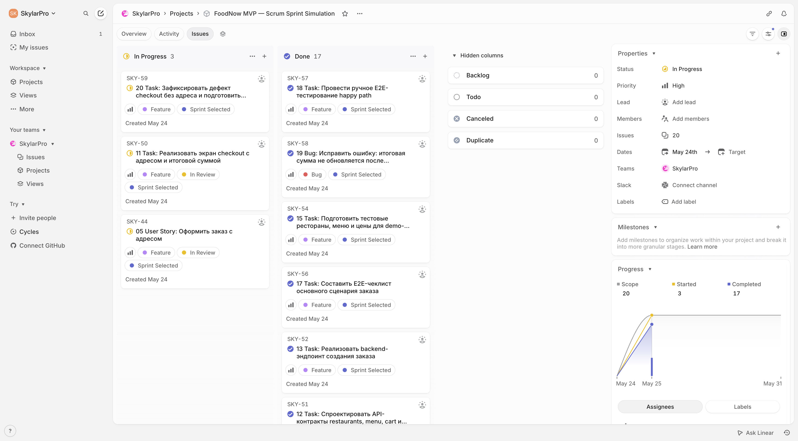

# FoodNow: симуляция Scrum-спринта для MVP заказа еды из ресторанов

## 0. Кейс и выбранная рамка

Тема кейса: **сервис заказа еды из ресторанов**.

Продукт: **FoodNow**, веб- и мобильный сервис, через который пользователь выбирает ресторан, собирает корзину, указывает адрес доставки, оплачивает заказ и отслеживает его базовый статус.

Цель симуляции: провести первый Scrum-спринт для MVP, который проверяет главную продуктовую гипотезу: пользователь может без звонков и ручных согласований оформить заказ из ресторана-партнера и получить понятное подтверждение, что заказ принят в работу.

Длительность спринта: **2 недели**.

Формат работы: Scrum-команда ведет задачи в Linear, проводит Sprint Planning, Daily Scrum, Sprint Review и Sprint Retrospective. На конец спринта доска показывает имитацию фактического выполнения: часть задач завершена, часть осталась в работе или заблокирована.

Ограничительная рамка MVP:

| В scope первого спринта | Out of scope первого спринта |
|---|---|
| Один город запуска | Масштабирование на несколько городов |
| Только рестораны-партнеры | Подключение непартнерских ресторанов |
| Каталог ресторанов и меню | Рекомендательная лента и персонализация |
| Корзина, адрес и оформление заказа | Групповые заказы и корпоративные аккаунты |
| Тестовая оплата или платежный мок | Полная банковская интеграция и возвраты |
| Базовый статус заказа | Живая карта курьера и сложная маршрутизация |
| Минимальная админка ресторана для принятия заказа | Полный ресторанный кабинет с аналитикой |
| QA-чеклист ключевого сценария | Нагрузочное тестирование и A/B-эксперименты |

Ключевой принцип спринта: команда не пытается построить весь маркетплейс доставки. Первый инкремент доказывает только основной поток: **выбрать ресторан -> собрать корзину -> оформить заказ -> получить подтверждение ресторана -> увидеть статус**.

## 1. Паспорт команды и обоснование состава

### 1.1 Состав команды

| Участник | Scrum-роль / специализация | Зона ответственности в спринте |
|---|---|---|
| Анна Морозова | Product Owner | Видение MVP, приоритизация backlog, критерии приемки, решение спорных вопросов по scope |
| Максим Лебедев | Scrum Master | Фасилитация Scrum-мероприятий, ведение Linear-доски, контроль блокеров и ритма команды |
| Ирина Волкова | Бизнес-аналитик | User Stories, acceptance criteria, карта пользовательского пути, описание правил заказа |
| Олег Сафонов | UX/UI-дизайнер | Прототип ключевых экранов: список ресторанов, меню, корзина, checkout, статус заказа |
| Никита Ершов | Frontend-разработчик | Клиентский интерфейс MVP, состояния загрузки и ошибок, интеграция с API |
| Павел Орлов | Backend-разработчик | API заказов, меню, корзины, мок оплаты, ресторанное подтверждение |
| Елена Романова | QA-инженер | Тест-кейсы, ручное E2E-тестирование, дефекты checkout и статуса заказа |
| Сергей Беляев | DevOps / Data-инженер | Окружение, тестовые данные, логирование demo-сценария и подготовка sprint report |

### 1.2 Почему такой состав достаточен

Product Owner нужен, чтобы не распылить первый спринт на вторичные функции вроде промокодов, отзывов и карты курьера. В MVP ценность создается только тогда, когда пользователь реально проходит заказ до подтверждения ресторана.

Scrum Master нужен, потому что задача учебная, но имитирует командную работу: нужно держать ритм Daily, фиксировать статусы в Linear, отдельно выносить блокеры и не смешивать Review с Retrospective.

Бизнес-аналитик нужен для формализации пользовательского пути и критериев приемки. Без этого команда быстро уйдет в технические задачи, но не сможет доказать, что MVP закрывает пользовательскую потребность.

UX/UI-дизайнер нужен, потому что сервис заказа еды сильно зависит от понятного checkout: пользователь должен быстро увидеть ресторан, блюда, стоимость, адрес и итоговый статус.

Frontend- и Backend-разработчики нужны для реализации минимального работающего вертикального среза. Frontend отвечает за пользовательский слой, Backend за правила заказа, данные меню, корзину, статусы и тестовую оплату.

QA-инженер нужен, потому что даже в MVP много пограничных ситуаций: пустая корзина, недоступное блюдо, ошибка оплаты, отказ ресторана, некорректный адрес.

DevOps / Data-инженер нужен для стабильного demo-окружения, тестовых данных и воспроизводимого отчета по спринту. В реальной команде часть этой роли могла бы быть совмещена с Backend, но по условию бюджет не ограничен, поэтому роль выделена отдельно.

## 2. Планирование спринта и MVP

### 2.1 Видение продукта

FoodNow должен помочь пользователю быстро заказать еду из ближайшего ресторана без звонков и ручного уточнения доступности. Для ресторана MVP дает простой канал принятия заказа. Для команды продуктовая ценность первого спринта в том, чтобы проверить, понятен ли пользователю основной путь заказа и можно ли технически провести заказ через минимальный backend-контур.

### 2.2 Видение MVP

MVP первого спринта включает:

| Блок MVP | Что должно работать |
|---|---|
| Каталог ресторанов | Пользователь видит список ресторанов-партнеров с базовой информацией и временем доставки |
| Меню | Пользователь открывает ресторан и видит блюда, цены и доступность |
| Корзина | Пользователь добавляет блюда, меняет количество и видит итоговую стоимость |
| Checkout | Пользователь вводит адрес, подтверждает заказ и запускает тестовую оплату |
| Ресторанное подтверждение | Система переводит заказ в статус "принят рестораном" через мок ресторанного ответа |
| Статус заказа | Пользователь видит понятный статус после оформления |
| QA и демо | Команда может показать end-to-end сценарий на Sprint Review |

### 2.3 Условный исходный backlog из 50 задач

Перед планированием команда представила 50 задач как общий product backlog. Они были распределены по группам:

| Группа backlog | Примеры задач | Решение для первого спринта |
|---|---|---|
| Регистрация и профиль | Регистрация, вход, профиль, сохраненные адреса | Взять только минимальный адрес в checkout, полноценный профиль отложить |
| Каталог ресторанов | Список, карточка ресторана, фильтры, поиск, рейтинг | Взять список и карточку, фильтры и рейтинг отложить |
| Меню и корзина | Блюда, доступность, количество, итоговая сумма | Взять как ядро MVP |
| Checkout и оплата | Адрес, подтверждение, тестовая оплата, возвраты, промокоды | Взять адрес и тестовую оплату, возвраты и промокоды отложить |
| Заказы и статусы | Создание заказа, подтверждение ресторана, статусы, история заказов | Взять создание и текущий статус, историю отложить |
| Ресторанный контур | Принятие заказа, кабинет, меню, аналитика | Взять мок подтверждения, кабинет и аналитику отложить |
| Доставка | Курьер, маршрут, ETA, карта, отмены | Взять только базовый статус, карту и маршруты отложить |
| Уведомления | Push, email, SMS, in-app | Взять только in-app статус, внешние уведомления отложить |
| Качество и операции | Тесты, тестовые данные, логирование, отчет | Взять E2E-чеклист, тестовые данные и sprint report |
| Рост продукта | Рекомендации, акции, loyalty, отзывы | Отложить полностью |

### 2.4 Почему выбраны именно 20 задач

В первый спринт выбраны задачи, которые собирают один вертикальный пользовательский поток. Если пользователь не может выбрать ресторан, добавить блюда, оформить заказ и увидеть подтверждение, остальные возможности не доказывают ценность сервиса.

В выборку не попали задачи, которые увеличивают удобство или масштаб, но не нужны для проверки ядра MVP: промокоды, рейтинги, сложный поиск, история заказов, push-уведомления, карта курьера, loyalty, ресторанная аналитика, возвраты и мультигород.

Sprint Goal: **к концу спринта показать на Review рабочий demo-flow заказа еды из ресторана-партнера с понятным состоянием заказа и зафиксированными результатами в Linear**.

## 3. Linear-доска задач

### 3.1 Проверочные ссылки Linear

Для учебной сдачи требуется внешний таск-трекер. Текстовый отчет фиксирует структуру доски и состояние задач. Проверочная ссылка на доску: [FoodNow MVP — Scrum Sprint Simulation](https://linear.app/skylarpro/project/foodnow-mvp-scrum-sprint-simulation-fdb60633514f). Отчетный документ по спринту: [Sprint 1 Report — FoodNow MVP](https://linear.app/skylarpro/document/sprint-1-report-foodnow-mvp-5e6f0e60c3c5).

В текущем Linear workspace доступны native statuses `Backlog`, `Todo`, `In Progress`, `Done`, `Canceled` и `Duplicate`. Поэтому состояние проверки заведено без подмены факта: задачи 5 и 11 находятся в native status `In Progress` и дополнительно помечены label `In Review`.

Скриншот Kanban/Scrum-доски на конец спринта:

### 3.2 Колонки доски

| Колонка / метка Linear | Как используется |
|---|---|
| Backlog | Идеи и задачи вне текущего спринта |
| Selected for Sprint | Label для 20 задач, выбранных на Sprint Planning |
| In Progress | Задачи, над которыми идет работа |
| In Review | Label для задач, ожидающих проверки PO, QA или другого специалиста |
| Done | Завершенные задачи, прошедшие критерии приемки |
| Blocked | Задачи, которые не могут быть закрыты без решения зависимости |

### 3.3 Срез доски на конец спринта

Единица оценки: **Story Points**. Фактические затраты указаны в часах командной работы. В таблице ровно 20 задач из условного исходного backlog. В графе "Исполнитель / роль" указан конкретный участник команды, чтобы было видно распределение работы между named participants.

| No | Тип | Название задачи | Приоритет | Исполнитель / роль | SP | Статус на конец спринта | Факт. затраты | Комментарий |
|---:|---|---|---|---|---:|---|---:|---|
| 1 | Epic | Вертикальный поток "заказ еды из ресторана" | High | Анна Морозова, Product Owner | 8 | Done | 6 ч | PO зафиксировала границы MVP, критерии приемки и исключения из scope. |
| 2 | Epic | Scrum-симуляция и Linear-управление спринтом | High | Максим Лебедев, Scrum Master | 5 | Done | 5 ч | Процесс описан, Linear-доска заведена, ссылки на проект и sprint report document указаны в разделе 3.1. |
| 3 | User Story | Как пользователь, я хочу видеть список ресторанов, чтобы выбрать место заказа | High | Ирина Волкова, бизнес-аналитик | 5 | Done | 7 ч | Описаны правила показа партнерских ресторанов и минимальные поля карточки. |
| 4 | User Story | Как пользователь, я хочу открыть меню ресторана, чтобы выбрать блюда | High | Ирина Волкова, бизнес-аналитик | 5 | Done | 6 ч | Добавлены acceptance criteria по доступности блюда, цене и пустому меню. |
| 5 | User Story | Как пользователь, я хочу оформить заказ с адресом, чтобы ресторан получил заявку | High | Анна Морозова, Product Owner | 8 | In Progress / label: In Review | 8 ч | PO приняла основной сценарий, но просит уточнить текст ошибки при недоступном блюде. |
| 6 | Task | Нарисовать user journey от выбора ресторана до статуса заказа | High | Олег Сафонов, UX/UI-дизайнер | 3 | Done | 5 ч | Используется как основа для демо и QA-сценария. |
| 7 | Task | Подготовить wireframes экранов каталога, меню, корзины и checkout | High | Олег Сафонов, UX/UI-дизайнер | 5 | Done | 9 ч | Макеты покрывают desktop и mobile-first состояния. |
| 8 | Task | Описать UI-состояния ошибок: пустая корзина, нет адреса, блюдо недоступно | Medium | Олег Сафонов, UX/UI-дизайнер | 3 | Done | 4 ч | Снижает риск непонятного поведения на Review. |
| 9 | Task | Реализовать страницу списка ресторанов | High | Никита Ершов, frontend-разработчик | 5 | Done | 10 ч | Подключены тестовые данные, отображается время доставки и минимальная сумма заказа. |
| 10 | Task | Реализовать страницу меню и добавление блюда в корзину | High | Никита Ершов, frontend-разработчик | 8 | Done | 14 ч | Самая крупная frontend-задача, потому что содержит счетчики, цены и disabled-состояния. |
| 11 | Task | Реализовать экран checkout с адресом и итоговой суммой | High | Никита Ершов, frontend-разработчик | 5 | In Progress / label: In Review | 9 ч | Работает happy path, QA нашла замечание по валидации пустого адреса. |
| 12 | Task | Спроектировать API-контракты restaurants, menu, cart и orders | High | Павел Орлов, backend-разработчик | 5 | Done | 8 ч | Контракты согласованы с frontend до начала реализации. |
| 13 | Task | Реализовать backend-эндпоинт создания заказа | High | Павел Орлов, backend-разработчик | 8 | Done | 13 ч | Создается заказ с составом корзины, адресом и стартовым статусом. |
| 14 | Task | Подключить мок тестовой оплаты и статус "оплата принята" | Medium | Павел Орлов, backend-разработчик | 5 | Done | 7 ч | Полная платежная интеграция не входит в MVP, поэтому используется управляемый мок. |
| 15 | Task | Подготовить тестовые рестораны, меню и цены для demo-окружения | High | Сергей Беляев, DevOps / Data-инженер | 3 | Done | 4 ч | Данные покрывают ресторан с доступными блюдами и ресторан с частично недоступным меню. |
| 16 | Task | Настроить demo-окружение и базовое логирование заказа | Medium | Сергей Беляев, DevOps / Data-инженер | 3 | Done | 5 ч | Логи помогают показать цепочку создания заказа на Review. |
| 17 | Task | Составить E2E-чеклист основного сценария заказа | High | Елена Романова, QA-инженер | 3 | Done | 5 ч | Чеклист включает выбор ресторана, корзину, checkout, мок оплаты и статус. |
| 18 | Task | Провести ручное E2E-тестирование happy path | High | Елена Романова, QA-инженер | 5 | Done | 8 ч | Основной сценарий проходит до статуса "заказ принят рестораном". |
| 19 | Bug | Исправить ошибку: итоговая сумма не обновляется после удаления блюда | High | Елена Романова, QA-инженер | 2 | Done | 3 ч | Дефект найден QA, исправлен совместно с frontend-разработчиком. |
| 20 | Task | Зафиксировать дефект checkout без адреса и подготовить перенос в следующий спринт | High | Максим Лебедев, Scrum Master | 2 | In Progress | 2 ч | Scrum Master держит препятствие в фокусе и готовит перенос; техническое исправление остается за frontend в следующем спринте. |

### 3.4 Проверка распределения задач по участникам

| Участник | Задачи на доске | Количество задач | Проверка условия |
|---|---|---:|---|
| Анна Морозова | 1, 5 | 2 | Минимум 2 задачи выполнен |
| Максим Лебедев | 2, 20 | 2 | Минимум 2 задачи выполнен; ссылки на Linear-доску и sprint report указаны в разделе 3.1 |
| Ирина Волкова | 3, 4 | 2 | Минимум 2 задачи выполнен |
| Олег Сафонов | 6, 7, 8 | 3 | Минимум 2 задачи выполнен |
| Никита Ершов | 9, 10, 11 | 3 | Минимум 2 задачи выполнен |
| Павел Орлов | 12, 13, 14 | 3 | Минимум 2 задачи выполнен |
| Елена Романова | 17, 18, 19 | 3 | Минимум 2 задачи выполнен |
| Сергей Беляев | 15, 16 | 2 | Минимум 2 задачи выполнен |

### 3.5 Итоги по доске

| Метрика | Значение |
|---|---:|
| Выбрано задач в спринт | 20 |
| Всего запланировано SP | 96 |
| Завершено задач | 17 |
| Завершено SP | 81 |
| Label In Review | 2 задачи |
| Native In Progress status | 3 задачи, включая 2 задачи с label In Review |
| Blocked | 0 задач |
| Основная причина незавершения | Найден критичный edge case checkout без адреса |

Команда считает MVP демонстрационно пригодным, потому что happy path заказа работает, а Linear-доска и sprint report доступны по ссылкам. Продукт нельзя считать полностью готовым к публикации только до закрытия дефекта с пустым адресом.

## 4. Регламент Scrum-мероприятий

### 4.1 Sprint Planning

График: первый день спринта, 10:00-12:00.

Участники: Product Owner, Scrum Master, вся команда разработки.

План встречи:

| Этап | Содержание | Результат |
|---|---|---|
| Видение продукта | Product Owner объясняет, что первый инкремент должен доказать возможность оформить заказ еды | Зафиксирован Sprint Goal |
| Обзор backlog | Команда смотрит 50 условных задач и группирует их по value stream | Выделены задачи ядра MVP |
| Выбор 20 задач | Команда отсекает вторичные функции и выбирает вертикальный flow | Сформирован sprint backlog |
| Оценка | Команда оценивает задачи в SP | Получена суммарная оценка 96 SP |
| Риски | Scrum Master фиксирует внешние блокеры и зависимости | Выявлены зависимости frontend от API orders, QA от стабильного build и риск checkout без адреса |

### 4.2 Daily Scrum

График: каждый рабочий день спринта в 10:15.

Продолжительность: 15 минут.

Участники: Scrum Master, бизнес-аналитик, UX/UI-дизайнер, frontend-разработчик, backend-разработчик, QA-инженер, DevOps / Data-инженер. Product Owner подключается 3 раза в неделю или по запросу, если нужно быстро решить вопрос по приоритету или scope.

Формат вопросов:

| Вопрос | Зачем обсуждается |
|---|---|
| Что я сделал с прошлого Daily для цели спринта? | Проверить фактический прогресс, а не просто занятость |
| Что я сделаю до следующего Daily? | Синхронизировать ближайшие действия и зависимости |
| Есть ли блокеры? | Быстро вынести препятствие в работу Scrum Master |
| Изменился ли риск по demo-flow? | Проверить, не ломается ли главный сценарий Review |

Пример среза Daily на середину спринта:

| Участник | Сделано | Дальше | Блокер |
|---|---|---|---|
| Анна, Product Owner | Приняла scope каталога и меню | Проверит тексты checkout-ошибок | Нет |
| Максим, Scrum Master | Обновил статусы Linear, прикрепил project link и sprint report document | Проверит перенос незавершенного checkout-дефекта | Нет |
| Ирина, аналитик | Закрыла acceptance criteria меню | Уточнит сценарий недоступного блюда | Нет |
| Олег, дизайнер | Передал wireframes checkout | Дорисует error states | Нет |
| Никита, frontend | Завершил каталог ресторанов | Делает checkout | Нужен API orders |
| Павел, backend | Согласовал API contracts | Реализует создание заказа | Нет |
| Елена, QA | Подготовила E2E-чеклист | Начнет прогон happy path | Ждет стабильный build |
| Сергей, DevOps / Data | Загрузил тестовые рестораны | Включит логи demo-заказа | Нет |

### 4.3 Sprint Review

График: последний день спринта, 15:00-16:00.

Продолжительность: 60 минут.

Участники: Scrum-команда, Product Owner, приглашенные стейкхолдеры со стороны ресторанных операций, поддержки и маркетинга.

План Review:

| Этап | Время | Что показываем |
|---|---:|---|
| Контекст Sprint Goal | 5 минут | Почему команда сфокусировалась на вертикальном заказе |
| Демо happy path | 20 минут | Выбор ресторана, меню, корзина, checkout, мок оплаты, статус заказа |
| Демо edge states | 10 минут | Недоступное блюдо, пустая корзина, ошибка без адреса |
| Обзор доски | 10 минут | 20 задач, статусы на конец спринта, незавершенные items |
| Обратная связь | 10 минут | Что нужно поправить перед следующим спринтом |
| Решение PO | 5 минут | Что принято, что переносится, что меняет приоритет |

Результат Review:

| Область | Решение |
|---|---|
| Каталог и меню | Принято для MVP |
| Основной checkout | Принят условно, нужно закрыть дефект по пустому адресу |
| Мок оплаты | Принят для учебного MVP, для production нужен отдельный платежный контур |
| Статус заказа | Принят для demo-flow |
| Linear-доска и sprint report | Приняты как подтверждение структуры спринта и итогового состояния задач |

### 4.4 Sprint Retrospective

График: последний день спринта, 16:30-17:15.

Продолжительность: 45 минут.

Участники: Scrum Master, Product Owner, вся команда разработки.

Вопросы для обсуждения:

| Вопрос | Цель |
|---|---|
| Что помогло нам приблизиться к Sprint Goal? | Зафиксировать работающие практики |
| Что замедлило поток задач? | Найти системные причины, а не виновных |
| Где мы поздно обнаружили риск? | Улучшить порядок работ в следующем спринте |
| Какие договоренности меняем? | Превратить выводы в конкретные действия |

Выводы ретроспективы:

| Наблюдение | Причина | Действие на следующий спринт |
|---|---|---|
| Вертикальный flow помог команде не распылиться | PO рано отсекла промокоды, карту курьера и историю заказов | Сохранять правило: сначала пользовательский flow, потом расширения |
| Ошибка checkout без адреса найдена поздно | Валидационные cases были описаны после реализации happy path | QA подключается к acceptance criteria до начала frontend-разработки |
| Frontend зависел от backend API | API contracts были согласованы, но мок не был готов в первый день | Backend публикует mock schema до начала frontend-задач |

Решения по переносу:

| Item | Решение |
|---|---|
| Checkout без адреса | Перенести в следующий спринт с приоритетом High и закрыть до новых функций |
| Push-уведомления | Не брать, пока не стабилизирован checkout |
| История заказов | Рассмотреть после базового статуса и restaurant confirmation |

## 5. Вклад участников

| Участник | Вклад 1 | Вклад 2 |
|---|---|---|
| Анна Морозова, Product Owner | Выбрала тему "сервис заказа еды из ресторанов", сформулировала MVP и Sprint Goal. | Расставила приоритеты, приняла 20 задач в sprint backlog и объяснила, почему вторичные функции отложены. |
| Максим Лебедев, Scrum Master | Описал Scrum-процесс, структуру Linear-доски, колонки, Daily, Review и Retrospective. | Сформировал проверочные ссылки на Linear-проект и sprint report document, зафиксировал незавершенные items и перенос дефекта checkout без адреса. |
| Ирина Волкова, бизнес-аналитик | Сформулировала пользовательские истории для каталога, меню и оформления заказа. | Подготовила acceptance criteria и правила отбора ресторанов, меню и checkout в рамке MVP. |
| Олег Сафонов, UX/UI-дизайнер | Подготовил пользовательский путь от каталога до статуса заказа. | Описал wireframes и error states для пустой корзины, отсутствующего адреса и недоступного блюда. |
| Никита Ершов, frontend-разработчик | Декомпозировал frontend-часть доски и оценил задачи по каталогу, меню и checkout. | Описал фактическое состояние UI на конец спринта, включая In Review по checkout. |
| Павел Орлов, backend-разработчик | Декомпозировал backend API для restaurants, menu, cart и orders. | Оценил задачи по созданию заказа, моку оплаты, статусам и техническим рискам интеграции. |
| Елена Романова, QA-инженер | Подготовила QA-задачи, E2E-чеклист и ручной happy path. | Смоделировала найденные дефекты и описала проверки, нужные для принятия MVP. |
| Сергей Беляев, DevOps / Data-инженер | Подготовил тестовые рестораны, меню, цены и demo-окружение. | Настроил базовое логирование demo-flow и список данных для будущего Linear sprint report. |

## 6. Финальный статус симуляции

| Область | Статус |
|---|---|
| Тема кейса выбрана | Закрыто: сервис заказа еды из ресторанов |
| Команда и роли описаны | Закрыто |
| MVP и выбор 20 задач обоснованы | Закрыто |
| Доска задач описана в отчете | Закрыто: 20 задач, роли, SP, native statuses, labels, фактические затраты и комментарии |
| Daily Scrum описан | Закрыто |
| Sprint Review описан | Закрыто |
| Sprint Retrospective описана | Закрыто |
| Вклад участников описан | Закрыто |
| Linear board link | Закрыто: [FoodNow MVP — Scrum Sprint Simulation](https://linear.app/skylarpro/project/foodnow-mvp-scrum-sprint-simulation-fdb60633514f) |
| Linear sprint report document | Закрыто: [Sprint 1 Report — FoodNow MVP](https://linear.app/skylarpro/document/sprint-1-report-foodnow-mvp-5e6f0e60c3c5) |

Итог: Scrum-симуляция завершена в формате отчета и Linear-доски. Проверочные ссылки на Linear-проект и sprint report document указаны в отчете.
