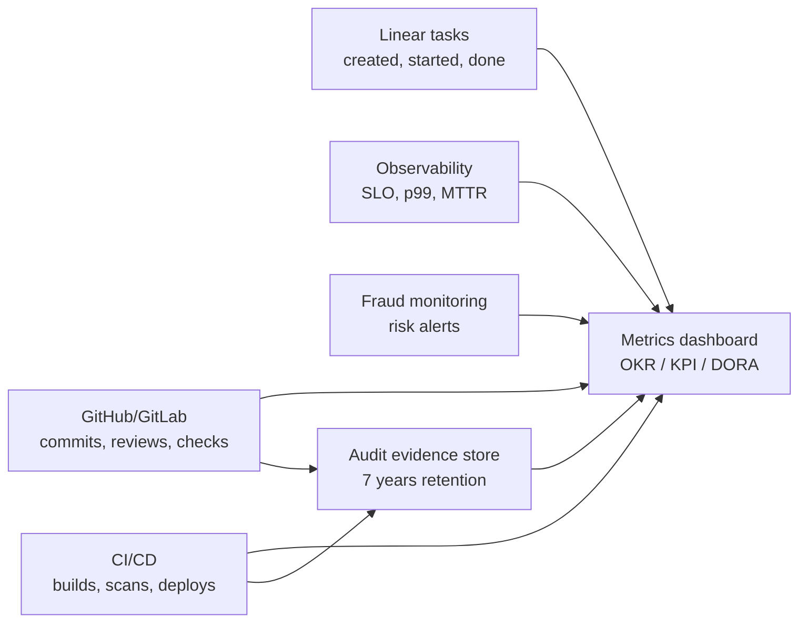
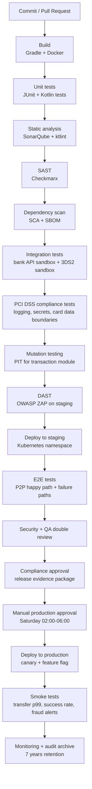
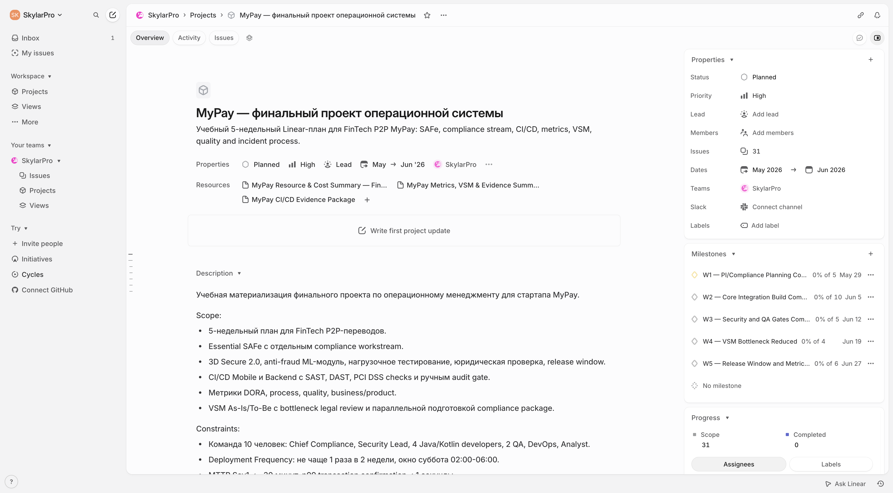
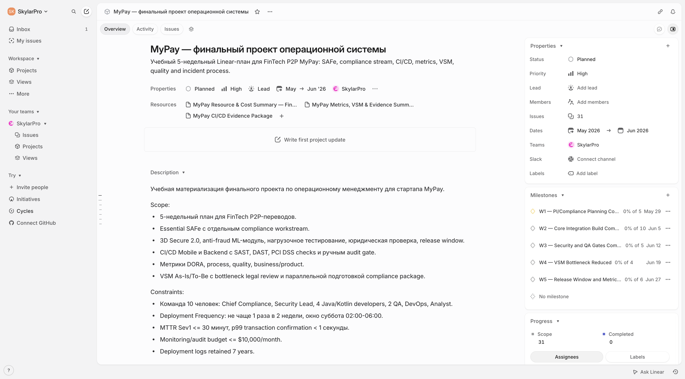
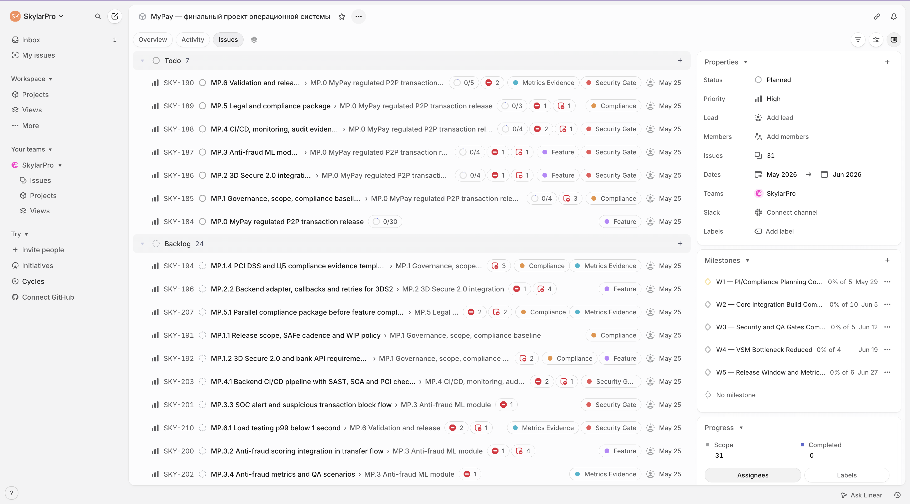
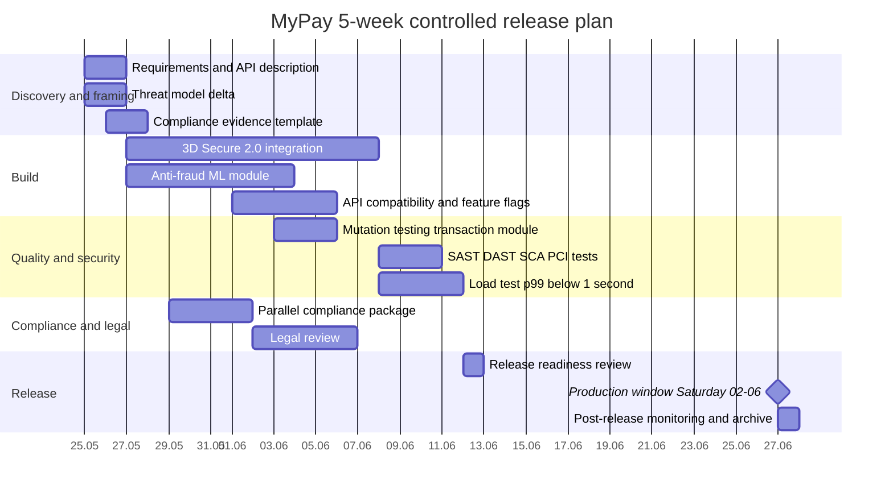
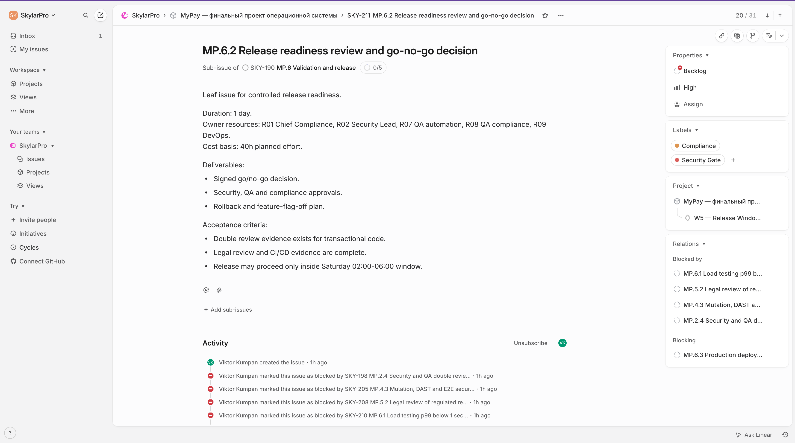
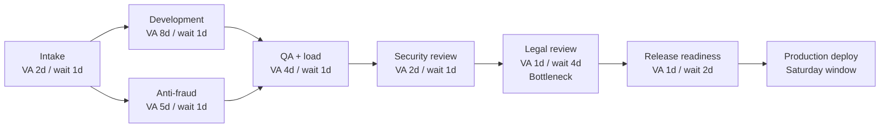
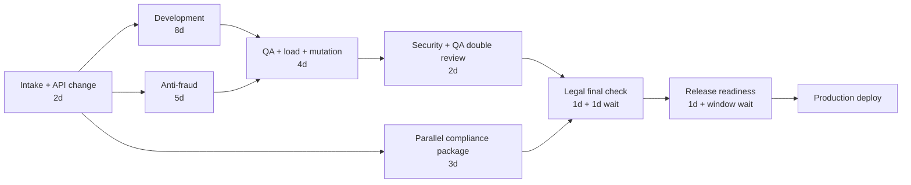
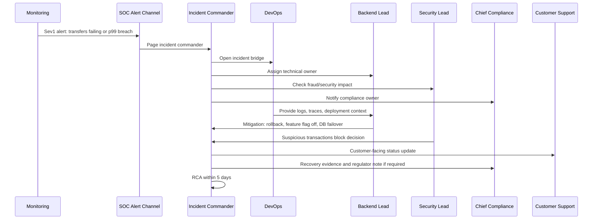

# MyPay: операционная система FinTech-стартапа для P2P-переводов

## 0. Рамка кейса и ограничения

Кейс: **MyPay**, FinTech-стартап для P2P-переводов. Система обрабатывает клиентские переводы между физическими лицами, интегрируется с банками-партнерами и должна соблюдать требования **PCI DSS Level 1** и регуляторные требования **ЦБ**.

Целевая работа: спроектировать операционную систему delivery и эксплуатации для безопасного выпуска изменений в транзакционном контуре MyPay. Основной фокус не на максимальной частоте релизов, а на контролируемом изменении платежной логики при жестких требованиях к безопасности, аудиту и доступности.

Ограничительная рамка:

| В scope | Out of scope |
|---|---|
| Методология управления delivery для команды из 10 человек | Масштабирование до нескольких независимых ART / value streams |
| Метрики OKR, KPI и DORA для продукта, процесса, качества и эксплуатации | Финансовая модель выручки MyPay |
| CI/CD для backend и mobile с security, QA и compliance gates | Полная закупочная спецификация инфраструктуры |
| Linear-план на 5 недель с ролями, зависимостями, буфером и фактическими ссылками на project/docs/issues | Публичная публикация Linear без доступа к workspace и реальное исполнение задач в production-команде |
| Расчет метрик на смоделированных задачах | Реальная выгрузка из Jira, Linear или GitHub |
| VSM As-Is и To-Be для изменения логики перевода | Детальная BPMN-модель всех банковских процессов |
| Управление качеством, инцидентами, Sev1 и аудитом | Юридический текст договоров с банками |

Жесткие числовые и регуляторные ограничения:

| Ограничение | Значение для операционной системы |
|---|---|
| Команда | 10 человек: 1 Chief Compliance, 1 Security Lead, 4 Java/Kotlin разработчика, 2 QA, 1 DevOps, 1 аналитик |
| Compliance | PCI DSS Level 1 и требования ЦБ учитываются как обязательные release gates |
| Review транзакционного кода | Каждое изменение транзакционной логики проходит double review: Security + QA |
| Аудит деплоев | Логи деплоев, approvals, checksums, SBOM и release evidence хранятся 7 лет |
| Deployment window | Не чаще 1 раза в 2 недели, суббота 02:00-06:00 |
| Доступность | 99.999%, то есть около 5 минут downtime в год |
| p99 транзакции | Подтверждение перевода p99 < 1 секунды |
| MTTR Sev1 | Не более 30 минут |
| Мониторинг и аудит | Не более $10 000 в месяц |
| Lead Time | Текущее значение 21 день, целевое значение 14 дней |
| VSM bottleneck | Legal review дает 4 дня чистой задержки |
| To-Be Lead Time | После корректировки ожидаемый цикл 16 дней |

Ключевой delivery-принцип: MyPay выпускает изменения пакетами в двухнедельном релизном окне. Внутри цикла команда работает итеративно, но production deployment выполняется только после прохождения security, QA, compliance и audit gates.

## 1. Методология управления

Для MyPay выбирается **Essential SAFe в облегченном формате для одной команды** с отдельным compliance workstream. Это не полный enterprise SAFe с несколькими ART, портфельным управлением и большим количеством ролей. В рамках кейса используется минимальная управленческая конфигурация, которая сохраняет главное: единый релизный поезд, общий planning horizon, синхронизацию delivery, security, QA, compliance и внешних банковских зависимостей.

Выбор методологии определяется не модностью Agile-подхода, а жесткими ограничениями MyPay. Команда небольшая, всего 10 человек, но работает в зоне высокой регуляторной ответственности: транзакционный код влияет на движение денег, каждое изменение проходит Security + QA review, деплой разрешен не чаще одного раза в две недели, deployment evidence хранится 7 лет, а доступность и MTTR заданы на банковском уровне. Поэтому чистый Scrum был бы слишком узким: он хорошо управляет спринтом разработки, но сам по себе не гарантирует согласованность compliance, release readiness, audit evidence и банковских интеграций.

Методология строится вокруг принципа: **итеративная разработка внутри команды, но управляемый релизный контур вокруг транзакционного продукта**. Команда может ежедневно двигать задачи, уточнять acceptance criteria и закрывать разработку в коротких циклах, но production release происходит только после прохождения общих gates. Это снижает риск ситуации, когда фича "готова по разработке", но не готова к безопасному выпуску в платежный контур.

### 1.1 Обоснование выбора Essential SAFe

Essential SAFe подходит MyPay как минимальный каркас координации для продукта, где релиз зависит не только от разработки, но и от безопасности, аудита, регуляторных проверок и внешних партнеров. В отчете он используется как **PI-lite / release-train модель** на 5 недель: команда планирует общий пакет изменений, заранее видит зависимости, выделяет compliance workstream и доводит релиз до go/no-go решения.

Ключевая причина выбора: MyPay не может оптимизировать только скорость разработки. Для FinTech P2P-переводов важнее безопасная предсказуемость: понятно, что именно войдет в релиз, какие проверки уже закрыты, где есть legal/compliance задержка, кто имеет право остановить релиз и какие evidence artifacts останутся после деплоя.

| Ограничение кейса | Почему чистого Scrum недостаточно | Как помогает Essential SAFe |
|---|---|---|
| PCI DSS Level 1 и требования ЦБ | Scrum фиксирует backlog и ceremonies, но не задает отдельный контур регуляторной готовности | Compliance workstream становится частью release train, а не внешней ручной проверкой в конце |
| Два обязательных review для транзакционного кода | В Scrum code review может быть частью DoD, но легко превращается в локальный team-level критерий | Security + QA review фиксируются как release gate и учитываются в планировании capacity |
| Deployment window раз в 2 недели | Обычный sprint может завершиться раньше окна, но это не означает готовность production release | Release train синхронизирует sprint output с субботним production window |
| Банки-партнеры и внешние API | Команда может закрыть задачу, но зависимость от банка останется вне управляемого контура | Зависимости выносятся в planning horizon и отслеживаются как release risks |
| Audit evidence 7 лет | Scrum не описывает долговременное хранение approvals, SBOM, checksums и deployment logs | Evidence является обязательным артефактом релиза, а не постфактум-документацией |
| MTTR Sev1 <= 30 минут | Sprint delivery не управляет incident readiness | Release readiness включает monitoring, rollback, on-call и post-release контроль |

Методология поэтому выбирается как управляемая комбинация:

| Практика | Роль в MyPay | Почему не используется отдельно |
|---|---|---|
| Essential SAFe | Дает общий релизный контур, planning horizon, dependency management и go/no-go gates | В полном виде слишком тяжел для одной команды, поэтому применяется облегченно |
| Scrum | Организует разработку внутри 2-недельных iterations | Без release train не закрывает compliance и банковские зависимости |
| Kanban | Визуализирует compliance, incident и review queues | Как основная методология не дает нужного планирования релизного пакета |
| XP-практики | Поддерживают качество кода: tests, review, CI, small changes | Не решают вопрос регуляторного release governance |
| Waterfall | Подходит для фиксированной регуляторной документации | Слишком медленный для стартапа и не дает адаптивности при изменении API банков |

### 1.2 Что именно означает Essential SAFe для MyPay

В MyPay Essential SAFe не означает создание большого процесса. Он означает, что у команды появляется единая операционная рамка: общий backlog релизного пакета, короткие итерации, видимые зависимости, формальные release gates и отдельный поток compliance evidence. Команда не масштабируется организационно, но масштабирует управляемость риска.

| Элемент Essential SAFe | Реализация в MyPay | Практический результат |
|---|---|---|
| Agile Team | Одна команда из 10 человек с фиксированными ролями | Нет искусственного расширения штата и скрытых ролей |
| Product / Solution backlog | Единый backlog релиза в Linear: 3D Secure 2.0, anti-fraud ML, load testing, legal/compliance, CI/CD evidence, release | Все work items видны в одном управляемом контуре |
| PI-lite planning | Планирование на 5 недель вместо полноценного квартального PI | Горизонт совпадает с заданием и двумя release windows |
| Iterations | 2-недельные циклы разработки и проверки | Команда сохраняет короткую обратную связь |
| Release Train | Релизный поток под субботнее окно 02:00-06:00 | Все задачи синхронизируются с допустимым production deployment |
| System Demo / Review | Демонстрация готовности не только функциональности, но и evidence | Проверяется не "фича показана", а "фича готова к безопасному выпуску" |
| Inspect & Adapt | Ретроспектива после релиза с VSM-коррекцией | Узкие места процесса не остаются теоретическими выводами |
| Built-in Quality | Security, QA, compliance и audit evidence встроены в DoD | Качество не выносится в отдельную финальную фазу |

От полного SAFe осознанно не берутся портфельный слой, несколько Agile Release Trains, Solution Train, сложная иерархия epic owners и отдельный Release Train Engineer как новая штатная роль. Для команды из 10 человек это создало бы лишнюю управленческую нагрузку и нарушило бы условие фиксированного состава. Функции RTE распределяются между аналитиком, DevOps и Security Lead в рамках их операционных зон.

### 1.3 Управленческая логика release train

Release train в MyPay - это не "частые деплои любой ценой". Это фиксированный управляемый ритм, в котором разработка, тестирование, безопасность, compliance и эксплуатация приходят к одному go/no-go решению. Релиз может быть отложен, если транзакционный риск выше допустимого, даже если разработка завершена.

| Фаза | Управленческий смысл | Выходной артефакт |
|---|---|---|
| PI-lite planning | Определить релизный пакет, зависимости, риски и capacity команды | Linear plan, release scope, dependency map |
| Iteration execution | Реализовать и проверить work items внутри коротких циклов | Закрытые задачи, review evidence, test results |
| Compliance parallel track | Не ждать конца разработки, а готовить evidence и legal review параллельно | PCI DSS / ЦБ evidence, compliance checklist |
| Hardening / release readiness | Свести code, QA, security, compliance и operations readiness | Go/no-go packet |
| Production window | Выпустить только то, что прошло все gates | Deployment log, approvals, checksums, SBOM |
| Post-release control | Подтвердить, что релиз не ухудшил p99, availability, fraud signals и incidents | Monitoring report, incident notes, VSM feedback |

Такой ритм особенно важен из-за ограничения "не чаще 1 раза в 2 недели". Если команда пропускает окно, следующая возможность production deployment появляется только через две недели. Поэтому methodology должна не только помогать "делать задачи", но и снижать риск срыва окна из-за позднего legal review, ручного аудита логов или незакрытого security finding.

### 1.4 Почему compliance выделяется в отдельный workstream

Compliance workstream нужен не как бюрократическая надстройка, а как способ убрать главный источник задержки из конца процесса. В исходной VSM-модели legal review дает 4 дня чистой задержки. Если compliance остается финальной ручной проверкой, Lead Time почти невозможно снизить с 21 до 14 дней. Поэтому compliance включается в planning и execution с начала релизного цикла.

| Compliance activity | Когда выполняется | Кто отвечает | Что предотвращает |
|---|---|---|---|
| Проверка влияния на PCI DSS / ЦБ | На planning и refinement | Chief Compliance + аналитик | Позднее обнаружение регуляторного требования |
| Threat model delta | До активной разработки и перед security review | Security Lead | Неполную оценку риска транзакционного изменения |
| Evidence checklist | Параллельно разработке | Chief Compliance + QA compliance | Ситуацию, когда код готов, но релиз не доказуем для аудита |
| Audit log readiness | До release readiness review | DevOps + Chief Compliance | Невозможность подтвердить approvals и deployment trail |
| Manual audit of logs | Перед production deployment | Chief Compliance + DevOps | Выпуск без регуляторной трассируемости |

Отдельный compliance workstream не означает отдельную команду. Это поток задач внутри общего Linear-плана, где для каждой транзакционной работы есть связанные evidence tasks. Такой подход делает задержку видимой и управляемой: legal/compliance review получает WIP-лимит, владельца и срок, а не появляется как непредсказуемый блокер перед релизом.

### 1.5 Сравнение целевой методологии с альтернативами

| Методология | Почему могла бы подойти | Почему не является основной для MyPay |
|---|---|---|
| Scrum | Команда небольшая, есть итерации, review и retrospective | Не управляет внешними compliance gates и фиксированным production window как системой |
| Kanban | Хорошо показывает очереди review, legal, incidents и support work | Не задает релизный горизонт и общий пакет готовности на 5 недель |
| XP | Усиливает инженерное качество через tests, CI, pair review и small releases | Не покрывает регуляторный governance и банковские зависимости |
| GitFlow-only delivery | Формализует ветвление и релизные ветки | Это техническая политика, а не методология управления командой |
| Waterfall | Удобен для заранее заданных compliance-документов | Увеличивает Lead Time и плохо подходит для API-зависимостей и стартап-изменений |
| Essential SAFe lite | Соединяет итеративную разработку, release train, compliance, quality gates и Inspect & Adapt | Требует дисциплины планирования, но не требует увеличения команды |

Итог: Scrum используется как внутренний цикл команды, Kanban - как визуализация потоков compliance/incidents, XP-практики - как инженерная дисциплина, а **Essential SAFe lite** является верхней управленческой рамкой.

### 1.6 Операционная модель методологии

Методология сочетает три уровня управления:

| Уровень | Как работает в MyPay | Зачем нужен |
|---|---|---|
| Essential SAFe cadence | 5-недельный planning horizon, 2-недельные iterations, общий release train под субботнее окно | Синхронизирует разработку, security, QA, compliance и банковские зависимости |
| Scrum внутри delivery-команды | Sprint Planning, Daily, Review, Retrospective, Definition of Done | Дает короткий управляемый цикл разработки и приемки |
| Kanban для compliance и incident work | WIP-лимиты, expedite lane для Sev1 и регуляторных замечаний | Не ломает sprint backlog, но делает срочные работы видимыми |

Операционная модель фиксирует не только ceremonies, но и права решений:

| Решение | Владелец решения | Кто участвует | Правило |
|---|---|---|---|
| Что входит в релизный scope | Аналитик как proxy product owner | Chief Compliance, Security Lead, backend leads | Scope не принимается без оценки compliance/security impact |
| Можно ли начинать разработку транзакционного изменения | Security Lead + аналитик | Backend lead, QA | Acceptance criteria должны содержать negative cases и threat model delta |
| Можно ли закрыть development task | Backend lead | QA, Security Lead при транзакционном коде | Код должен пройти tests, review и feature flag policy |
| Можно ли переводить задачу в release candidate | QA + Security Lead | Chief Compliance, DevOps | Должны быть закрыты security, regression и compliance evidence |
| Можно ли выпускать релиз | Chief Compliance + Security Lead + DevOps | QA, backend lead, аналитик | Go/no-go принимается только после release readiness review |
| Можно ли ускорить задачу вне WIP-лимита | Incident commander / Security Lead | DevOps, QA, аналитик | Разрешено только для Sev1, fraud risk или регуляторного замечания |

### 1.7 Распределение ролей внутри команды 10 человек

| Роль в кейсе | Операционная роль | Ответственность |
|---|---|---|
| Chief Compliance | Compliance Owner / release approver | PCI DSS evidence, требования ЦБ, legal review, аудит deployment evidence |
| Security Lead | Security Owner / secure SDLC gate | Threat modeling, SAST/DAST policy, секреты, double review транзакционного кода |
| Java/Kotlin разработчик 1 | Backend transaction lead | Логика P2P-перевода, идемпотентность, статусы транзакций |
| Java/Kotlin разработчик 2 | Backend integration developer | Интеграция 3D Secure 2.0 и банковских API |
| Java/Kotlin разработчик 3 | Backend anti-fraud developer | Anti-fraud ML-модуль, risk scoring, fraud telemetry |
| Java/Kotlin разработчик 4 | Mobile/API integration developer | Mobile/backend integration, API compatibility, feature flags |
| QA 1 | QA automation | Regression, integration, E2E, mutation testing checks |
| QA 2 | QA compliance testing | PCI DSS test evidence, release checklist, test data control |
| DevOps | Platform / release engineer | CI/CD, Kubernetes, audit logs, observability, deployment window |
| Аналитик | System analyst / proxy product owner | Требования, acceptance criteria, API change description, Linear hygiene |

Отдельный Product Owner не добавляется, потому что состав команды фиксирован. Функция приоритизации распределяется между аналитиком, Chief Compliance и бизнес-стейкхолдером вне команды; в отчете планируется только команда delivery из 10 человек. Это важно: методология не должна "лечить" нехватку роли добавлением человека, которого нет в кейсе. Вместо этого она явно распределяет decision rights между существующими участниками.

Ролевая логика внутри методологии:

| Контур | Основной владелец | Почему именно он |
|---|---|---|
| Product / requirements | Аналитик | Он переводит бизнес-требования в acceptance criteria, API impact и Linear structure |
| Transaction logic | Backend transaction lead | Он отвечает за корректность денег, идемпотентность и статусы переводов |
| External bank integration | Backend integration developer | Он управляет зависимостью от 3D Secure 2.0 и банковских API |
| Fraud risk | Security Lead + anti-fraud developer | Fraud detection влияет и на безопасность, и на продуктовый success rate |
| Compliance evidence | Chief Compliance | Только эта роль может подтвердить PCI DSS / ЦБ готовность |
| Release engineering | DevOps | Он отвечает за pipeline, deployment logs, rollback и observability |
| Quality gate | QA automation + QA compliance | Один QA закрывает regression/E2E, второй - evidence и test data control |

### 1.8 Ритм управления

| Событие | Частота | Участники | Результат |
|---|---:|---|---|
| PI-lite planning | 1 раз на 5 недель | Вся команда | Scope релиза, зависимости, compliance artifacts, release risk map |
| Sprint Planning | Каждые 2 недели | Вся команда | Sprint backlog, WIP-лимиты, DoD и dependencies |
| Daily sync | Каждый рабочий день, 15 минут | Вся команда | Статус задач, риск релиза, ожидания review |
| Compliance sync | 2 раза в неделю | Chief Compliance, Security Lead, QA compliance, аналитик | Готовность evidence, legal review, требования ЦБ |
| Release readiness review | За 2 рабочих дня до окна | Chief Compliance, Security Lead, QA, DevOps, lead developers | Go/no-go решение по релизу |
| Production deployment | Раз в 2 недели, суббота 02:00-06:00 | DevOps, Security Lead, QA on-call, backend lead | Контролируемый production release |
| Post-release monitoring | Первые 4 часа после деплоя | DevOps, QA, Security Lead, backend lead | Smoke, p99, error budget, fraud alerts |
| Retrospective | После релиза | Вся команда | Улучшения процесса, VSM и CI/CD gates |

Ритм управления завязан на deployment window. Разработка может завершаться внутри спринта, но релизное решение не принимается автоматически. Если readiness review показывает незакрытый compliance artifact, высокий fraud risk, незавершенный DAST или неполный audit trail, задача остается в release candidate или переносится на следующий train.

### 1.9 Управление backlog и WIP

Backlog в Linear делится не только по типам задач, но и по управленческим потокам. Это нужно, чтобы compliance и security не растворялись внутри разработки.

| Backlog stream | Примеры задач | WIP-правило |
|---|---|---|
| Product / analysis | Acceptance criteria, API change description, dependency clarification | Не начинать development без закрытого scope и negative cases |
| Backend delivery | 3D Secure 2.0, transfer logic, anti-fraud integration | Не более 2 транзакционных задач одновременно |
| QA / test evidence | Regression, E2E, mutation testing, compliance test data | QA task открывается вместе с development task, а не после завершения кода |
| Security | Threat model delta, SAST/DAST findings, secrets, authz checks | Security review обязателен для каждой транзакционной задачи |
| Compliance | PCI DSS evidence, ЦБ checklist, legal review | Отдельный WIP-лимит, чтобы legal review не стал невидимой очередью |
| Release / DevOps | Pipeline, deployment logs, SBOM, checksums, monitoring | Release tasks должны быть закрыты до go/no-go |
| Incident / expedite | Sev1, fraud signal, production rollback | Может прерывать sprint plan, но фиксируется отдельным lane |

Таким образом, methodology не скрывает работу "проверить, согласовать, доказать". Она превращает ее в полноценные work items с владельцами, зависимостями и критериями завершения.

### 1.10 Definition of Done для транзакционного кода

| Gate | Критерий завершения |
|---|---|
| Requirements | Acceptance criteria содержат бизнес-сценарий, negative cases, fraud/compliance impact и API change description |
| Development | Код покрыт unit и integration tests, миграции обратимы, feature flag задан для risk-controlled rollout |
| Security review | Security Lead проверил threat model delta, SAST findings, secrets, authz и криптографические изменения |
| QA review | QA проверила regression, E2E, mutation testing для критичных веток и test evidence |
| Compliance review | Chief Compliance подтвердил PCI DSS / ЦБ evidence и audit trail |
| Release evidence | DevOps зафиксировал build artifact, SBOM, commit SHA, approvals, checksums и deployment log |

Definition of Done применяется жестче для транзакционного кода, чем для вспомогательных задач. Для обычного внутреннего улучшения достаточно стандартных engineering gates, но для логики перевода требуется полный набор: требования, разработка, security, QA, compliance и release evidence. Это соответствует ограничению кейса о двойной проверке Security + QA и хранении audit trail.

### 1.11 Как методология снижает основные риски MyPay

| Риск | Как проявляется без методологии | Управленческий механизм |
|---|---|---|
| Срыв deployment window | Разработка готова, но security/compliance/evidence не закрыты | Release train, readiness review, ранний compliance workstream |
| Рост Lead Time из-за legal review | Legal проверка начинается после разработки и добавляет 4 дня ожидания | Compliance sync 2 раза в неделю, WIP-лимит и параллельная подготовка evidence |
| Ошибка в транзакционной логике | Изменение проходит только обычный code review | Double review Security + QA, mutation testing, feature flag |
| Невозможность пройти аудит деплоя | Логи, approvals и checksums собираются вручную после релиза | Release evidence как обязательный DoD gate |
| Перегруз QA и Security | Все задачи приходят на проверку в конце спринта | Встроенные review tasks и WIP-ограничения |
| Конфликт срочного инцидента и sprint backlog | Sev1 ломает план и остается неучтенным | Kanban expedite lane с явным правилом входа |
| Невыполнение MTTR | Релиз готовится без on-call и rollback readiness | Release readiness включает monitoring, rollback и первые 4 часа наблюдения |

Методология считается успешной не тогда, когда команда формально провела все ceremonies, а когда она сокращает Lead Time без ухудшения Change Failure Rate, сохраняет deployment frequency в разрешенном окне, снижает legal-review bottleneck и оставляет проверяемый audit trail по каждому production release.

## 2. Метрики OKR, KPI и DORA

Метрики строятся сквозным деревом: бизнес-цель задает outcome, process-метрики показывают скорость delivery, quality-метрики показывают надежность изменений, DORA связывает delivery с устойчивостью production.

### 2.1 OKR

| Objective | Key Result | Цель | Владелец |
|---|---|---:|---|
| O1. Безопасно ускорить выпуск изменений в P2P-переводах | KR1. Lead Time for Change для логики перевода | 21 -> 14 дней; промежуточно 16 дней после VSM To-Be | Аналитик + backend transaction lead |
| O1. Безопасно ускорить выпуск изменений в P2P-переводах | KR2. Deployment Frequency | 2 production deployments в месяц, без нарушения окна | DevOps |
| O2. Сохранить банковский уровень надежности | KR3. Доступность сервиса переводов | 99.999% | DevOps + backend lead |
| O2. Сохранить банковский уровень надежности | KR4. p99 подтверждения транзакции | < 1 секунды | Backend transaction lead |
| O3. Пройти регуляторные и security gates без повторных циклов | KR5. Compliance audit pass rate | 100% | Chief Compliance |
| O3. Пройти регуляторные и security gates без повторных циклов | KR6. Change Failure Rate | <= 1% | Security Lead + QA |
| O4. Быстро реагировать на критичные сбои | KR7. MTTR Sev1 | <= 30 минут | DevOps + incident commander |
| O4. Быстро реагировать на критичные сбои | KR8. Time to detect fraud | < 3 секунд | Security Lead |

### 2.2 KPI и DORA-метрики

| Группа | Метрика | Формула / измерение | Цель |
|---|---|---|---:|
| Process | Lead Time for Change | `release_date - task_created_at` | <= 14 дней; To-Be 16 дней как ближайший этап |
| Process | Cycle Time | `done_at - work_started_at` | <= 10 дней для стандартной backend-задачи |
| Process | Throughput | `done_tasks / период` | >= 5 задач за 5 недель для релизного scope |
| Process | WIP | Активные задачи в работе одновременно | <= 6 задач, из них <= 2 транзакционные |
| Quality | Defect Rate | `(production_defects / releases) * 100%` | <= 50% в учебной симуляции; production target <= 1 критичный defect на 20 релизов |
| Quality | Change Failure Rate | `(failed_deployments / deployments) * 100%` | <= 1% |
| Quality | False Positive Rate fraud | `false_positive_fraud_alerts / all_fraud_alerts` | <= 3% |
| Quality | Compliance audit pass rate | `passed_controls / all_controls` | 100% |
| Product | Transaction success rate | `successful_transactions / all_transactions` | >= 99.99% |
| Product | Customer Ticket Volume | Количество обращений по переводам за неделю | Не выше baseline + 5% после релиза |
| Product | Feature Cycle Time | `feature_released_at - feature_selected_at` | <= 5 недель для релизного пакета |
| DORA | Deployment Frequency | Production deployments за месяц | 2 раза в месяц из-за регуляторного окна |
| DORA | Lead Time for Change | От commit/task до production | 14 дней target; 16 дней после VSM correction |
| DORA | MTTR | Время восстановления Sev1 | <= 30 минут |
| DORA | Change Failure Rate | Доля релизов с production incident / rollback | <= 1% |

### 2.3 Контур измерения

## 3. CI/CD и release pipeline

MyPay использует два изолированных пайплайна: **Backend** и **Mobile**. Backend pipeline отвечает за транзакционную логику, anti-fraud, банковские API и 3D Secure 2.0. Mobile pipeline отвечает за клиентские сборки и совместимость с backend API.

Оба пайплайна имеют ограничение: **не более 3 запусков на ветку в день**, чтобы не перегружать security/compliance review и не тратить аудиторские ресурсы на шумовые сборки.

### 3.1 Политика ветвления

| Правило | Решение |
|---|---|
| Базовая модель | Trunk-Based Development с short-lived branches |
| Feature flags | Все рискованные изменения транзакционного контура закрыты feature flags |
| Pull request | Обязателен для всех изменений |
| Транзакционный код | Double review: Security Lead + QA approval перед merge |
| Release branch | Создается за 2 рабочих дня до deployment window |
| Hotfix | Только через expedited branch, тот же security/QA gate, отдельный incident record |
| Production deploy | Ручной approval в субботу 02:00-06:00, не чаще 1 раза в 2 недели |

### 3.2 Backend CI/CD pipeline

### 3.3 Mobile CI/CD pipeline

| Этап | Инструменты | Автоматизация | Gate |
|---|---|---|---|
| Build | Gradle / Xcode Cloud или GitHub Actions runners | Автоматически на PR | Build должен быть воспроизводимым |
| Unit tests | JUnit, XCTest | Автоматически | Нет critical failures |
| Static analysis | Detekt, SwiftLint, SonarQube | Автоматически | Нет high severity issues |
| API contract tests | OpenAPI diff, mocked backend | Автоматически | Mobile не ломает backend contract |
| Security checks | Mobile secrets scan, dependency scan | Автоматически | Нет secrets и vulnerable SDK |
| Staging deploy | Internal distribution | Ручной trigger после checks | QA approval |
| E2E regression | Device farm + manual critical path | Полуавтоматически | QA evidence attached |
| Production release | Store release / phased rollout | Ручной approval | Не нарушает backend release window |

### 3.4 Audit evidence package

| Evidence | Что сохраняется | Retention |
|---|---|---:|
| Build artifact | Image digest, binary checksum, build metadata | 7 лет |
| Source trace | Commit SHA, PR, reviewers, branch policy result | 7 лет |
| Security evidence | SAST/DAST reports, SCA report, SBOM, threat model delta | 7 лет |
| QA evidence | Test run, mutation testing report, E2E checklist, defects summary | 7 лет |
| Compliance evidence | PCI DSS controls, ЦБ checklist, legal review result | 7 лет |
| Deployment evidence | Approval, deployment log, start/end time, rollback decision | 7 лет |
| Monitoring evidence | First 4 hours smoke, p99, success rate, fraud alerts, incidents | 7 лет |

### 3.5 Бюджет мониторинга и аудита

Бюджет $10 000 в месяц считается как **лимит на monitoring + audit контур**, а не как полный ИТ-бюджет MyPay. В него не включаются зарплаты команды, production Kubernetes, банковские комиссии, стоимость разработки, store release fee и банковские sandbox/partner fees. Внутри лимита учитываются observability, on-call, хранение evidence, поиск по audit events, security evidence и витрины для p99, MTTR, fraud alerts и compliance evidence.

Цены ниже проверены по публичным pricing pages на дату **25 мая 2026**. Это расчет по list price без enterprise discounts, НДС/налогов, валютных колебаний и индивидуальных коммерческих условий.

Базовые допущения для расчета:

| Параметр | Допущение | Почему реалистично для кейса |
|---|---|---|
| Размер продукта | Небольшой FinTech-стартап, одна команда из 10 человек, ограниченный контур P2P-переводов | Нельзя считать бюджет как для банка с десятками продуктовых команд |
| Production services | 6-8 критичных runtime-компонентов: API, transfer core, bank integration, fraud scoring, mobile backend, audit/evidence jobs | Соответствует задачам 3D Secure 2.0, anti-fraud, CI/CD и monitoring |
| Metrics | 60 000 billable series, из них 10 000 входят в Grafana Cloud Free/Pro allowance | Для FinTech критичны p99, availability, fraud, banking integration, CI/CD gates и per-service SLO |
| Logs hot retention | 5 TB/month полезных structured logs после redaction и sampling, 30 дней searchable retention | Объем выше обычного стартапа, потому что нужны audit-grade transaction logs и быстрые расследования Sev1 |
| Tracing | 1 TB/month traces после tail sampling; error/slow traces сохраняются полностью | Снижает стоимость, но сохраняет диагностическую ценность для p99 < 1 секунды |
| Synthetic checks | 720 000 API checks/month и 60 000 browser checks/month | Покрывает transaction smoke, bank API health и release-window monitoring |
| Incident users | 10 active IRM users, 3 входят в Grafana allowance | Совпадает с delivery-командой и on-call участниками |
| Security evidence | 6 active committers для GitHub Secret Protection + Code Security | 4 разработчика, DevOps и один технический lead могут попадать в active-committer billing |
| Audit retention | 1 TB/month release/audit artifacts; 6 месяцев Standard hot archive, далее Glacier Deep Archive до 7 лет | 7 лет применяется к immutable evidence trail, а не к полному hot-search всех debug logs |

Публичные unit prices, использованные в расчете:

| Источник | Цена | Как используется |
|---|---:|---|
| [Grafana Cloud Pricing](https://grafana.com/pricing/) | Pro platform fee $19/month; metrics $6.50 / 1k series; logs/traces/profiles $0.50 / GB; synthetics $5 / 10k API checks и $50 / 10k browser checks; k6 $0.15 / VU-hour; IRM $20 / active user | Основной observability, SLO, traces, synthetic checks и incident management |
| [Grafana Cloud Logs invoice docs](https://grafana.com/docs/grafana-cloud/cost-management-and-billing/manage-invoices/understand-your-invoice/logs-invoice/) | Logs: $0.05 / GB processed, $0.40 / GB written, $0.10 / GB retained | Для conservative logs расчета используется $0.55 / GB после бесплатных 50 GB |
| [GitHub Advanced Security](https://github.com/security/advanced-security) | Secret Protection $19 / active committer / month; Code Security $30 / active committer / month | SAST/SCA/secret evidence для private repositories |
| [GitHub billing docs](https://docs.github.com/en/billing/concepts/product-billing/github-advanced-security) | Active committer считается по коммитам за последние 90 дней | Объясняет, почему расчет берется по 6 active committers, а не по всем ролям команды |
| [AWS CloudTrail Pricing](https://aws.amazon.com/cloudtrail/pricing/) | Other auditable data sources $0.50 / GB; queries $0.005 / GB scanned | Индексация и поиск по compliance/release evidence |
| [AWS S3 Glacier](https://aws.amazon.com/s3/storage-classes/glacier/) | S3 Glacier Deep Archive $0.00099 / GB-month | Долгосрочный immutable archive для 7-летнего retention |
| [AWS S3 pricing / storage blog](https://aws.amazon.com/blogs/storage/monitor-data-transfer-costs-related-to-amazon-s3-replication/) | S3 Standard example: $0.023 / GB-month | Hot archive для последних 6 месяцев evidence |
| [AWS S3 Object Lock docs](https://docs.aws.amazon.com/AmazonS3/latest/dev/object-lock-overview.html) | Compliance mode prevents overwrite/delete | Используется как WORM/immutability механизм; отдельная license fee не закладывается |

Расчет бюджета:

| Статья | Формула | План, $/мес |
|---|---|---:|
| Grafana Cloud Pro platform | Fixed platform fee | 19 |
| Metrics, dashboards, alerting | `(60 000 - 10 000 included) / 1 000 * $6.50` | 325 |
| Hot logs и audit search | `(5 000 GB - 50 GB included) * ($0.05 process + $0.40 write + $0.10 retain)` | 2 723 |
| Distributed tracing | `(1 000 GB - 50 GB included) * $0.50` | 475 |
| Synthetic API checks | `(720 000 - 100 000 included) / 10 000 * $5` | 310 |
| Synthetic browser checks | `(60 000 - 10 000 included) / 10 000 * $50` | 250 |
| k6 release-window smoke/load checks | `(1 000 VU-hours - 500 included) * $0.15` | 75 |
| Incident response management | `(10 active users - 3 included) * $20` | 140 |
| Security evidence generation | `6 active committers * ($19 Secret Protection + $30 Code Security)` | 294 |
| CloudTrail Lake evidence index | `200 GB/month * $0.50 + 1 000 GB queried * $0.005` | 105 |
| Immutable audit archive | `6 TB S3 Standard * $0.023/GB + 78 TB Glacier Deep Archive * $0.00099/GB + requests/metadata/checksum reserve` | 300 |
| Cost reserve | 25% buffer for release-week log spikes, incident burst, regional price variance and tax/FX delta | 1 250 |
| **Итого план** |  | **6 266** |
| **Лимит кейса** |  | **10 000** |
| **Свободный запас до лимита** | `$10 000 - $6 266` | **3 734** |

Расчет специально не добивает бюджет до $10 000. Реалистичная модель показывает, что при disciplined telemetry MyPay укладывается примерно в **$6.3k/month**, а оставшиеся **$3.7k/month** являются управленческим запасом на рост транзакций, всплески логов, инциденты, изменение тарифов или переход на enterprise support.

Главный компромисс: MyPay не хранит весь технический лог 7 лет в дорогом hot search. Горячими остаются 30-дневные structured logs и traces для расследования, а долгосрочно и immutable хранятся именно audit artifacts: approvals, checksums, deployment logs, SBOM, release evidence, compliance checklist и ссылки на результаты проверок. Это сохраняет доказуемость для PCI DSS / ЦБ и одновременно удерживает бюджет ниже заданного лимита.

## 4. Linear ресурсный план на 5 недель

Project link: [MyPay — финальный проект операционной системы](https://linear.app/skylarpro/project/mypay-finalnyj-proekt-operacionnoj-sistemy-bd3d0c7610a3)

Resource plan link: [MyPay Resource & Cost Summary — Final Operations Project](https://linear.app/skylarpro/document/mypay-resource-and-cost-summary-final-operations-project-b912d6c6a94c)

Metrics/VSM evidence link: [MyPay Metrics, VSM & Evidence Summary](https://linear.app/skylarpro/document/mypay-metrics-vsm-and-evidence-summary-586a46f975bb)

CI/CD evidence link: [MyPay CI/CD Evidence Package](https://linear.app/skylarpro/document/mypay-cicd-evidence-package-3bf9f3f12925)

Ниже приведен внешний контрольный вид проекта в Linear: проект MyPay, статус, прогресс, milestone-структура и связанные рабочие артефакты зафиксированы в одном проектном контуре.

План построен на 5 недель, потому что production deployment возможен только раз в 2 недели, а пакет включает разработку, security, QA, compliance evidence, legal review и release. Буфер 15% встроен в план через отдельную строку stabilization / incident reserve.

### 4.1 Ресурсный пул

| Код | Роль | Доступность | Основная зона |
|---|---|---:|---|
| R01 | Chief Compliance | 100% | PCI DSS, ЦБ, legal review, release approval |
| R02 | Security Lead | 100% | Threat model, secure review, SAST/DAST policy, incident security |
| R03 | Java/Kotlin developer 1 | 100% | Transaction module |
| R04 | Java/Kotlin developer 2 | 100% | 3D Secure 2.0 integration |
| R05 | Java/Kotlin developer 3 | 100% | Anti-fraud ML module |
| R06 | Java/Kotlin developer 4 | 100% | Mobile/API integration and feature flags |
| R07 | QA 1 | 100% | Automation, regression, E2E |
| R08 | QA 2 | 100% | Compliance testing, evidence, release checklist |
| R09 | DevOps | 100% | CI/CD, staging, production deploy, audit archive |
| R10 | Analyst | 100% | Requirements, API change package, Linear, VSM |

Ресурсно-стоимостная часть материализована в Linear как отдельный evidence document: роли, занятость, cost baseline и резерв согласованы с 5-недельным планом.

### 4.2 Work Breakdown Structure

| ID | Уровень | Задача | Длительность | Предшественники | Назначено | Выход |
|---|---|---|---:|---|---|---|
| MP-0 | Parent | MyPay controlled release package for P2P transfer logic | 5 недель | Start | Вся команда | Release package |
| MP-1 | Этап | Discovery, scope и compliance framing | 4 дня | Start | R01, R02, R10, R03 | Approved scope |
| MP-1.1 | Task | Зафиксировать требования 3D Secure 2.0 и банковского API | 2 дня | Start | R10, R04, R01 | API change description |
| MP-1.2 | Task | Threat model delta для транзакционного flow | 2 дня | MP-1.1 SS | R02, R03, R05 | Security risks and controls |
| MP-1.3 | Task | Подготовить compliance evidence template | 2 дня | MP-1.1 SS | R01, R08 | PCI/CБ evidence template |
| MP-2 | Этап | Backend и anti-fraud разработка | 12 дней | MP-1 FS | R03, R04, R05, R06 | Implemented backend changes |
| MP-2.1 | Task | Интеграция 3D Secure 2.0 с внешним API | 12 дней | MP-1.1 FS | R04, R03 | 3DS2 integration |
| MP-2.2 | Task | Anti-fraud ML-модуль и risk scoring | 8 дней | MP-1.2 FS | R05, R02 | Fraud scoring service |
| MP-2.3 | Task | API compatibility и feature flags | 5 дней | MP-2.1 SS +3d | R06, R10 | Backward-compatible API |
| MP-3 | Этап | Quality, security и load validation | 8 дней | MP-2 SS +4d | R07, R08, R02, R09 | Test evidence |
| MP-3.1 | Task | Mutation testing транзакционного модуля | 3 дня | MP-2.1 SS +5d | R07, R03 | PIT report |
| MP-3.2 | Task | SAST, DAST, SCA, PCI DSS test run | 3 дня | MP-2.1 FS | R02, R08 | Security report |
| MP-3.3 | Task | Нагрузочное тестирование p99 < 1 секунды | 4 дня | MP-2.1 FS; MP-2.2 FS | R09, R07, R05 | Load report |
| MP-4 | Этап | Compliance и legal review | 5 дней | MP-1.3 FS | R01, R10, R08 | Compliance package |
| MP-4.1 | Task | Подготовка compliance-пакета параллельно разработке | 4 дня | MP-1.3 FS; MP-2 SS | R01, R10, R08 | Pre-filled evidence |
| MP-4.2 | Task | Юридическая проверка документации | 5 дней | MP-4.1 FS | R01, R10 | Legal approval |
| MP-5 | Этап | Release readiness и production deploy | 3 дня + окно | MP-3 FS; MP-4 FS | R09, R01, R02, R07, R08 | Production release |
| MP-5.1 | Task | Release readiness review и go/no-go | 1 день | MP-3.2 FS; MP-3.3 FS; MP-4.2 FS | R01, R02, R07, R08, R09 | Signed release decision |
| MP-5.2 | Task | Production deploy в окно суббота 02:00-06:00 | 1 день | MP-5.1 FS | R09, R02, R07, R03 | Deployed release |
| MP-5.3 | Task | Post-release monitoring и audit archive | 1 день | MP-5.2 FS | R09, R08, R01 | Archived evidence |
| MP-6 | Этап | Stabilization and incident reserve | 15% буфер | В течение 5 недель | R03-R09 | Managed risk buffer |

WBS дополнительно закреплена в Linear через иерархию parent issue, stage issues и leaf issues. Это позволяет проверять не только таблицу плана, но и фактическую структуру задач в рабочем инструменте.

### 4.3 Mermaid Gantt

Авторитетный календарь материализован в native Linear milestones: W1 завершается 2026-05-29, W2 - 2026-06-05, W3 - 2026-06-12, W4 - 2026-06-19, W5 - 2026-06-27. Mermaid Gantt ниже является компактной иллюстрацией delivery-последовательности и не заменяет Linear milestones.

### 4.4 Критический путь

Критический путь As-Is: `MP-1.1 -> MP-2.1 -> MP-3.2/MP-3.3 -> MP-4.2 -> MP-5.1 -> MP-5.2`.

Главный риск находится не в разработке, а в позднем legal/compliance review. Если юридическая проверка стартует только после завершения разработки, она добавляет 4 дня чистого ожидания и удерживает весь релизный пакет перед readiness review.

To-Be корректировка: `MP-4.1 Подготовка compliance-пакета` стартует параллельно с разработкой. Аналитик заранее готовит описание API changes, Chief Compliance заранее заполняет PCI DSS / ЦБ evidence template, QA compliance заранее готовит test evidence structure. Это сокращает общий Lead Time до 16 дней без нарушения double review и deployment window.

Зависимости release chain материализованы в Linear через relations между задачами: readiness review блокирует production deploy, а deploy блокирует post-release monitoring и audit archive.

## 5. Расчет метрик на смоделированных данных

Единица расчета: календарные дни от создания задачи до production release или закрытия в релизном пакете. Для учебного расчета выбран срез из 5 задач, потому что он покрывает разработку, compliance, тестирование, релиз и инцидентную готовность.

### 5.1 Исходные данные

| ID | Задача | Created | Work started | Done / Released | Lead Time, дни | Cycle Time, дни | Production defect |
|---|---|---:|---:|---:|---:|---:|---:|
| M-1 | 3D Secure 2.0 integration | День 1 | День 3 | День 20 | 19 | 17 | 0 |
| M-2 | Anti-fraud ML module | День 1 | День 4 | День 16 | 15 | 12 | 0 |
| M-3 | Load testing p99 < 1s | День 5 | День 13 | День 17 | 12 | 4 | 0 |
| M-4 | Legal/compliance review package | День 2 | День 5 | День 18 | 16 | 13 | 0 |
| M-5 | Release and post-release monitoring | День 15 | День 18 | День 20 | 5 | 2 | 0 |

### 5.2 Формулы

| Метрика | Формула | Расчет |
|---|---|---|
| Lead Time | `Дата релиза или закрытия - дата создания задачи` | `(19 + 15 + 12 + 16 + 5) / 5 = 13.4 дня` |
| Cycle Time | `Дата готовности - дата старта работы` | `(17 + 12 + 4 + 13 + 2) / 5 = 9.6 дня` |
| Throughput | `Количество завершенных задач / период` | `5 задач / 5 недель = 1 задача в неделю` для sampled scope |
| Defect Rate | `(Число дефектов в production / число релизов) * 100%` | `(0 / 1) * 100% = 0%` |
| Deployment Frequency | `Количество production deployments / месяц` | `2 deployments / месяц` |
| Change Failure Rate | `(Неуспешные deployments / все deployments) * 100%` | `(0 / 1) * 100% = 0%` в симуляции |
| MTTR Sev1 | `Время восстановления - время обнаружения` | `28 минут`, целевой лимит `<= 30 минут` |

### 5.3 Сравнение факта и целей

| Метрика | Baseline / факт | Цель | Статус | Обоснование |
|---|---:|---:|---|---|
| Lead Time логики перевода | 21 день baseline; 20 дней в текущем релизном пакете | 14 дней | Улучшается, но не достигнута | Без VSM-коррекции legal review остается поздним gate |
| Lead Time после To-Be | 16 дней | 14 дней | Близко к цели | Параллельный compliance stream убирает 4 дня ожидания, но release window сохраняет ограничение |
| Cycle Time sample | 9.6 дня | <= 10 дней | Достигнута | Работа внутри команды не является главным ограничением |
| Deployment Frequency | 2 раза в месяц | Не чаще 1 раза в 2 недели | Достигнута | Частота соответствует регуляторному окну |
| MTTR Sev1 | 28 минут | <= 30 минут | Достигнута | Incident playbook и on-call покрывают отказ базы |
| Change Failure Rate | 0% в симуляции | <= 1% | Достигнута в учебном срезе | Строгий QA/Security gate снижает риск |
| Transaction success rate | 99.99% target | >= 99.99% | Целевое значение | Измеряется production monitoring после релиза |
| p99 подтверждения | < 1 секунды target | < 1 секунды | Целевое значение | Проверяется нагрузочным тестом и post-release monitoring |

Важно: средний Lead Time по пяти задачам ниже 14 дней, но это не означает автоматическое достижение цели для изменения логики перевода. Для ключевого транзакционного изменения релевантен end-to-end путь от требования до production window, поэтому в VSM отдельно фиксируется 20 дней As-Is и 16 дней To-Be.

## 6. VSM As-Is / To-Be и корректировка проекта

VSM показывает, что разработка не является единственным источником задержки. Основное ожидание появляется на стыке compliance, legal review и release readiness, потому что evidence часто собирается после завершения кода.

### 6.1 VSM As-Is

| Шаг | VA, дни | NVA / ожидание, дни | %C&A | Комментарий |
|---|---:|---:|---:|---|
| Intake и уточнение требований | 2 | 1 | 85% | Требования требуют согласования с compliance |
| Разработка 3DS2 / transaction changes | 8 | 1 | 90% | Работа идет предсказуемо, но зависит от sandbox API |
| Anti-fraud module | 5 | 1 | 88% | Параллельная разработка, но есть ожидание test data |
| QA, mutation, load testing | 4 | 1 | 92% | Хорошая точность, но late build создает сжатое окно |
| Security review | 2 | 1 | 95% | Обязательный double review |
| Legal / compliance review | 1 | 4 | 80% | Bottleneck: 4 дня чистой задержки |
| Release readiness и deploy window | 1 | 2 | 98% | Ожидание субботнего окна не устраняется полностью |
| **Итого** | **23** | **11** |  | As-Is календарный Lead Time для ключевого изменения около 20-21 дня за счет параллельности отдельных шагов |

### 6.2 Bottleneck

Узкое место: **legal review с 4 днями чистой задержки**. Причина не в том, что юристы работают медленно, а в том, что пакет доказательств приходит к ним слишком поздно: API change description, PCI DSS evidence, test evidence и fraud-impact summary собираются после разработки.

Последствия bottleneck:

| Последствие | Влияние |
|---|---|
| Lead Time держится около 20-21 дня | Цель 14 дней не достигается |
| QA и DevOps получают сжатое release-readiness окно | Растет риск ручных ошибок перед production |
| Compliance review становится late gate | Повышается вероятность возврата на доработку |
| Release window нельзя сдвинуть | Даже небольшое опоздание переносит deployment на 2 недели |

### 6.3 VSM To-Be

To-Be сохраняет обязательные security, QA и compliance gates, но меняет момент подготовки evidence. Compliance-пакет создается параллельно разработке: аналитик фиксирует API changes, Chief Compliance заранее готовит PCI DSS / ЦБ матрицу, QA заранее заводит test evidence shell, Security Lead заранее проверяет threat model delta.

| Шаг | VA, дни | NVA / ожидание, дни | %C&A | Улучшение |
|---|---:|---:|---:|---|
| Intake и API change package | 2 | 0.5 | 92% | Аналитик сразу готовит материал для compliance |
| Разработка 3DS2 / transaction changes | 8 | 0.5 | 92% | Feature flags и API contract уменьшают ожидание |
| Anti-fraud module | 5 | 0.5 | 90% | Test data готовится заранее |
| Parallel compliance package | 3 | 0.5 | 93% | Evidence собирается до конца разработки |
| QA, mutation, load testing | 4 | 0.5 | 95% | QA получает критерии и evidence shell заранее |
| Security + QA double review | 2 | 0.5 | 96% | Review идет по заранее известному scope |
| Legal final check | 1 | 1 | 90% | Legal review превращается из 5 дней в финальную проверку |
| Release readiness и deploy window | 1 | 2 | 98% | Ожидание окна остается системным ограничением |
| **Итого** | **26** | **6** |  | To-Be end-to-end Lead Time: **16 дней** |

### 6.4 Корректировка проекта после VSM

| Область | As-Is | To-Be корректировка |
|---|---|---|
| Методология | Compliance проверяет ближе к концу | Compliance workstream стартует в первой неделе planning horizon |
| Linear | Legal review стоит после разработки | Добавлена параллельная задача `MP-4.1 Подготовка compliance-пакета` |
| CI/CD | Evidence собирается после всех проверок | Evidence package пополняется на каждом gate автоматически |
| WIP | Разработчики могут держать несколько транзакционных задач одновременно | WIP limit: не более 2 транзакционных задач в активной разработке |
| QA | QA поздно получает финальный build | QA готовит mutation/e2e evidence shell заранее |
| Release | Readiness сжат перед субботним окном | Go/no-go review проводится за 2 рабочих дня до окна |

To-Be не достигает идеальной цели 14 дней, но честно сокращает цикл с 21 до 16 дней без нарушения PCI DSS, ЦБ, double review, 7-летнего аудита и production window.

## 7. Качество и инциденты

### 7.1 Quality process

| Контроль | Правило MyPay | Владелец |
|---|---|---|
| Code review | Любой PR требует review разработчика; транзакционный код дополнительно требует Security + QA approval | Backend lead, Security Lead, QA |
| Mutation testing | Для transaction module обязателен PIT; critical branches должны быть покрыты мутационными проверками | QA automation |
| Unit tests | Новая бизнес-логика перевода покрыта unit tests, включая negative cases | Разработчики |
| Integration tests | Проверяются bank API sandbox, 3DS2 sandbox, anti-fraud risk scoring, idempotency | Разработчики + QA |
| E2E tests | Проверяется P2P happy path, отказ банка, timeout, fraud hold, duplicate request | QA |
| Static analysis | SonarQube, ktlint, SAST, SCA; high severity findings не допускаются к релизу | Security Lead |
| Test data | Карты, токены и PII не хранятся в открытом виде; тестовые данные синтетические | QA compliance |
| Definition of Done | Нельзя закрыть задачу без acceptance evidence, security/QA review и audit trail | Analyst + QA |
| Release checklist | Перед production есть signed go/no-go, rollback plan, smoke plan, on-call roster | DevOps |

### 7.2 Incident process

| Severity | Пример | Detection target | Response target | Recovery target | Участники |
|---|---|---:|---:|---:|---|
| Sev1 | Массовый отказ переводов, потеря возможности подтверждения транзакций, критический сбой БД | <= 1 минута | <= 5 минут | <= 30 минут | Incident Commander, DevOps, Security Lead, backend lead, Chief Compliance |
| Sev2 | Деградация p99 > 1 секунды, частичный отказ банка-партнера, повышенный fraud hold | <= 3 минуты | <= 10 минут | <= 2 часа | DevOps, backend, QA, Security |
| Sev3 | Ошибка отдельного сценария, рост клиентских обращений, некритичный дефект mobile | <= 15 минут | <= 30 минут | <= 1 рабочий день | QA, разработчики, аналитик |
| Sev4 | Низкоприоритетная операционная ошибка, документация, dashboard noise | <= 1 день | <= 1 день | По плану sprint backlog | Владелец области |

Для Sev1 вводится жесткий регламент: автоматический алерт в SOC, incident commander назначается за 5 минут, подозрительные транзакции могут быть заблокированы за 30 секунд как hard limit, RCA выполняется в течение 5 дней с участием Chief Compliance и при необходимости регулятора.

### 7.3 Incident flow

### 7.4 SLA и post-incident governance

| Процесс | Правило |
|---|---|
| Alert routing | Sev1 идет в SOC, PagerDuty/Opsgenie, Slack incident channel и SMS дежурным |
| Communication | Каждые 10 минут во время Sev1 фиксируется status update |
| Rollback | Rollback или feature flag off должен быть технически готов до production deployment |
| Customer impact | Customer Support получает текст статуса без раскрытия sensitive details |
| Compliance impact | Chief Compliance определяет, нужен ли регуляторный follow-up |
| RCA | RCA готовится до 5 рабочих дней после Sev1 |
| Corrective actions | Action items заводятся в Linear и получают владельца |
| Audit | Incident timeline, logs, decisions и artifacts сохраняются в audit archive |

## Заключение

Предложенная операционная система MyPay делает delivery достаточно быстрым для FinTech-стартапа, но не снимает банковские ограничения искусственно. В проекте сохраняется фиксированное production window раз в две недели, обязательный Security + QA double review, PCI DSS / ЦБ evidence, 7-летний audit trail и жесткий MTTR для Sev1.

Ключевая логика решения состоит в том, что MyPay ускоряет не сам момент деплоя, а подготовку к безопасному релизу. Essential SAFe lite задает общий release train, Scrum дает короткий цикл разработки, Kanban делает compliance и incident work видимыми, а CI/CD и audit evidence уменьшают ручные задержки перед релизным окном.

После VSM-корректировки Lead Time сокращается с 21 до 16 дней за счет раннего compliance workstream, параллельной подготовки legal review, автоматизации security/QA evidence и явных WIP-лимитов. Цель 14 дней остается следующим этапом оптимизации, потому что в текущих ограничениях MyPay нельзя ускорять релиз за счет ослабления транзакционной безопасности, аудита или регуляторных проверок.

Итоговая модель является реалистичной для команды из 10 человек: роли не расширяются сверх условий кейса, Linear материализует план на 5 недель, метрики связывают delivery с reliability, а бюджет monitoring + audit рассчитан по публичным list prices и остается ниже лимита $10 000 в месяц.
